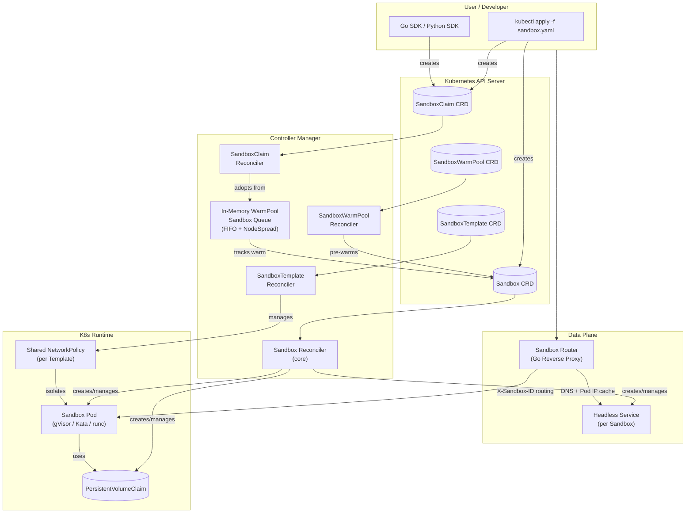
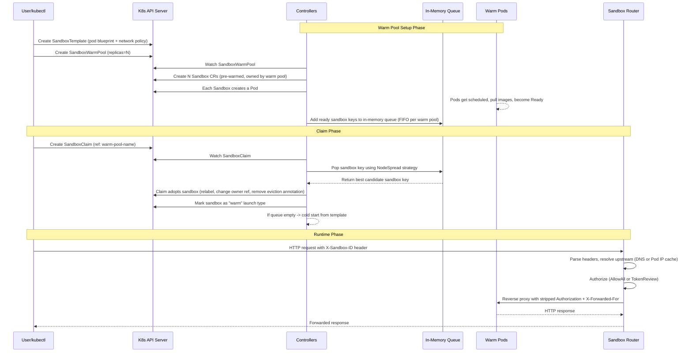
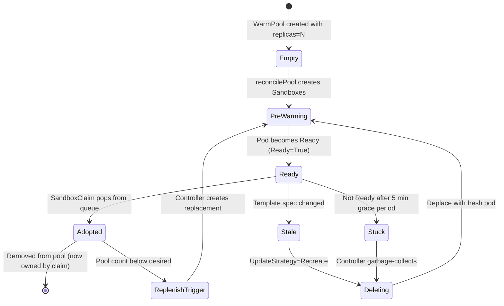
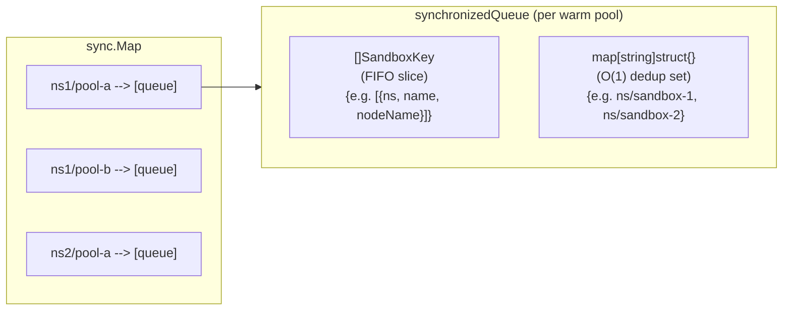
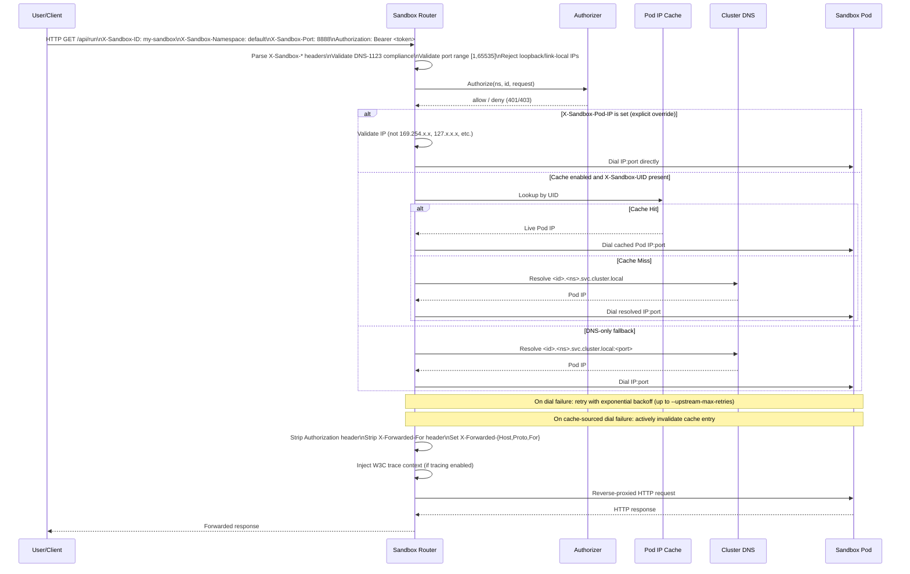
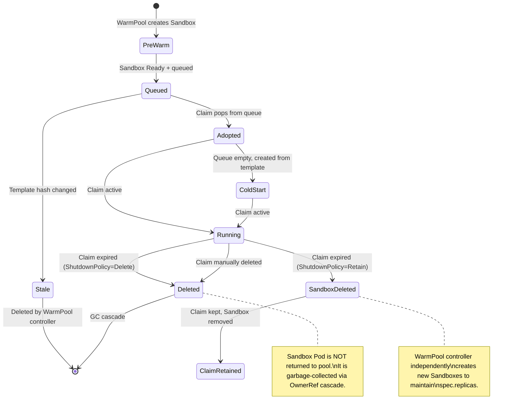

# Agent Sandbox Project Research

## 1. What is this project?

**Agent Sandbox** (sigs.k8s.io/agent-sandbox) is a Kubernetes SIG Apps subproject that provides a set of Custom Resource Definitions (CRDs) and controllers for managing **isolated, stateful, singleton workloads** -- lightweight, single-container virtual machine-like experiences built on Kubernetes primitives. Its primary use case is **AI agent runtimes**: executing untrusted, LLM-generated code in sandboxed environments with strong isolation, stable identity, and persistent storage.

The project consists of two layers:

- **Core (`agents.x-k8s.io/v1beta1`)**: The `Sandbox` CRD -- a declarative API for a single, stateful pod with stable hostname, persistent storage, and lifecycle management (pause/resume, scheduled expiry).
- **Extensions (`extensions.agents.x-k8s.io/v1beta1`)**: Three opt-in CRDs built on top of the core: `SandboxTemplate` (reusable pod blueprints), `SandboxWarmPool` (pre-warmed sandbox pools for low-latency allocation), and `SandboxClaim` (a user-facing abstraction that adopts sandboxes from a warm pool or cold-starts them).

A companion **sandbox-router** (Go reverse proxy) handles HTTP(S) traffic routing from clients to sandbox pods using `X-Sandbox-*` headers, enabling the "check-out" pattern where a single warm pool of identical pre-warmed pods serves many users.

- Go module: `sigs.k8s.io/agent-sandbox` (Go 1.26.x)
- API group: `agents.x-k8s.io` (core), `extensions.agents.x-k8s.io` (extensions)
- API versions: `v1alpha1` (deprecated), `v1beta1` (storage version)
- License: Apache 2.0
- Repository: https://github.com/kubernetes-sigs/agent-sandbox

### Motivation

Kubernetes excels at stateless replicated workloads (Deployments) and numbered stateful sets (StatefulSets), but there is a gap for use cases needing:

- **AI Agent Runtimes**: Isolated environments for executing untrusted, LLM-generated code.
- **Development Environments**: Isolated, persistent, network-accessible cloud environments for developers.
- **Notebooks and Research Tools**: Persistent single-container sessions (Jupyter, VS Code server, etc.).
- **Stateful Single-Pod Services**: Single-instance applications needing stable identity without StatefulSet overhead.

---

## 2. Terminology and Core Concepts

| Term | Definition |
|---|---|
| **Sandbox** | Core CRD. A singleton, stateful, pod-backed workload with stable hostname and persistent storage. The fundamental unit of compute. |
| **SandboxTemplate** | Reusable blueprint for creating Sandboxes. Defines the PodSpec, PVC templates, network policy, and injection policies for env vars and volumes. |
| **SandboxWarmPool** | A pool of pre-warmed, pre-scheduled Sandboxes that sit ready to be "adopted" by a SandboxClaim, reducing cold-start latency. |
| **SandboxClaim** | User-facing CRD. A request for a sandbox from a named SandboxWarmPool. The controller either adopts a pre-warmed sandbox or cold-starts one from the template. |
| **Adoption** | The process of transferring ownership of a warm-pool sandbox to a SandboxClaim -- relabeling it, changing its owner reference from the warm pool to the claim, and removing it from the warm pool's label selector. |
| **Cold Start** | Creating a new Sandbox from scratch (template -> Sandbox CR -> Pod), bypassing the warm pool entirely. |
| **Warm Launch** | A sandbox created from the warm pool (pre-provisioned, then adopted). The pod already exists and is running before adoption. |
| **Sandbox Router** | A stateless HTTP reverse proxy that routes traffic to sandbox pods using `X-Sandbox-ID` headers. Acts as the data-plane entry point. |
| **Secure by Default** | The controller's default security posture: disables automount of service account tokens, enforces strict NetworkPolicy (only sandbox-router may ingress, only public internet may egress), overrides DNS to public resolvers. |
| **Ghost Pod** | A sandbox that was deleted from the cluster but whose key remains in the in-memory warm pool queue. Removed on delete-event handling. |
| **NodeSpread Strategy** | The sandbox-claim controller's algorithm for selecting which warm sandbox to adopt: prefers nodes with the most remaining warm sandboxes to spread adoption load across nodes. |

### CRD Overview

| CRD | API Group | Scope | Short Name | Purpose |
|---|---|---|---|---|
| Sandbox | `agents.x-k8s.io` | Namespaced | `sandbox` | Core singleton pod workload |
| SandboxTemplate | `extensions.agents.x-k8s.io` | Namespaced | `sandboxtemplate` | Reusable pod blueprint + network policy |
| SandboxWarmPool | `extensions.agents.x-k8s.io` | Namespaced | `swp` | Pre-warmed sandbox pool (HPA-scalable) |
| SandboxClaim | `extensions.agents.x-k8s.io` | Namespaced | `sandboxclaim` | User request for a sandbox from a warm pool |

### Key Labels and Annotations

| Key | Type | Purpose |
|---|---|---|
| `agents.x-k8s.io/sandbox-name-hash` | Label | Tracking label on pods for O(1) sandbox-to-pod lookup |
| `agents.x-k8s.io/warm-pool-sandbox` | Label | Marks a sandbox as belonging to a warm pool |
| `agents.x-k8s.io/launch-type` | Label | `cold` or `warm` -- records how the sandbox was created |
| `agents.x-k8s.io/sandbox-pod-template-hash` | Label | Hash of the pod template for staleness detection |
| `agents.x-k8s.io/pod-name` | Annotation | Tracks the actual pod name when it differs from sandbox name (warm pool adoption) |
| `agents.x-k8s.io/claim-uid` | Label | Identity label on pods for NetworkPolicy targeting and claim-to-sandbox discovery |
| `extensions.agents.x-k8s.io/sandbox-template-ref-hash` | Label | Hash of the template reference for staleness detection |

---

## 3. Overall Architecture

### High-Level System Architecture



### Component Interactions



---

## 4. Core Algorithm

### Warm Pool Reconciliation (SandboxWarmPool controller)

The warm pool controller runs a standard Kubernetes reconcile loop. On each trigger (pool spec change, template change, sandbox lifecycle event), it:

1. Lists all Sandbox CRs with the warm pool label `agents.x-k8s.io/warm-pool-sandbox`.
2. Fetches the referenced SandboxTemplate and computes a hash of its PodTemplate spec.
3. Filters active sandboxes: deletes stale ones, adopts orphans, removes stuck sandboxes older than 5 minutes.
4. Calculates desired vs current replica count.
5. Creates or deletes sandboxes in parallel batches using an adaptive slow-start batch strategy (starts with 1, doubles on success).

```
FUNCTION reconcilePool(warmPool, template):
    poolNameHash = hash(warmPool.name)
    sandboxes = LIST sandboxes WHERE label = warmPoolLabel:poolNameHash
    
    template, templateHash = fetchTemplateAndHash(warmPool)
    
    activeSandboxes = []
    FOR each sandbox IN sandboxes:
        IF sandbox.deleting: SKIP
        IF sandbox.orphan OR updateStrategy == Recreate:
            IF isStale(sandbox, template, templateHash):
                DELETE sandbox
                SKIP
        IF sandbox.orphan:
            ADOPT sandbox (set warm pool as owner)
        activeSandboxes.APPEND(sandbox)
    
    // Remove sandboxes stuck in non-ready state for >5 minutes
    activeSandboxes = REMOVE_STUCK(activeSandboxes)
    
    desired = warmPool.spec.replicas ?? 1
    current = LEN(activeSandboxes)
    
    IF current < desired:
        // Create sandboxes in parallel batches (slow-start: 1, 2, 4, 8...)
        toCreate = MIN(desired - current, maxBatchSize)
        blueprint = BUILD_SANDBOX_CR(warmPool, template, templateHash)
        slowStartBatch(toCreate, fn: -> CREATE sandbox from blueprint)
    
    IF current > desired:
        // Delete excess, prioritizing unready then newest first
        toDelete = MIN(current - desired, maxBatchSize)
        SORT activeSandboxes: unready before ready, newest first within group
        slowStartBatch(toDelete, fn: -> DELETE sandbox)
```

### SandboxClaim Adoption Algorithm (SandboxClaim controller)

When a SandboxClaim is created, the controller attempts to adopt a pre-warmed sandbox before falling back to cold start:

```
FUNCTION getOrCreateSandbox(claim):
    // 1. Check if claim already has an adopted sandbox (from status or annotation)
    IF claim.status.sandboxName is set:
        sandbox = GET sandbox(claim.status.sandboxName)
        IF sandbox is controlled by this claim:
            RETURN sandbox
    
    // 2. Try in-memory warm pool queue
    IF claim has NO custom env or volumeClaimTemplates:
        adopted = adoptSandboxFromCandidates(claim)
        IF adopted is not nil:
            RETURN adopted
    
    // 3. Fall through to cold start
    RETURN nil  // Caller will create from template

FUNCTION adoptSandboxFromCandidates(claim):
    poolName = claim.namespace + "/" + claim.spec.warmPoolRef.name
    FOR attempt IN 1..3:
        sandbox, key = getCandidate(claim)
        IF sandbox is nil:
            RETURN nil  // Queue empty
        
        // Optimistic adoption: update claim annotation first
        claim.annotations["sandbox-name"] = sandbox.name
        UPDATE claim  // May conflict if another controller raced
        
        // Transfer ownership from warm pool to claim
        REMOVE warm pool labels from sandbox
        SET controller reference to claim
        PATCH sandbox  // Atomic JSON merge patch
        RETURN sandbox

FUNCTION getCandidate(claim):
    poolName = claim.namespace + "/" + claim.spec.warmPoolRef.name
    callback = NodeSpreadStrategy  // Pick from node with most remaining warm pods
    WHILE queue has items:
        key = queue.PopWithStrategy(callback)
        sandbox = GET sandbox(key)
        IF sandbox not found: CONTINUE  // Ghost pod
        IF sandbox.namespace != claim.namespace: SKIP and retry
        IF not isAdoptable(sandbox): SKIP
        IF sandbox is Ready:
            RETURN sandbox, key  // Found ready candidate!
        ELSE:
            // Save first unready as fallback, keep scanning for ready
            fallback = sandbox ?? fallback
    RETURN fallback  // Best effort: return unready sandbox if no ready one found
```

### Secure Defaults Application

When building a Sandbox from a template, the controller applies these defaults:

```pseudocode
FUNCTION ApplySandboxSecureDefaults(template, podSpec):
    // 1. Disable service account token mounting
    IF podSpec.automountServiceAccountToken is nil:
        podSpec.automountServiceAccountToken = false
    
    // 2. Override DNS to use public resolvers (only under Secure by Default)
    isManaged = (template.networkPolicyManagement == "" OR "Managed")
    isSecureByDefault = isManaged AND template.networkPolicy is nil
    IF isSecureByDefault AND podSpec.dnsPolicy is "":
        podSpec.dnsPolicy = "None"
        podSpec.dnsConfig = { nameservers: ["8.8.8.8", "1.1.1.1"] }
```

---

## 5. Deep Dive

### 5.1 SandboxWarmPool -- Full Lifecycle

The warm pool is the project's key performance optimization. It maintains a buffer of pre-warmed, pre-scheduled sandbox pods that can be instantly reassigned to users, eliminating the latency of pod scheduling, image pulling, and PVC binding.

#### Lifecycle States



#### Pool Creation Mechanics

When a SandboxWarmPool with `replicas: 3` is created, the warm pool controller:

1. Computes `poolNameHash = fnv32a(warmPool.Name)` as an 8-character hex string.
2. Fetches the referenced SandboxTemplate and computes `currentPodTemplateHash = fnv32a(json(template.Spec.PodTemplate))`.
3. Lists all existing Sandbox CRs with label `agents.x-k8s.io/warm-pool-sandbox: <poolNameHash>`.
4. If count < 3, creates new Sandbox CRs with:
   - `metadata.generateName = "<warmPool.Name>-"` (random suffix, not claim-bound)
   - Labels: `warmPoolLabel: poolNameHash`, `sandboxTemplateRefHash: hash(templateName)`, `launch-type: warm`, `sandbox-pod-template-hash: currentPodTemplateHash`
   - Owner reference: SandboxWarmPool (not a claim -- sandboxes are pool-owned until adopted)
   - Annotations: `sandbox-template-ref: <templateName>`
   - Pod template annotation `cluster-autoscaler.kubernetes.io/safe-to-evict: "true"` (so cluster autoscaler can evict idle warm pods)
   - Secure defaults applied (no service account token, public DNS)
5. Each Sandbox controller reconcile creates a Pod and headless Service.
6. As pods become Ready, their sandbox keys are pushed into the in-memory `SimpleSandboxQueue` via the `sandboxEventHandler` (triggered by the Sandbox informer watch).

#### Queue Structure

The `SimpleSandboxQueue` is a thread-safe, in-memory data structure backed by `sync.Map` (keyed by `namespace/warmPoolName`) pointing to `synchronizedQueue` instances:



Key properties:
- **Deduplication**: O(1) set prevents duplicate entries.
- **Node tracking**: When a sandbox is re-added (e.g., node assignment changed), its `NodeName` is updated in-place.
- **FIFO with strategy**: Default pop is FIFO; `PopWithStrategy` accepts a callback for custom selection (NodeSpread).
- **Ghost pod defense**: On sandbox delete events, the key is actively removed from the queue.

#### NodeSpread Strategy

When multiple warm sandbox candidates exist, the claim controller applies a **NodeSpread** strategy to distribute adoption load across cluster nodes:

1. Snapshot all candidate keys from the queue.
2. Separate into scheduled (nodeName set) vs unscheduled (nodeName empty).
3. For scheduled keys, count how many remaining warm sandboxes exist per node.
4. Pick from the node with the highest count (that node has been selected the least).
5. Break ties by FIFO order (oldest candidate first).

This prevents all claims from adopting sandboxes on the same node, which would create a hot spot.

#### Update Strategies

| Strategy | Behavior | Use Case |
|---|---|---|
| `Recreate` | Stale sandboxes (hash mismatch) are deleted immediately; pool replenishes with fresh ones. | When template changes must roll out ASAP. |
| `OnReplenish` (default) | Stale sandboxes remain until adopted by a claim or manually deleted. Replacement happens naturally. | Avoids killing healthy pre-warmed VMs (especially important for Kata/gVisor where cold start is expensive). |

#### Staleness Detection

The controller determines if a warm sandbox is stale by:

1. **Template ref hash mismatch**: If `sandbox.Labels[sandboxTemplateRefHash] != hash(template.Name)`, the sandbox references a different template -- definitely stale.
2. **Pod template hash mismatch**: If `sandbox.Labels[sandboxPodTemplateHashLabel] != currentPodTemplateHash`, the pod spec may have changed. Falls through to deep comparison.
3. **Semantic DeepEqual**: Normalizes both the expected and actual pod specs (applying the same secure defaults to each), then compares via `equality.Semantic.DeepEqual`. Results are cached per hash value for efficiency.

#### Scaling

The pool size is driven by `spec.replicas` and can be controlled by a standard Kubernetes HPA (Horizontal Pod Autoscaler) based on custom metrics like claim creation rate. The controller supports configurable batch size (`--sandbox-warm-pool-max-batch-size`, default 300) for parallel creation/deletion with adaptive slow-start to avoid API server overload.

---

### 5.2 Request Flow End-to-End



#### Routing Protocol (X-Sandbox-* Headers)

| Header | Required | Default | Description |
|---|---|---|---|
| `X-Sandbox-ID` | Yes | -- | Sandbox pod name. Must be a valid DNS-1123 label. Used as the hostname for DNS resolution. |
| `X-Sandbox-UID` | No | -- | Sandbox CR UID. Used for Pod-IP cache lookup (the KEP fast path). |
| `X-Sandbox-Namespace` | No | `default` | Target namespace. Must be a valid DNS-1123 label. |
| `X-Sandbox-Port` | No | `8888` | Target port. Must be a valid port number [1, 65535]. |
| `X-Sandbox-Pod-IP` | No | -- | Direct Pod IP override. Bypasses cache and DNS. Validated to reject loopback, link-local, multicast, and unspecified addresses (SSRF defense). |

#### Resolution Priority

1. `X-Sandbox-Pod-IP` (explicit caller override)
2. Cache lookup by `X-Sandbox-UID` (when `--cache-enabled=true`)
3. DNS form: `http://<ID>.<Namespace>.svc.<cluster-domain>:<port>`

#### Security Headers

The router strips these headers before forwarding to the sandbox:
- **`Authorization`**: Consumed by the router for auth (e.g., TokenReview). Not forwarded because it would let the sandbox impersonate the caller against the K8s API.
- **`X-Forwarded-For`**: Stripped inbound, then set to the actual client IP the router observed. Prevents client-side header spoofing.
- **`Origin`** (only on upgrade/WebSocket requests): Stripped to prevent CSRF origin mismatch (since Host is rewritten to the upstream sandbox address).

---

### 5.3 Security Isolation Mechanisms

The project implements a **defense-in-depth** approach to untrusted code execution. No single mechanism guarantees safety; they compose:

#### 5.3.1 Runtime-Level Isolation (Sandbox Runtime)

The project is **runtime-agnostic** but explicitly designed for strong isolation runtimes:

| Runtime | Isolation Level | Mechanism | Configuration |
|---|---|---|---|
| **gVisor** | Kernel-level sandbox | User-space kernel intercepts syscalls. Each sandbox gets its own kernel boundary. | `runtimeClassName: gvisor` in the PodTemplate |
| **Kata Containers** | Hardware virtualized | Each pod runs inside a lightweight VM (Hyper-V, Firecracker, QEMU). Full hardware isolation. | `runtimeClassName: kata-vm-isolation` or `kata-mshv-vm-isolation` |
| **Standard runc** | Container only | Relies on Linux namespaces + cgroups. Weakest isolation. | Default (no runtimeClassName) |

The AKS Kata example (`extensions/examples/kata-aks/`) shows production configuration:
- NodeSelector + Tolerations to pin to Kata-capable node pools.
- `securityContext.runAsNonRoot: true`, `allowPrivilegeEscalation: false`, `capabilities.drop: ["ALL"]`, `seccompProfile.type: RuntimeDefault`.

#### 5.3.2 Service Account Isolation

The controller **disables service account token mounting by default** on all sandbox pods (`spec.automountServiceAccountToken = false`). This is the project's "Secure by Default" policy. Without a mounted token, a compromised sandbox cannot authenticate to the Kubernetes API server, preventing cluster-level privilege escalation.

#### 5.3.3 Network Isolation (NetworkPolicy)

The `SandboxTemplateReconciler` creates a **shared NetworkPolicy** per SandboxTemplate (one policy applies to all sandboxes from that template). Two modes:

**Managed Mode (default) -- Secure by Default policy**:

```yaml
# Ingress: ONLY the sandbox-router may connect
ingress:
  - from:
    - namespaceSelector:
        matchLabels:
          kubernetes.io/metadata.name: agent-sandbox-system
      podSelector:
        matchLabels:
          app: sandbox-router

# Egress: ONLY public internet, ALL private/internal blocked
egress:
  - to:
    - ipBlock:
        cidr: 0.0.0.0/0
        except:
          - 10.0.0.0/8      # Block private/Cluster/VPC networks
          - 172.16.0.0/12   # Block private networks
          - 192.168.0.0/16  # Block private networks
          - 169.254.0.0/16  # Block link-local (metadata server)
    - ipBlock:
        cidr: "::/0"
        except:
          - "fc00::/7"    # Block IPv6 unique local
          - "fe80::/10"   # Block IPv6 link-local
```

This policy:
- **Blocks all sandbox-to-sandbox communication** (they can only be reached through the router).
- **Blocks access to cluster metadata servers** (169.254.169.254 on cloud).
- **Blocks access to internal DNS** (CoreDNS runs on 10.x.x.x), preventing internal service discovery.
- **Blocks access to the Kubernetes API server** (typically on 10.x.x.x).
- **Allows public internet access** (the agent can call external APIs).

**Custom Managed Mode**: Users can provide custom ingress/egress rules while the controller still manages the `PodSelector` and `PolicyTypes` for proper default-deny posture.

**Unmanaged Mode**: The controller skips NetworkPolicy creation entirely, allowing external systems (Cilium, Calico, etc.) to manage networking.

**DNS hardening**: When Secure by Default is active, the controller overrides DNS to use public resolvers (`8.8.8.8`, `1.1.1.1`) and sets `dnsPolicy: None`, preventing the sandbox from resolving internal service names.

#### 5.3.4 Resource Limits

The controller does not enforce resource limits by default (these are pod-level concerns). However, best-practice examples set explicit CPU/memory requests and limits:

```yaml
resources:
  requests:
    cpu: "250m"
    memory: "512Mi"
  limits:
    cpu: "1"
    memory: "1Gi"
```

Kata Container examples note that Kata pods are full micro-VMs and the kubelet sizes guest memory from the sum of container requests/limits -- leaving them unset causes OOM kills.

#### 5.3.5 Input Validation and SSRF Defenses

The sandbox-router implements strict input validation:

- **X-Sandbox-ID**: Must match `^[a-z0-9]([-a-z0-9]*[a-z0-9])?$` (DNS-1123 label). Rejects injection inputs like `foo.evil.com` or `foo/bar`.
- **X-Sandbox-Pod-IP**: Must be a valid IP literal that is NOT in loopback/link-local/multicast/unspecified ranges. Without this check, a caller could set `X-Sandbox-Pod-IP: 169.254.169.254` and have the router proxy to cloud metadata (SSRF attack).
- **X-Sandbox-Port**: Must parse as integer in [1, 65535].

#### 5.3.6 Authorization (Router)

The router supports two authorization modes:

| Mode | Description | Default |
|---|---|---|
| `allow-all` | Every request with valid X-Sandbox-ID is forwarded. Preserves the Python router's no-auth contract. | Yes |
| `tokenreview` | Submits the `Authorization: Bearer` token to the K8s TokenReview API. Results are cached in an LRU (SHA-256 token hash, default 2048 entries, 30s TTL). |

TokenReview only **authenticates** -- it verifies the token belongs to a known principal. Per-sandbox authorization (checking whether that principal is allowed to access the specific sandbox named in `X-Sandbox-ID`) is tracked as future work.

#### 5.3.7 Sandbox Expiry and Resource Cleanup

All sandboxes have configurable lifecycle with `shutdownTime` (absolute expiry time). When a sandbox expires:

1. The Sandbox controller marks the Ready condition as "Expired".
2. Pod, Service, and PVCs are deleted (regardless of ownership).
3. `shutdownPolicy` controls what happens to the Sandbox CR:
   - `Delete`: Sandbox CR is also deleted.
   - `Retain` (default): Sandbox CR remains with "Expired" status for audit.

SandboxClaim expiry works similarly but with three policies:
- `Delete`: Deletes the claim (and cascadingly the sandbox).
- `DeleteForeground`: Uses foreground cascade deletion; the claim remains with a deletionTimestamp until the sandbox and pod are fully terminated.
- `Retain`: Keeps the claim; underlying sandbox/pod are deleted to save resources.

#### 5.3.8 Container Security Context (Kata AKS Example)

The production-grade example (`extensions/examples/kata-aks/sandboxtemplate.yaml`) demonstrates recommended security settings:

```yaml
securityContext:
  runAsNonRoot: true
  runAsUser: 1000
  runAsGroup: 1000
  allowPrivilegeEscalation: false
  capabilities:
    drop:
    - ALL
  seccompProfile:
    type: RuntimeDefault
```

These settings satisfy Pod Security Admission (PSA) `restricted` profile and common admission policies (OPA/Kyverno).

---

### 5.4 Sandbox Router -- Pod IP Cache (KEP Fast Path)

When `--cache-enabled=true`, the router runs an in-process Kubernetes informer that watches sandbox-owned Pods and maintains a UID-to-PodIP map:

- **Informer filter**: Server-side label selector on `agents.x-k8s.io/sandbox-name-hash`.
- **Cache content**: Only Pods with `PodReady=True` and non-empty `Status.PodIP`.
- **Eviction**: Pods that flip out of Ready are removed automatically by the informer event handler.
- **Active invalidation**: When a cache-sourced dial fails, the entry is evicted immediately so the next request falls through to DNS instead of retrying a stale IP.
- **Readiness gating**: `/readyz` does not flip to ready until the initial Pod LIST has completed (misconfigured RBAC fails fast).

---

### 5.5 Key Code Architecture

The codebase follows standard Kubernetes controller-runtime patterns:

| Directory | Purpose |
|---|---|
| `api/v1beta1/` | Core Sandbox CRD types + kubebuilder markers |
| `extensions/api/v1beta1/` | SandboxTemplate, SandboxWarmPool, SandboxClaim types |
| `controllers/` | Core Sandbox reconciler (manages Pods, Services, PVCs) |
| `extensions/controllers/` | Extension reconcilers (template, warm pool, claim) |
| `extensions/controllers/queue/` | In-memory warm pool sandbox queue |
| `internal/lifecycle/` | Expiry/time calculation utilities |
| `internal/metrics/` | Prometheus metrics and OpenTelemetry tracing |
| `internal/version/` | Version information |
| `cmd/agent-sandbox-controller/` | Controller manager entrypoint (wires all controllers) |
| `sandbox-router/` | Go reverse proxy (standalone binary, not part of controller) |
| `clients/go/sandbox/` | High-level Go SDK for SandboxClaim lifecycle |
| `clients/python/agentic-sandbox-client/` | Python SDK (sync + async) |
| `k8s/` | Generated CRDs, RBAC manifests, controller deployment YAML |

### 5.6 SandboxClaim Lifecycle

The SandboxClaim is the user-facing abstraction for requesting a sandbox. Its lifecycle determines when sandbox Pods are created, assigned, and destroyed, and whether they return to the warm pool.

#### Ownership Chain

When a Claim adopts a sandbox from the warm pool, the controller clears the old owner references and sets the Claim as the controller owner of the Sandbox:

```
Claim ---(controllerRef)---> Sandbox ---(controllerRef)---> Pod
```

When the Claim is deleted, **Kubernetes garbage collection** (not the controller) handles cascade deletion along the OwnerRef chain: Claim deletion → GC deletes Sandbox → GC deletes Pod. The claim controller itself returns immediately when it detects `DeletionTimestamp != nil` (line 181-183 of `sandboxclaim_controller.go`), relying entirely on the API server's garbage collector.

#### Full Lifecycle



#### Claim Deletion Behavior (DeletionTimestamp != nil)

```go
if !claim.DeletionTimestamp.IsZero() {
    return ctrl.Result{}, nil  // No cleanup -- GC handles cascade
}
```

The controller does **nothing** when a claim is being deleted. Kubernetes garbage collector walks the OwnerRef chain (Claim → Sandbox → Pod) and deletes everything. The warm pool queue is unaffected because the sandbox was already removed from it during adoption.

#### Expiration and ShutdownPolicy

Claims have a TTL (expiration time). When the claim expires, the behavior depends on `ShutdownPolicy`:

| ShutdownPolicy | Behavior |
|---|---|
| `Delete` / `DeleteForeground` | The entire Claim is deleted (with optional foreground propagation). GC cascade deletes Sandbox → Pod. |
| `Retain` (default) | Only the Sandbox is deleted. The Claim itself persists, allowing inspection of its status and events. |

In both cases, the sandbox Pod is **permanently destroyed** and never returns to the warm pool.

#### Warm Pool Replenishment is Independent

The SandboxWarmPool controller monitors pool size independently. When `current_replicas < spec.replicas`, it creates new sandboxes. This is a **one-way flow**:

```
Pool → (adopt) → Claim → (expire/delete) → GC destroys Pod
  ↑                                               |
  └─── Pool controller creates replacement ───────┘
       (independent reconciliation loop)
```

There is no mechanism to "return" a sandbox to the pool after a claim is finished. The sandbox has been mutated (OwnerReferences changed, labels changed, env injected, volumes attached) and is no longer a clean warm-pool candidate. Re-creating from the template ensures each warm-pool sandbox starts from a known-clean state.


