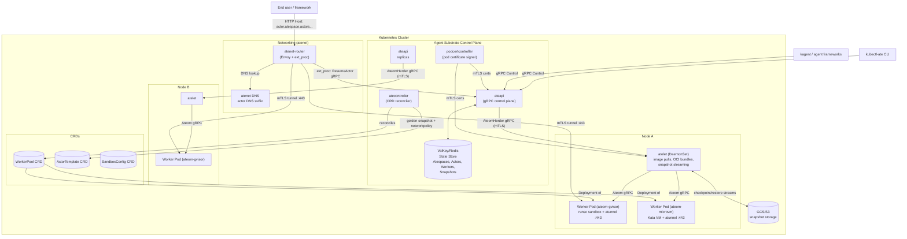
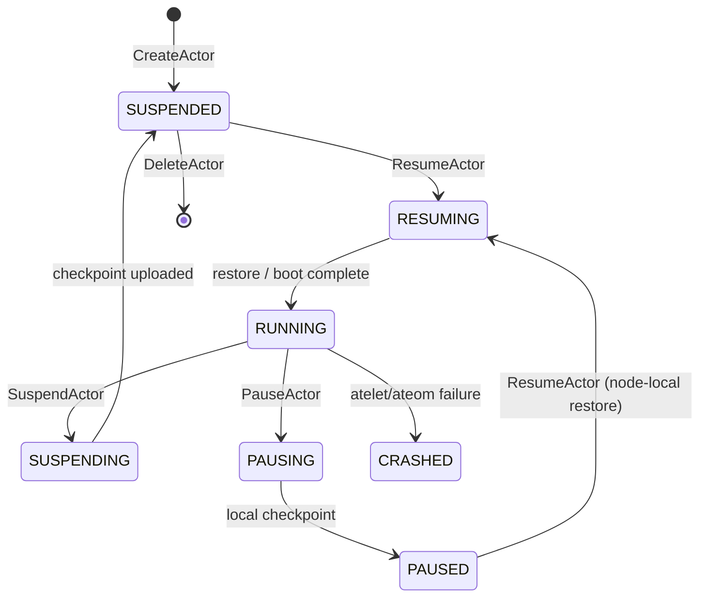
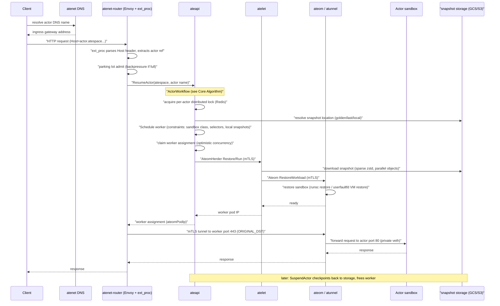

# Agent Substrate Research

## 1. What is this project?

**Agent Substrate** (`github.com/agent-substrate/substrate`) is a high-density runtime environment for large-scale agent deployments, built on top of Kubernetes. It provides full lifecycle management for agent sandboxes — sub-second suspend/resume of "actors" onto a pool of pre-warmed "workers" (Kubernetes Pods) — achieving heavy multiplexing of idle agent workloads onto shared physical infrastructure.

At its core, Agent Substrate maps a larger set of **actors** (agent-like applications) onto a smaller set of ready **workers**, relying on the observation that agent workloads spend most of their time idle. When an actor is idle, it is *suspended* (checkpointed to a snapshot in object storage) and the worker is freed. When traffic arrives, the actor is *resumed* (restored from snapshot) onto any available worker, and the request is routed to it. This decouples the actor lifecycle from the Kubernetes Pod lifecycle: Kubernetes handles low-frequency infrastructure provisioning (worker Pods), while a dedicated control plane handles the high-frequency, low-latency actor scheduling that Kubernetes was not designed for.

- **Go module**: `github.com/agent-substrate/substrate` (Go 1.26.3)
- **Sandbox backends**: gVisor (`runsc`, default) and microVMs (Kata Containers on Cloud Hypervisor) — both support suspend/resume
- **License**: Apache 2.0
- **Repository**: https://github.com/agent-substrate/substrate
- **Status**: early development (v0.0.0), "not ready for production use", APIs "almost guaranteed to change"
- **Maintainer**: Google (the README notes: *"This is not an officially supported Google product"* and it is excluded from Google's VSRP). 425 commits; top contributors: Benjamin Elder, Julian Gutierrez Oschmann, Haven Xia, Tim Hockin, Omer Yahud. Community via the `ate-dev` Google Group, weekly community meeting, and CNCF Slack (`#substrate-users`, `#substrate-dev`).

### Relationship to kagent

kagent (see `RESEARCH-kagent.md`) uses Agent Substrate as its **SandboxLayer** backend for running untrusted agent code: kagent's `SandboxAgent` runs declarative agents in sandboxed environments, backed by a **Substrate Client** (`go/core/pkg/sandboxbackend/substrate/` in the kagent repo) that is a gRPC client for the Substrate `ate-api` control plane, with pre-provisioned WorkerPools for sandbox execution capacity.

### North Star Metrics (from `docs/architecture.md`)

| Metric | Target |
|---|---|
| Activation latency (wakeup event → agent can serve traffic) | 100ms at p95 |
| Scale (active + idle agents per cluster) | 1 billion |
| Wakeup throughput per cluster | 1,000/second |

### Motivation

- Idle Pods still consume resources; agent workloads are terrible for efficiency.
- The Kubernetes API server is not designed for millions of discrete resources or high write volume.
- Pod scheduling latency (several async controllers + image pulls) is unacceptable for workloads that run for milliseconds to seconds.
- Kubernetes state management (PVs) does not scale to millions of volumes.

---

## 2. Terminology and Core Concepts

| Term | Definition |
|---|---|
| **Actor** | A single instance of an agent-like workload, derived from an `ActorTemplate`. Addressed by `(atespace, name)`. The unit that is suspended/resumed; it migrates between workers over its lifetime. Stored as a record in the control-plane database. |
| **Atespace** | The isolation boundary an Actor belongs to (analogous to a namespace, but NOT a Kubernetes namespace). Global-scoped record; an actor's identity is `(atespace, name)`. Must exist before actors; deletable only when empty. |
| **Worker** | A record representing one worker Pod in a `WorkerPool`. Hosts at most one actor at a time; state `ACTIVE` or `DRAINING`. |
| **WorkerPool** | CRD declaring warm compute capacity: a fleet of pre-started worker Pods, reconciled into a Kubernetes `Deployment` by `atecontroller`. |
| **ActorTemplate** | CRD: immutable definition of an actor "class" — container image(s), resources, env, snapshot config, worker selector, sandbox class. Creating one triggers creation of a **Golden Snapshot**. |
| **SandboxConfig** | Cluster-scoped CRD holding the sandbox binaries for one runtime family (gVisor `runsc`, or microVM kernel/firmware/config). Pins the runtime version for many templates. |
| **ate-api-server (ateapi)** | The control plane: gRPC API owning actor lifecycle, scheduling, and snapshots, backed by a ValKey/Redis state store. |
| **atecontroller** | Kubernetes controller reconciling the CRDs (WorkerPool → Deployment, ActorTemplate → golden snapshot, NetworkPolicy). |
| **atelet** | Node-level supervisor (DaemonSet): pulls images, assembles OCI bundles, drives sandboxes via ateom, streams snapshots to/from GCS/S3. |
| **ateom** | Coordinator running inside each worker Pod that drives the sandbox runtime on behalf of atelet. One per sandbox class: `ateom-gvisor`, `ateom-microvm`. Decouples the physical Pod lifecycle from the sandboxed process. |
| **atenet** | Networking stack: DNS server for actor resolution + Envoy-based router with an `ext_proc` processor that resumes suspended actors on demand. |
| **atunnel** | mTLS tunnel component: the router opens an authenticated TLS tunnel to a per-worker listener (port 443) hosted by ateom, which forwards to the actor over its private veth interface. |
| **Golden Snapshot** | Initial checkpoint captured once, when an ActorTemplate is created, from a temporary "golden" boot of the workload. First resume of an actor restores from this shared snapshot. |
| **Last Snapshot** | The most recent per-actor snapshot, written on Suspend; used to restore that specific actor on next Resume. |
| **Suspend** | Hibernate a running actor: checkpoint to a snapshot, upload to object storage (GCS/S3), free the worker. |
| **Pause** | Short-term checkpoint kept *on the node VM*; the following Resume is prioritized onto that same node (data locality). |
| **Resume** | Activate a suspended/paused actor by restoring it onto a worker; common path restores from a snapshot rather than cold-booting. |
| **Snapshot scope** | `FULL` (process memory + rootfs delta + DurableDir volumes) or `DATA` (only DurableDir volumes; actor cold-boots from OCI image). Configured per-trigger via `onPause` / `onCommit`. |
| **DurableDir volume** | A directory mounted into one or more containers whose contents are preserved by `DATA`-scope snapshots — the per-actor application-data surface. |
| **Uniform DNS Mesh** | Every actor is reachable at `<actor-name>.<atespace>.actors.resources.substrate.ate.dev`, resolved by atenet and auto-routing (with on-demand resume) to the right worker. |
| **Golden snapshot / actor identity** | Actors get a stable Substrate-managed identity (JWT or x509 cert) independent of the underlying hardware, minted by the `ActorIdentity` gRPC service. |
| **Request Parking** | Router holds inbound requests while retrying resume during transient worker-pool saturation, instead of failing with 503 immediately. |

### API Resource Model (dual-layer)

The project deliberately splits state into two tiers (from `docs/architecture.md`):

1. **System configuration (declarative, Kubernetes CRDs)**: `WorkerPool`, `ActorTemplate`, `SandboxConfig` — managed via kubectl, subject to familiar RBAC/auditing/policy.
2. **Dynamic instance state (database records)**: `Atespace`, `Actor`, `Worker`, `ActorSnapshot`, `ActorSnapshotTag` — stored in a high-performance ValKey/Redis store to support millions of actors with thousands of updates/sec, bypassing etcd and the kube-apiserver's eventual consistency.

```mermaid
classDiagram
    namespace kube-apiserver {
        class ActorTemplate {
            <<CRD>>
            image, env, snapshotsConfig
            workerSelector, sandboxClass
        }
        class WorkerPool {
            <<CRD>>
            replicas, ateomImage
            sandboxClass
        }
        class SandboxConfig {
            <<CRD>>
            sandbox binaries
        }
        class Deployment
        class WorkerPod {
            ateom + runsc
        }
    }

    namespace ate-api-server (Redis) {
        class Atespace {
            <<record>>
            global-scoped
        }
        class Actor {
            <<record>>
            status: RUNNING/SUSPENDED/...
            latestSnapshot, workerPoolName
        }
        class Worker {
            <<record>>
            podIP, assignment, state
        }
        class ActorSnapshot {
            <<record>>
            immutable, self-describing
        }
    }

    ActorTemplate "1" --> "0..*" Actor : derived from
    ActorTemplate "1" --> "1" WorkerPool : workerPoolRef
    WorkerPool ..> Deployment : reconciled by atecontroller
    Deployment "1" *-- "*" WorkerPod : manages
    Actor "0..1" --> "0..1" Worker : runs on
    Worker "1" --> "1" WorkerPod : maps to
    Actor "1" --> "0..1" ActorSnapshot : latest
    WorkerPool "1" --> "0..1" SandboxConfig : resolves binaries
```

---

## 3. Overall Architecture

### Repository Layout

```
substrate/
├── cmd/                # One subdirectory per binary
│   ├── ateapi/         #   control plane gRPC server (internal/: controlapi, scheduling, store, actoridentity, workercache, ...)
│   ├── atelet/         #   node-level supervisor DaemonSet (internal/ategcs: GCS/S3 storage mover)
│   ├── atecontroller/  #   Kubernetes CRD controller (internal/controllers)
│   ├── atenet/         #   networking: DNS + Envoy router + ext_proc (internal/dns, internal/router)
│   ├── ateom-gvisor/   #   gVisor sandbox herder (runsc checkpoint/restore)
│   ├── ateom-microvm/  #   microVM herder (Kata + Cloud Hypervisor, userfaultfd restore)
│   ├── podcertcontroller/  # Pod Certificate signer polyfill (short-lived mTLS identity)
│   ├── kubectl-ate/    #   kubectl plugin CLI
│   └── benchmarking/   #   load-test workloads (glutton)
├── internal/           # Shared packages, internal to the module
│   ├── proto/          #   ateletpb (AteomHerder gRPC), ateompb (Ateom gRPC), gluttonpb
│   ├── atunnel/        #   mTLS tunnel client/server + egress gateway
│   ├── actorlog/       #   per-actor logging
│   ├── imagecache/     #   node-local OCI layer cache (overlay lowerdirs)
│   ├── localca/        #   local certificate authority for pod certs
│   ├── localjwtauthority/ # local JWT authority (actor identity)
│   ├── e2e/            #   end-to-end test framework (suites: demo, example, identity, metrics, networking, networkpolicy, parking)
│   └── ...
├── pkg/                # Public API for external consumers
│   ├── api/v1alpha1/   #   WorkerPool / ActorTemplate / SandboxConfig CRD types
│   ├── client/         #   generated clientset, informers, listers
│   └── proto/ateapipb/ #   public Control / Debug / ActorIdentity gRPC API
├── docs/               # architecture.md, api-guide.md, glossary.md, threat-model.md, roadmap.md, ...
├── manifests/          # Kubernetes YAML for deploying Agent Substrate (ate-install/)
├── demos/              # counter, sandbox, claude-code-multiplex, multi-template, parking, autoscaled-workerpool
├── benchmarking/       # Locust-based load tests
├── hack/               # dev/CI scripts, kind cluster helpers, code generators
├── tools/              # standalone Go tools (setup-gcp, ...)
├── vendor/             # vendored dependencies
├── .github/workflows/  # pr-workflow.yaml, govulncheck.yaml
├── .ko.yaml            # ko image build config
└── Makefile
```

### System Components and Data Flow



### Binaries Overview

| Binary | Role | Deployment | Key gRPC/API |
|---|---|---|---|
| `cmd/ateapi` | Control plane "brain": actor lifecycle, scheduling, snapshot orchestration | Deployment (HA) | `Control`, `Debug`, `ActorIdentity` (in `pkg/proto/ateapipb`) |
| `cmd/atelet` | Node supervisor: image pulls, OCI bundle assembly, snapshot streaming | DaemonSet | `AteomHerder` server (in `internal/proto/ateletpb`) |
| `cmd/ateom-gvisor` | gVisor herder inside worker pods | sidecar in worker Pod | `Ateom` server (in `internal/proto/ateompb`) |
| `cmd/ateom-microvm` | microVM herder (Kata + cloud-hypervisor) | sidecar in worker Pod | `Ateom` server |
| `cmd/atecontroller` | CRD reconcilers: WorkerPool → Deployment, ActorTemplate → golden snapshot, NetworkPolicy | Deployment | — |
| `cmd/atenet` | DNS server + Envoy router with `ext_proc` external processor + proxy sidecars | Deployment / DaemonSet | Envoy ext_proc (gRPC) |
| `cmd/podcertcontroller` | Pod Certificate signer "polyfill" for short-lived mTLS identities | Deployment | Kubernetes CertificateSigningRequest |
| `cmd/kubectl-ate` | kubectl plugin CLI (`kubectl ate create atespace/actor`, list workers, ...) | local binary | Control client |
| `cmd/benchmarking` | Load-test workloads (`glutton`: consumes RAM/disk/FDs on demand) | load-test | — |
| `tools/setup-gcp` | Provisions GKE/GCS/IAM for a deployment | dev tool | — |

### Actor Lifecycle (state machine)



### End-to-End Request Flow



---

## 4. Core Algorithm

### 4.1 The Workflow Engine (Client-Driven Forward Recovery)

The control plane implements all multi-step actor operations as **idempotent step sequences** executed by a generic workflow engine (`cmd/ateapi/internal/controlapi/workflow.go`). This is the project's key reliability pattern: if the server crashes mid-operation, the client simply retries the same RPC, and each step's `IsComplete()` check fast-forwards past already-completed work.

```
FUNCTION RunWorkflow(params, state, steps):
    FOR each step IN steps:
        IF ctx cancelled: ABORT

        // Fast-forward: already completed?
        IF step.IsComplete(params, state):
            CONTINUE  // skip Execute, move to next step

        // Validate preconditions (e.g. actor status allows this edge)
        step.CheckPrerequisite(params, state)   // FailedPrecondition → abort

        // Execute with optional retry on version conflict
        IF step.RetryBackoff() == nil:
            step.Execute(params, state)
        ELSE:
            wait.ExponentialBackoff(step.RetryBackoff()):
                err = step.Execute(params, state)
                IF err == nil: DONE
                IF err is store.ErrVersionConflict: RETRY  // optimistic concurrency
                ELSE: FATAL
```

The resume workflow (`workflow_resume.go`) is a sequence of such steps:

```
ResumeActor(actorRef, boot):
    lock = store.AcquireLock("lock:actor:<atespace>:<name>")  // Redis lock, auto-renewed
    defer lock.Close()
    steps = [
        LoadActorForResume   // load Actor + ActorTemplate + snapshot location;
                             // if status==RESUMING (crashed mid-resume), reload assigned worker instead
        CreateVolumes        // create PENDING external volumes
        AssignWorker         // schedule + claim a worker (see 4.2)
        AttachVolumes        // attach volumes to the worker's node
        CallAteletRestore    // pick restore source:
                             //   local snapshot (Paused)  -> Atelet.Restore (LOCAL)
                             //   durable snapshot         -> Atelet.Restore (EXTERNAL)
                             //   none (boot)              -> Atelet.Run (golden or from scratch)
        FinalizeRunning      // status = RUNNING
    ]
    RunWorkflow(steps)
```

Suspend mirrors this: `LoadActorForSuspend → MarkSuspending → CallAteletSuspend (checkpoint + upload) → DetachVolumes → FinalizeSuspended`. Pause and Delete are analogous step sequences. Every workflow starts by acquiring a distributed lock per actor, serializing concurrent operations (a concurrent op gets `Aborted`).

### 4.2 Worker Scheduling (random among eligible)

The scheduler (`cmd/ateapi/internal/scheduling/scheduling.go`) is deliberately simple — it is not the bottleneck; Redis state and resume latency are. A worker must satisfy all constraints:

```
FUNCTION Schedule(constraints):
    workers = workerCache.Workers()
    candidates = []
    FOR each worker IN workers:
        IF worker.assignment == nil                      // free
           AND worker.sandboxClass == constraints.sandboxClass
           AND worker.state == ACTIVE
           AND templateSelector.Matches(worker.labels)
           AND actorSelector.Matches(worker.labels)      // per-actor worker_selector
           AND (constraints.requiredNodes empty OR
                worker.nodeName IN constraints.requiredNodes)  // data locality for Paused actors
        THEN candidates.APPEND(worker)
    IF candidates empty: RETURN ErrNoCapacity
    RETURN candidates[random(0, len(candidates))]        // uniform random
```

Assignment is an optimistic-concurrency update of the `Worker` record (version check); the actor's status is set to `RESUMING` with `ateomPodUid/Name/IP` and `workerPoolName` populated. If the control plane crashes after claiming the worker but before updating the actor, the next retry detects the already-assigned worker in the worker cache and resumes from there (or releases it in the background if it is no longer eligible).

### 4.3 Router Resume with Request Parking (data plane)

The router (`cmd/atenet/internal/router/`) never blocks the Envoy data path. On each request's `RequestHeaders` phase, the ext_proc server:

1. Parses `<actor>.<atespace>.actors.resources.substrate.ate.dev` from the Host header (404 on invalid).
2. Admits the request to a bounded **parking lot** (sheds with 429 when full).
3. Calls `ResumeActor` through an `ActorResumer` that:
   - **Deduplicates** concurrent requests for the same actor with `singleflight.Group` (one control-plane RPC per hot actor).
   - **Parks** the request when the pool is transiently saturated: retries with exponential backoff on `FailedPrecondition` ("no free workers") / `Unavailable` / `Aborted` until a budget (default 5s) elapses, then returns the underlying error (503 with the capacity message) instead of failing fast.
   - Detaches the retry loop's context from the first caller so a disconnecting client does not cancel the resume for others.
4. On success, routes via an **ORIGINAL_DST** cluster mutation: Envoy dials `workerIP:443` (the atunnel mTLS listener) while preserving the original Host header — atunnel authorizes by the actor DNS name and forwards to the actor's port 80 over its private veth.

### 4.4 Checkpoint/Restore (atelet ↔ ateom)

`atelet` (node) and `ateom` (in-pod) split the work. For gVisor:

- **Restore/Run**: atelet fetches the pinned `runsc` binary (content-addressed, from a `SandboxConfig`), assembles OCI bundles for each container, then calls `ateom.RestoreWorkload`/`RunWorkload`; ateom executes `runsc restore`/`runsc create` in the pod's cgroup (per-container cgroup leaf) and hosts the atunnel ingress.
- **Checkpoint**: ateom runs `runsc checkpoint` to a directory, reports the snapshot file list back; atelet streams them to GCS/S3 (sparse zstd compression for memory images).
- **Snapshot self-description**: each snapshot's manifest pins the exact sandbox binaries that created it, so restores stay reproducible across runtime upgrades — no binary config is sent on restore.

---

## 5. Deep Dive

### 5.1 Control Plane (`ateapi`) internals

`cmd/ateapi/main.go` wires: gRPC server on `:443` (mTLS, serving `Control`, `Debug`, `ActorIdentity`), ValKey/Redis client (TLS, optional IAM auth), JWT issuer/audience validation for clients, an in-process informer watching worker Pods, and a `workercache` (in-memory copy of the worker fleet for O(1) scheduling). Flags include `redis-cluster-address`, `client-jwt-issuer/audience`, `actor-id-jwt-pool`, `pod-identity-ca-certs`, and graceful drain (`drain-delay` 13s / `drain-timeout` 15s). Internal packages:

| Package | Purpose |
|---|---|
| `internal/controlapi/` | The `Control` gRPC implementation: create/get/update/delete actor, resume/suspend/pause, atespaces, snapshots & tags, workers. Contains the workflow steps and the crash-detection logic (`crash.go`). |
| `internal/scheduling/` | The Scheduler (Section 4.2). |
| `internal/store/` + `store/ateredis/` | Store interface: actors, workers, atespaces, snapshots, tags, distributed locks (`AcquireLock`), worker watch (pub/sub). Redis implementation. |
| `internal/actoridentity/`, `actoridjwt/`, `k8sjwt/` | Actor identity: mints OIDC-compatible JWTs and x509 certs for actors. |
| `internal/workercache/` | In-memory worker fleet mirror for scheduling. |
| `internal/ateinterceptors/` | gRPC authn/z interceptors (JWT bearer, mTLS). |

Key API concepts (`pkg/proto/ateapipb/ateapi.proto`):

- `ActorSnapshot` — an independently addressable, **immutable** durable snapshot; physical location is private to Substrate. Snapshots can be aliased by Atespace-owned **tags** (`ActorSnapshotTag`), with `ATESPACE` or `PUBLISHED` scope, acting as retention pins.
- `Actor` statuses: `RESUMING / RUNNING / SUSPENDING / SUSPENDED / PAUSING / PAUSED / CRASHED / DELETING`.
- `ActorIdentity.MintJWT` / `MintCert` — a workload authenticates with its Kubernetes service account (JWT or pod cert) and receives a **stable actor-level credential** whose subject is `app/${appID}/user/${userID}/actor/${actorID}` — stable across physical migrations.

### 5.2 State Store (ValKey/Redis)

All dynamic records live in Redis, not etcd. The store interface provides optimistic concurrency (`UpdateActor`/`UpdateWorker` with expected version → `ErrVersionConflict`), a distributed lock for per-actor serialization, a worker watch subscription for the scheduler cache, and paginated list APIs. The roadmap explicitly flags "Is Redis/ValKey the right answer for API storage?" as an open question.

### 5.3 Sandbox Classes (ateom-gvisor and ateom-microvm)

**gVisor (default)**: `cmd/ateom-gvisor` drives `runsc` (fetched at runtime, content-addressed). Suspend/resume uses gVisor's native checkpoint/restore of the sandboxed process tree. The gVisor backend requires a runsc with `--allow-connected-on-save` to work around a networking-restore bug. A single `DurableDir` volume limit applies.

**microVM**: `cmd/ateom-microvm` runs the actor inside a **Kata Containers** guest on **Cloud Hypervisor**. Suspend/resume captures a memory-only VM snapshot restored on demand using `userfaultfd` memory demand-paging; container rootfs writes are captured in guest RAM via a `tmpfs` overlay. `DurableDir` volumes are host-backed over a second writable virtio-fs share and shipped in snapshots as a tar — so `DATA`-scope snapshots capture them without any guest memory, and multiple durable volumes cost nothing extra (the microVM class lifts the gVisor single-volume limit). The pod image is glibc-based (`debian:stable-slim`) because the fetched cloud-hypervisor binary needs glibc and mount/umount.

### 5.4 Networking (atenet)

- **DNS**: serves `<actor-name>.<atespace>.actors.resources.substrate.ate.dev` for location-transparent actor discovery.
- **Router**: Envoy with an `ext_proc` external processor (Section 4.3). Envoy config is pushed by the router controller via xDS (`xds.go`).
- **atunnel**: recent addition — mTLS tunnel servers inside workers (port 443) and egress gateways, so worker pod port 80 is no longer a direct actor ingress path; the router authenticates with its pod-identity client cert (ORIGINAL_DST cluster's upstream TLS context).
- Actor egress can be redirected through a remote `egress_gateway_address` (selected per activation) instead of direct egress.

### 5.5 Identity and mTLS

- `podcertcontroller` implements **Pod Certificate** signers (a polyfill for a Kubernetes feature that will eventually ship upstream); components hold short-lived certificates used as mTLS identities for all internal gRPC (ateapi ↔ atelet ↔ ateom).
- `ActorIdentity` service gives actors a hardware-independent credential so policies can be written in terms of stable actor identity.

### 5.6 Security Model (from `docs/threat-model.md`)

Defense-in-depth: sandboxed execution (gVisor/microVM), actor identity, uniform-DNS identity-aware routing (requests only routed to registered actors), Kubernetes NetworkPolicy at the WorkerPool boundary, and mTLS everywhere. Known gaps acknowledged in the roadmap: control-plane authn/z, granular per-actor authorization, actor-to-actor policy, and default-deny ACLs at scale are still future work.

### 5.7 Observability

OpenTelemetry tracing and Prometheus metrics everywhere (`internal/ateattr` attribute constants; OTLP exporters; a `docs/observability.md` guide including an OTel Collector setup guide). `actorlog` provides per-actor logging to follow an actor across migrations. The router records route-latency histograms with `template`, `outcome` (`ok/no_capacity/timeout/lock_conflict/not_found/...`), and `resume` (`none/triggered/joined`) labels; metrics include snapshot sizes and parking wait durations.

### 5.8 Demos

- **counter**: stateful Go HTTP server showing state preservation across suspends/resumes and CRD routing.
- **sandbox (Antigravity)**: secure Alpine sandbox allowing arbitrary shell execution with filesystem state preserved across sessions (explicitly not auth-secured).
- **claude-code-multiplex**: multiplexing multiple Claude Code agents onto a limited worker pool (30x+ oversubscription demo).
- **multi-template**: two ActorTemplates sharing one WorkerPool across three namespaces.
- **parking**: oversubscribed pool; router parks requests instead of returning 503.
- **autoscaled-workerpool**: HPA scaling on assigned-worker count fed by prometheus-adapter.

### 5.9 External Dependencies and Frameworks

| Area | Dependencies |
|---|---|
| Kubernetes | `k8s.io/api`, `k8s.io/apimachinery`, `k8s.io/client-go`, `k8s.io/metrics` (v0.36.1), `sigs.k8s.io/controller-runtime` v0.24.1 |
| Cloud storage | `cloud.google.com/go/storage` (GCS), `aws-sdk-go-v2/service/s3` (S3), GCP resource APIs (`container`, `iam`, `monitoring`, `resourcemanager`, `serviceusage`) |
| Runtime/sandbox | `opencontainers/runtime-spec`, `containerd/ttrpc`, `google/go-containerregistry` (image pulls), `google/nftables` |
| State store | `redis/go-redis/v9` (ValKey/Redis), `alicebob/miniredis` (tests) |
| Networking | `envoyproxy/go-control-plane` (xDS + ext_proc), `vishvananda/netlink` + `netns`, `google/nftables` |
| Observability | `go.opentelemetry.io/otel` (+ grpc/http instrumentation, OTLP + Prometheus exporters), `prometheus/client_golang` |
| Identity/security | `spiffe/go-spiffe/v2`, `go-jose/go-jose/v4` (indirect, JWT), `google/go-containerregistry` authn |
| CLI | `spf13/cobra`, `spf13/pflag` |
| Benchmarking | `myzhan/boomer` (Locust-compatible load generator), `zeromq/goczmq`, `hashicorp/go-reap` |
| Build | `ko` (container builds, `.ko.yaml`: distroless static base, alpine for sandbox demo, debian slim for ateom-microvm), golangci-lint, protoc + `protoc-gen-*` (`hack/protoc.sh`) |

### 5.10 Current Repository State

- **Branch**: `main` (425 commits); remote branches include `feat/long-running-actor-support`, `feature/nanoclaw-multiplex-demo`, `feature/openclaw-integration`, `security-md-fixup` (OpenClaw integration is a notable in-flight direction — relevant to kagent's AgentHarness backends).
- **Version tag**: `v0.0.0` only. Version stamping via `git describe` (`internal/version`).
- **Recent commits** (July 2026): `imagecache` two-phase layer retirement and atomic WriteSpec; actor ingress routed through the atunnel mTLS server; ateapi `ActorSnapshot` lifecycle APIs + self-describing snapshots under stable paths; worker eligibility checks before assignment; docs for OTel collector setup and request parking.
- **Build**: `make build` (ko images for ateapi/atelet/podcertcontroller/atenet + kubectl-ate), `make test`, `make e2e` (requires GKE + built images), `make verify` (fmt, boilerplate, lint, go mod checks).
- **Testing**: extensive Go unit tests per package (scheduling, workflows, store, router ext_proc, ateom-microvm restore), `internal/e2e` framework with suites for demo/example/identity/metrics/networking/networkpolicy/parking run against a real cluster (`hack/run-e2e.sh`), root tests, `envtest` (envtestbins), `govulncheck` in CI.
- **CI**: `.github/workflows/pr-workflow.yaml` (least-privilege token permissions, actions pinned to commit hashes, keeps failed-run namespaces and dumps worker logs) and `govulncheck.yaml`.
- **Vendored dependencies** (`vendor/`) with license metadata in `LICENSES/`.
