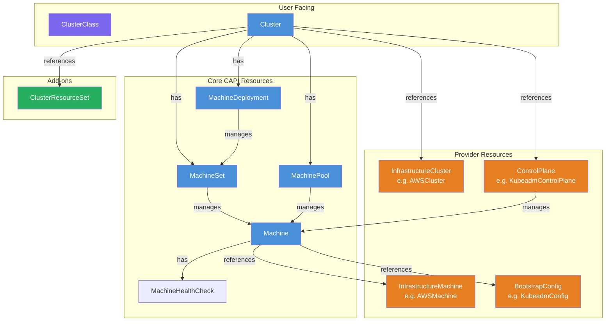
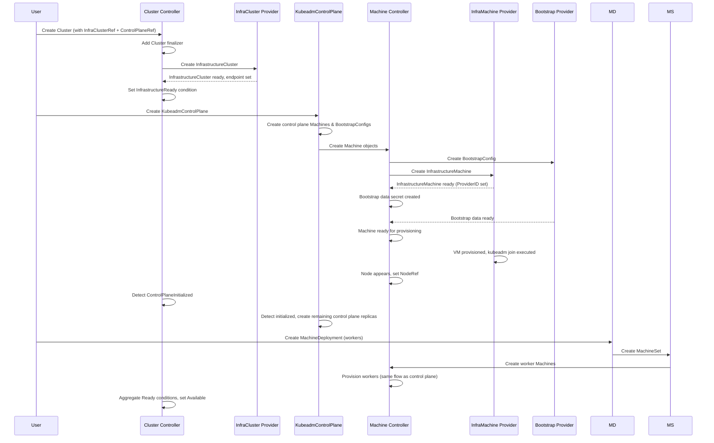
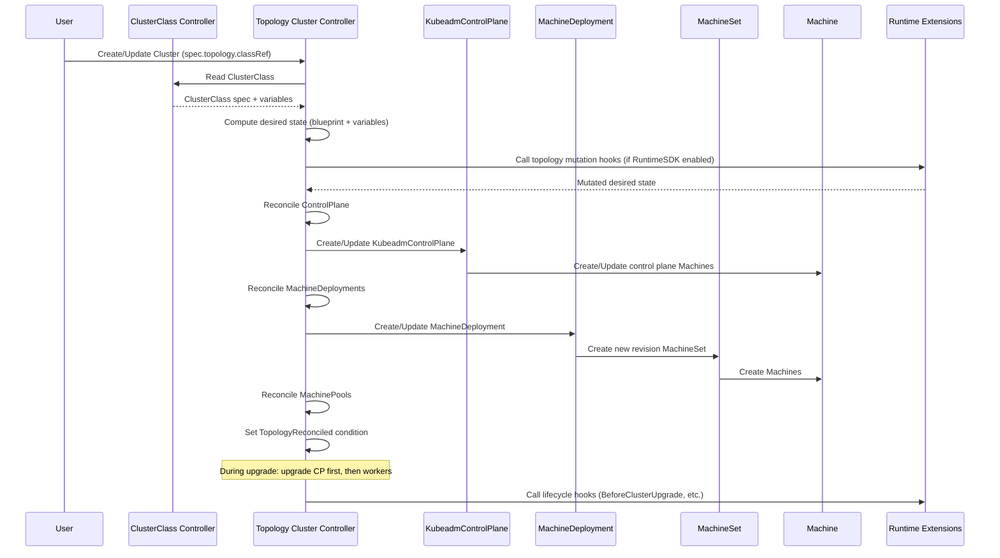
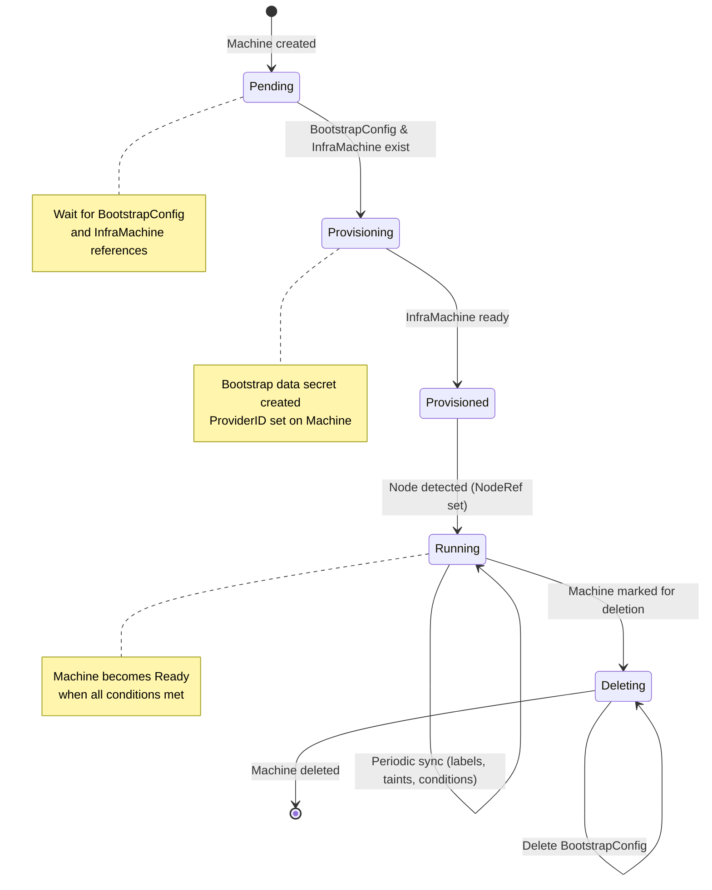
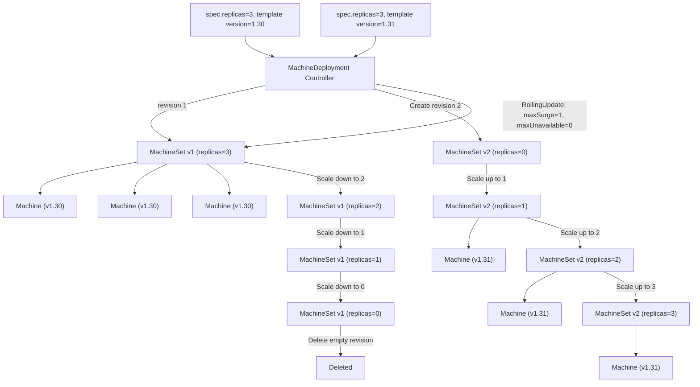
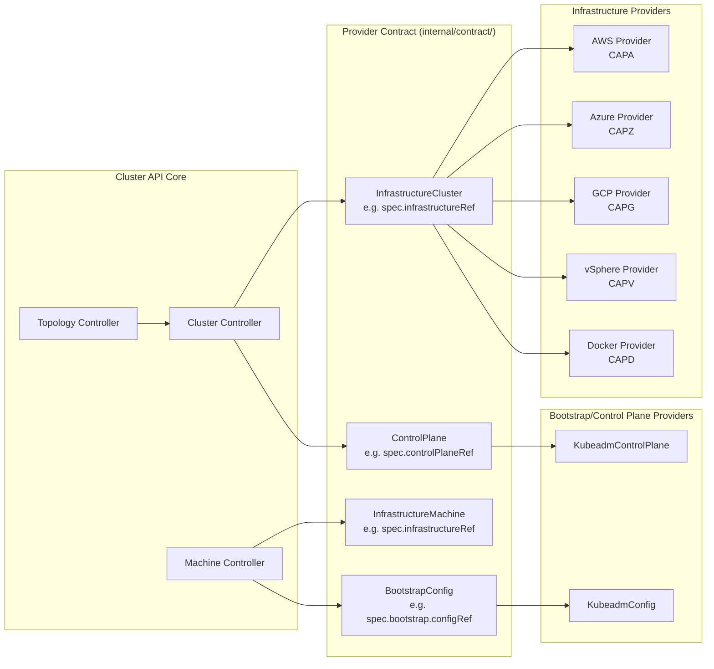
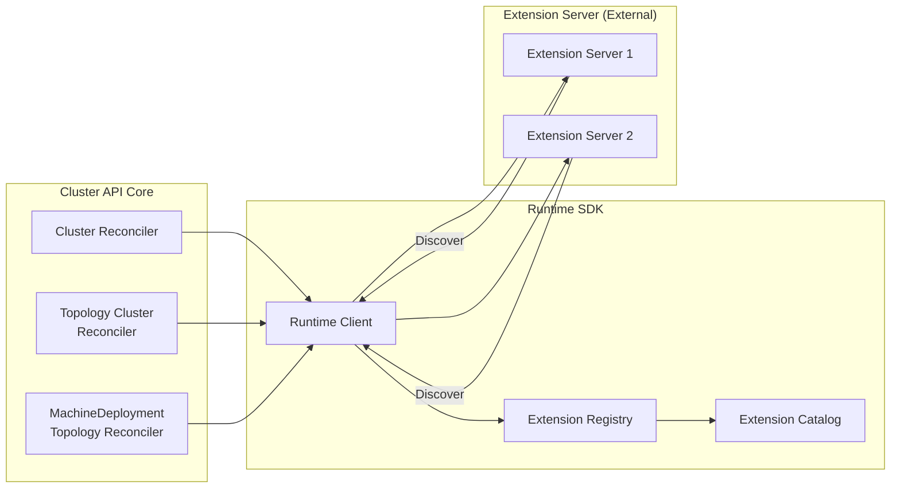

# Cluster API Project Research

## 1. What is this project?

**Cluster API (CAPI)** is a Kubernetes subproject focused on providing declarative APIs and tooling to simplify provisioning, upgrading, and operating multiple Kubernetes clusters. It is part of the `kubernetes-sigs` organization under the Kubernetes Special Interest Group (SIG) Cluster Lifecycle.

Cluster API uses Kubernetes-style APIs and patterns to automate cluster lifecycle management for platform operators. The supporting infrastructure (virtual machines, networks, load balancers, VPCs) and the Kubernetes cluster configuration are all defined in the same way application developers deploy and manage their workloads. This enables consistent and repeatable cluster deployments across a wide variety of infrastructure environments.

- Module path: `sigs.k8s.io/cluster-api`
- Go version: 1.26.0 (directive) / 1.26.4 (toolchain)
- API contract: v1beta2 (current), with v1beta1 for backwards compatibility
- License: Apache License 2.0
- Current release series: v1.13.x (latest stable: v1.13.2)
- Repository: `https://github.com/kubernetes-sigs/cluster-api`
- Home page: `https://cluster-api.sigs.k8s.io`
- Slack: `#cluster-api` on Kubernetes Slack

### Maintainers

The project is governed by the Kubernetes SIG Cluster Lifecycle. Key roles:
- **sig-cluster-lifecycle-leads** -- SIG leads
- **cluster-api-admins** -- repository administration
- **cluster-api-maintainers** -- core maintainers with approval rights
- **cluster-api-reviewers** -- regular reviewers
- Notable emeritus approvers include CecileRobertMichon, detiber, kris-nova, ncdc, roberthbailey

## 2. High-Level Architecture

### Top-Level Directory Layout

| Directory | Purpose |
|---|---|
| `api/` | Kubernetes API types (CRDs): core, bootstrap, controlplane, addons, runtime, IPAM |
| `cmd/clusterctl/` | The `clusterctl` CLI tool -- provider management, cluster lifecycle |
| `controllers/` | Public controller interfaces (ClusterCache, remote client, CRD migrator) |
| `internal/controllers/` | Core reconciler implementations (Cluster, Machine, MachineSet, MachineDeployment, topology, etc.) |
| `internal/contract/` | Provider contract types -- defines how CAPI interacts with infrastructure, bootstrap, and control plane providers |
| `internal/topology/` | Managed topology logic (upgrade, variables, names, ownerrefs, selectors) |
| `internal/webhooks/` | Admission webhook implementations |
| `bootstrap/` | Bootstrap provider framework + built-in kubeadm bootstrap provider |
| `controlplane/` | Control plane provider framework + built-in kubeadm control plane provider |
| `exp/` | Experimental features: Runtime SDK (catalog, client, server), topology mutation |
| `config/` | Kubernetes manifests -- CRDs, RBAC, webhooks, manager deployment, cert-manager |
| `webhooks/` | Public webhook type definitions |
| `feature/` | Feature gate definitions and management |
| `version/` | Version information |
| `errors/` | Error type definitions |
| `util/` | Utility packages |
| `docs/` | Documentation, proposals, community |
| `test/` | E2E and integration tests |
| `hack/` | Build and code-generation scripts |
| `Tiltfile` | Tilt development environment configuration |

### Key Binary and Entry Points

There is a single manager binary entry point:

- `main.go` -- **Core Cluster API controller manager**. This is the only production binary in the core repository. It registers all reconcilers and webhooks with controller-runtime.

The `clusterctl` CLI tool lives under `cmd/clusterctl/` and provides:
- `clusterctl init` -- Initialize a management cluster with providers
- `clusterctl generate cluster` -- Generate YAML for workload clusters
- `clusterctl move` -- Move CAPI objects between management clusters
- `clusterctl upgrade` -- Upgrade CAPI providers

### Core Packages

| Package | Purpose |
|---|---|
| `api/core/v1beta2/` | Core CAPI resource types (Cluster, Machine, MachineSet, MachineDeployment, MachinePool, MachineHealthCheck, ClusterClass) |
| `api/bootstrap/kubeadm/v1beta2/` | Kubeadm bootstrap provider types (KubeadmConfig, KubeadmConfigTemplate) |
| `api/controlplane/kubeadm/v1beta2/` | Kubeadm control plane provider types (KubeadmControlPlane, KubeadmControlPlaneTemplate) |
| `api/addons/v1beta2/` | Add-on types (ClusterResourceSet, ClusterResourceSetBinding) |
| `api/runtime/v1beta2/` | Runtime SDK types (ExtensionConfig) |
| `api/runtime/hooks/v1alpha1/` | Runtime hook definitions |
| `api/ipam/v1beta2/` | IPAM types (IPAddress, IPAddressClaim) |
| `internal/controllers/cluster/` | Cluster reconciler |
| `internal/controllers/machine/` | Machine reconciler (phase management, node ref, in-place updates, drain) |
| `internal/controllers/machineset/` | MachineSet reconciler (scale up/down, preflight checks) |
| `internal/controllers/machinedeployment/` | MachineDeployment reconciler (rolling update, revision management) |
| `internal/controllers/topology/cluster/` | Topology-aware Cluster reconciler (ClusterClass managed topologies) |
| `internal/controllers/clusterclass/` | ClusterClass reconciler (variable discovery, ref version management) |
| `internal/contract/` | Provider contract (infrastructure cluster/machine, bootstrap, control plane) |
| `internal/hooks/` | Lifecycle hook orchestration |

### The Provider Contract

The internal `contract/` package defines how Cluster API interacts with providers through unstructured object inspection:

- `infrastructure_cluster.go` -- Contract for InfrastructureCluster objects
- `infrastructure_machine.go` -- Contract for InfrastructureMachine objects
- `bootstrap.go` -- Contract for BootstrapConfig objects
- `controlplane.go` -- Contract for ControlPlane objects
- `infrastructure_cluster_template.go` -- Contract for InfrastructureClusterTemplate
- `infrastructure_machine_template.go` -- Contract for InfrastructureMachineTemplate
- `controlplane_template.go` -- Contract for ControlPlaneTemplate
- `bootstrap_config_template.go` -- Contract for BootstrapConfigTemplate
- `metadata.go` -- Metadata contract (labels, annotations)
- `types.go` -- Shared types (ContractVersionedObjectReference)
- `version.go` -- API version handling

## 3. Main Entry Points and Core Abstractions

### Core CRDs (all in `api/core/v1beta2/`)

| CRD | Short Name | Kind | Purpose |
|---|---|---|---|
| `clusters.cluster.x-k8s.io` | `cl` | Cluster | Top-level resource representing a Kubernetes cluster |
| `machines.cluster.x-k8s.io` | `ma` | Machine | A single machine (VM or bare-metal) that will become a Kubernetes node |
| `machinesets.cluster.x-k8s.io` | `ms` | MachineSet | Manages a set of identical Machines (analogous to ReplicaSet) |
| `machinedeployments.cluster.x-k8s.io` | `md` | MachineDeployment | Declarative rolling updates for MachineSets (analogous to Deployment) |
| `machinepools.cluster.x-k8s.io` | | MachinePool | Manages a pool of machines that can be scaled (autoscaling support) |
| `machinehealthchecks.cluster.x-k8s.io` | | MachineHealthCheck | Automatic remediation of unhealthy machines |
| `machinedrainrules.cluster.x-k8s.io` | | MachineDrainRule | Configurable node drain rules |
| `clusterclasses.cluster.x-k8s.io` | `cc` | ClusterClass | Reusable template for creating Clusters with managed topologies (behind ClusterTopology feature gate) |

### Bootstrap Provider CRDs (`api/bootstrap/kubeadm/v1beta2/`)

| CRD | Purpose |
|---|---|
| `kubeadmconfigs.bootstrap.cluster.x-k8s.io` | Kubeadm bootstrap configuration for joining a cluster |
| `kubeadmconfigtemplates.bootstrap.cluster.x-k8s.io` | Template for creating KubeadmConfig objects |

### Control Plane Provider CRDs (`api/controlplane/kubeadm/v1beta2/`)

| CRD | Purpose |
|---|---|
| `kubeadmcontrolplanes.controlplane.cluster.x-k8s.io` | Kubeadm-based control plane management (HA, upgrades, scaling) |
| `kubeadmcontrolplanetemplates.controlplane.cluster.x-k8s.io` | Template for creating KubeadmControlPlane objects |

### Add-on Types (`api/addons/v1beta2/`)

| CRD | Purpose |
|---|---|
| `clusterresourcesets.addons.cluster.x-k8s.io` | Apply a set of resources (ConfigMaps, Secrets) to workload clusters |
| `clusterresourcesetbindings.addons.cluster.x-k8s.io` | Tracks which resources have been applied to which clusters |

### Runtime SDK Types (`api/runtime/v1beta2/`)

| CRD | Purpose |
|---|---|
| `extensionconfigs.runtime.cluster.x-k8s.io` | Configures Runtime Extensions (webhook-like hooks) |
| Runtime hooks (`api/runtime/hooks/v1alpha1/`) | Defines hook extension points (LifecycleHooks, TopologyMutationHooks, etc.) |

### IPAM Types (`api/ipam/v1beta2/`)

| CRD | Purpose |
|---|---|
| `ipaddresses.ipam.cluster.x-k8s.io` | Represents an IP address |
| `ipaddressclaims.ipam.cluster.x-k8s.io` | Claim for an IP address from an IPAM provider |

### Resource Hierarchy

```
Cluster
  |
  +-- ClusterClass (optional, managed topology)
  |
  +-- InfrastructureCluster (provider-specific, e.g. AWSCluster)
  |
  +-- ControlPlane (provider-specific, e.g. KubeadmControlPlane)
  |     |
  |     +-- Machine (control plane)
  |           |
  |           +-- BootstrapConfig (e.g. KubeadmConfig)
  |           +-- InfrastructureMachine (e.g. AWSMachine)
  |
  +-- MachineDeployment (optional, for workers)
  |     |
  |     +-- MachineSet
  |           |
  |           +-- Machine (worker)
  |                 |
  |                 +-- BootstrapConfig (e.g. KubeadmConfig)
  |                 +-- InfrastructureMachine (e.g. AWSMachine)
  |
  +-- MachinePool (optional, alternative for workers)
  |     |
  |     +-- Machine
  |
  +-- ClusterResourceSet (optional, add-ons)
```

### Controller Architecture and Reconciliation

Each core type has a dedicated controller that follows the standard controller-runtime pattern:

**Cluster Reconciler** (`internal/controllers/cluster/cluster_controller.go`):
- Reconciles on Cluster object changes
- Manages Cluster phases: Pending -> Provisioning -> Provisioned -> Deleting -> Failed
- Tracks InfrastructureCluster readiness
- Tracks ControlPlane readiness
- Manages control plane endpoint
- Computes aggregated conditions (Available, ScalingUp, ScalingDown, Remediating, etc.)

**Machine Reconciler** (`internal/controllers/machine/machine_controller.go`):
- Reconciles on Machine object changes
- Manages machine lifecycle phases: Pending -> Provisioning -> Provisioned -> Running -> Deleting -> Deleted
- Creates BootstrapConfig (if needed)
- Waits for InfrastructureMachine readiness
- Watches for Node creation (via cluster cache)
- Updates Node references
- Handles node draining on deletion
- Handles in-place updates (behind InPlaceUpdates feature gate)
- Propagates taints to nodes (behind MachineTaintPropagation feature gate)

**MachineSet Reconciler** (`internal/controllers/machineset/`):
- Reconciles on MachineSet object changes
- Scales up/down to match desired replica count
- Runs preflight checks before scaling up (behind MachineSetPreflightChecks feature gate)
- Computes aggregated conditions (MachinesReady, MachinesUpToDate, ScalingUp, etc.)

**MachineDeployment Reconciler** (`internal/controllers/machinedeployment/`):
- Reconciles on MachineDeployment object changes
- Manages MachineSet revisions (revision annotation)
- Executes rolling update strategy (RollingUpdate or OnDelete)
- Handles in-place updates via MachineSet migration
- Computes aggregated conditions

**ClusterClass Reconciler** (`internal/controllers/clusterclass/`):
- Reconciles on ClusterClass object changes
- Discovers available variables from referenced templates
- Validates references are up-to-date with current API versions

**Topology Cluster Reconciler** (`internal/controllers/topology/cluster/`):
- Reconciles on Cluster objects with `.spec.topology` set (managed topologies)
- Computes desired state from ClusterClass + topology variables
- Reconciles control plane, machine deployments, machine pools
- Handles upgrades (version upgrades, control plane first, then workers)
- Runs lifecycle hooks via Runtime SDK
- Handles topology mutations via patches/variables

### Feature Gates

Defined in `feature/feature.go`:

| Feature Gate | Default | Stage | Description |
|---|---|---|---|
| `MachinePool` | true | Beta | MachinePool functionality |
| `ClusterTopology` | false | Alpha | ClusterClass and managed topologies |
| `RuntimeSDK` | false | Alpha | Runtime hooks and extensions |
| `KubeadmBootstrapFormatIgnition` | false | Alpha | Ignition bootstrap format |
| `MachineSetPreflightChecks` | true | Beta | MachineSet preflight checks |
| `PriorityQueue` | true | Beta | controller-runtime PriorityQueue |
| `ReconcilerRateLimiting` | true | Beta | Rate-limited reconcilers |
| `InPlaceUpdates` | false | Alpha | In-place machine updates |
| `MachineTaintPropagation` | false | Alpha | Machine taint propagation to Nodes |
| `MachineWaitForVolumeDetachConsiderVolumeAttachments` | true | GA (deprecated, will be removed in v1.15) | Consider VolumeAttachments for detach |

## 4. External Dependencies and Frameworks

### Core Dependencies

| Dependency | Purpose |
|---|---|
| `sigs.k8s.io/controller-runtime v0.24.1` | Core framework for Kubernetes controllers |
| `k8s.io/api v0.36.2` | Kubernetes API types |
| `k8s.io/apimachinery v0.36.2` | Kubernetes API machinery |
| `k8s.io/client-go v0.36.2` | Kubernetes client library |
| `k8s.io/apiextensions-apiserver v0.36.2` | CRD support |
| `k8s.io/apiserver v0.36.2` | API server utilities (CEL, etc.) |
| `k8s.io/component-base v0.36.2` | Component base (flags, logs, feature gates) |
| `k8s.io/klog/v2 v2.140.0` | Logging |
| `k8s.io/cluster-bootstrap v0.36.2` | Cluster bootstrap token handling |
| `sigs.k8s.io/yaml v1.6.0` | YAML marshal/unmarshal |
| `sigs.k8s.io/structured-merge-diff/v6 v6.4.0` | Server-side apply |
| `github.com/spf13/cobra v1.10.2` | CLI framework |
| `github.com/spf13/viper v1.21.0` | Configuration management |
| `github.com/google/cel-go v0.26.0` | Common Expression Language for validation |
| `github.com/prometheus/client_golang v1.23.2` | Metrics |
| `github.com/onsi/ginkgo/v2 v2.31.0` | Testing framework |
| `github.com/onsi/gomega v1.42.0` | Matchers/testing |
| `github.com/blang/semver/v4 v4.0.0` | Semantic versioning |
| `github.com/Masterminds/sprig/v3 v3.3.0` | Template functions |
| `github.com/pkg/errors v0.9.1` | Error handling |
| `go.etcd.io/etcd/client/v3 v3.6.12` | etcd client (used by Kubeadm control plane) |
| `golang.org/x/oauth2 v0.36.0` | OAuth2 |

### Provider Model

Cluster API uses a modular **provider model**. The core repository ships with one built-in provider for each category:

**Infrastructure Providers** (external repositories):
- `cluster-api-provider-aws` (CAPA) -- Amazon Web Services
- `cluster-api-provider-azure` (CAPZ) -- Microsoft Azure
- `cluster-api-provider-gcp` (CAPG) -- Google Cloud Platform
- `cluster-api-provider-vsphere` (CAPV) -- VMware vSphere
- `cluster-api-provider-openstack` (CAPO) -- OpenStack
- `cluster-api-provider-docker` (CAPD, in `test/infrastructure/docker`) -- Docker (for testing)
- `cluster-api-provider-ibmcloud` -- IBM Cloud
- `cluster-api-provider-metal3` -- Bare metal via Ironic

**Bootstrap Providers**:
- `KubeadmConfig` / `KubeadmConfigTemplate` (built-in in `bootstrap/kubeadm/`) -- generates kubeadm join commands
- Support for Ignition format via `KubeadmBootstrapFormatIgnition` feature gate

**Control Plane Providers**:
- `KubeadmControlPlane` / `KubeadmControlPlaneTemplate` (built-in in `controlplane/kubeadm/`) -- manages HA Kubernetes control planes via kubeadm

**IPAM Providers** (external):
- Implement the IPAddressClaim/IPAddress CRDs for dynamic IP allocation

**Runtime Extensions** (external):
- Custom extension servers that implement Runtime SDK hooks

### The Provider Contract

The `internal/contract/` package defines how Cluster API objects reference provider objects:

```
Cluster.spec.infrastructureRef       --> InfrastructureCluster (e.g. AWSCluster)
Cluster.spec.controlPlaneRef         --> ControlPlane (e.g. KubeadmControlPlane)
Machine.spec.infrastructureRef       --> InfrastructureMachine (e.g. AWSMachine)
Machine.spec.bootstrap.configRef     --> BootstrapConfig (e.g. KubeadmConfig)
MachineDeployment.spec.template      --> MachineTemplateSpec (includes MachineSpec)
  MachineSpec.infrastructureRef      --> InfrastructureMachineTemplate
  MachineSpec.bootstrap.configRef    --> BootstrapConfigTemplate
ClusterClass.spec.infrastructure.ref --> InfrastructureClusterTemplate
ClusterClass.spec.controlPlane.ref   --> ControlPlaneTemplate
ClusterClass.spec.workers[...].ref   --> MachineDeploymentClass/MachinePoolClass templates
```

## 5. Current Repository State

### Version Information
- Latest stable release: **v1.13.2**
- Current main branch: pre-release of v1.14.0 (commit `1cca791f4` corresponds to `v1.13.0-rc.0-288-g1cca791f4`)
- API contract version transition: v1beta1 -> v1beta2 started in v1.11 release series

### Release Model
- Semantic versioning (vMAJOR.MINOR.PATCH)
- Supported release series: 1.14 (current dev), 1.13, 1.12, 1.11, 1.10 (v1beta1 contract)
- Each minor version introduces features under feature gates
- Release branches are cut from main for each minor version
- RC (Release Candidate) and beta tags published before stable releases

### Build System
- Makefile-based build (standard for Kubernetes SIG projects)
- Go 1.26.4 toolchain required
- Docker-based container image builds
- Cloud Build pipelines configured (`cloudbuild.yaml`, `cloudbuild-nightly.yaml`)
- Kustomize for configuration management
- Controller-gen for code generation (deepcopy, CRDs, RBAC, webhooks)
- Go module vendoring via standard `go.mod` / `go.sum`

### Recent Git Activity (main branch)

The project is highly active. Recent commits include:
- `ClusterClass` and topology improvements
- Managed fields interning
- Runtime extension error handling
- CRD migrator and orphan cleanup
- OwnerReferencesPermissionEnforcement support
- KubeadmControlPlane remediation improvements
- Migration of test infrastructure from Docker to InMemory backend

### Testing
- Unit tests (Ginkgo/Gomega) alongside each package
- Integration tests using envtest (controller-runtime test framework)
- E2E tests in `test/` directory
- Test infrastructure provider (CAPD) uses `dev` backend for faster tests

## 6. Deep Dive

### Cluster API Resource Hierarchy



### Reconciliation Flow for Creating a Cluster



### Managed Topology Reconciliation Flow (ClusterClass)



### Reconciliation Flow for a Machine (Detailed)



### MachineDeployment Rollout Flow



### The Provider Contract



### Pseudocode: Core Reconciliation Algorithms

#### Cluster Reconciler

```pseudocode
FUNCTION ReconcileCluster(ctx, cluster):
    IF cluster is being deleted:
        CALL DeleteCluster(ctx, cluster)
        RETURN

    IF cluster is paused:
        SET Paused condition
        RETURN

    // Initialize external refs
    IF cluster.Spec.InfrastructureRef is set:
        infraCluster = GET InfrastructureCluster from cluster.Spec.InfrastructureRef
        IF infraCluster does not exist:
            SET InfrastructureReady = False, reason "ObjectDoesNotExist"
            RETURN
        IF infraCluster is being deleted:
            SET InfrastructureReady = False, reason "ObjectDeleted"
            RETURN
        SET InfrastructureReady = mirror of infraCluster's Ready condition
        SET InfrastructureProvisioned from infraCluster status

    IF cluster.Spec.ControlPlaneRef is set:
        controlPlane = GET ControlPlane from cluster.Spec.ControlPlaneRef
        IF controlPlane exists and is ready:
            SET ControlPlaneAvailable = True
            IF controlPlane initialized:
                SET ControlPlaneInitialized = True
        ELSE:
            SET ControlPlaneAvailable = False

    // Compute aggregate conditions
    aggregatedConditions = AGGREGATE(InfrastructureReady, ControlPlaneAvailable,
                                     WorkersAvailable, RemoteConnectionProbe)
    IF cluster.Spec.Topology is defined:
        aggregatedConditions += TopologyReconciled

    // Compute phase
    IF cluster.DeletionTimestamp is set:
        phase = "Deleting"
    ELSE IF infrastructure provisioned AND control plane initialized:
        phase = "Provisioned"
    ELSE IF infrastructure provisioned OR control plane exists:
        phase = "Provisioning"
    ELSE:
        phase = "Pending"

    UPDATE cluster status with aggregatedConditions and phase
```

#### Machine Reconcile Loop

```pseudocode
FUNCTION ReconcileMachine(ctx, machine):
    IF machine is being deleted:
        CALL DeleteMachine(ctx, machine)
        RETURN

    IF machine is paused:
        SET Paused condition
        RETURN

    // Phase 1: Ensure BootstrapConfig exists
    IF machine.Spec.Bootstrap.ConfigRef is set:
        bootstrapConfig = GET BootstrapConfig
        IF bootstrapConfig does not exist AND machine.Spec.Bootstrap.DataSecretName is nil:
            CREATE BootstrapConfig from template
            RETURN (wait)
        IF bootstrapConfig is ready OR DataSecretName is set:
            SET BootstrapConfigReady = True
        ELSE:
            SET BootstrapConfigReady = False
            RETURN (wait)

    // Phase 2: Ensure InfrastructureMachine exists
    IF machine.Spec.InfrastructureRef is set:
        infraMachine = GET InfrastructureMachine
        IF infraMachine does not exist:
            CREATE InfrastructureMachine from template
            RETURN (wait)
        IF infraMachine is ready (ProviderID set):
            SET InfrastructureReady = True
            SET ProviderID on Machine
        ELSE:
            SET InfrastructureReady = False
            RETURN (wait)

    // Phase 3: Wait for Bootstrap data
    IF machine.Spec.Bootstrap.DataSecretName is nil:
        RETURN (wait for bootstrap data secret)

    // Phase 4: Wait for Node
    node = GET Node matching ProviderID via ClusterCache
    IF node does not exist:
        RETURN (wait for node to appear)

    SET NodeRef, NodeInfo on Machine
    SYNC labels from Machine to Node
    SYNC taints from Machine to Node (if MachineTaintPropagation enabled)

    // Compute Ready condition
    IF all readiness gates satisfied
        AND BootstrapConfigReady
        AND InfrastructureReady
        AND NodeHealthy
        AND NOT Updating:
        SET Ready = True
    ELSE:
        SET Ready = False

    SET phase = "Running"
```

#### MachineSet Scale-up/Down

```pseudocode
FUNCTION ReconcileMachineSet(ctx, ms):
    IF ms is being deleted:
        DELETE all owned Machines
        REMOVE finalizer when machines are gone
        RETURN

    machines = LIST machines matching ms.Spec.Selector
    desiredReplicas = GET desired replicas (from spec or autoscaler annotations)

    // Scale Up
    IF len(machines) < desiredReplicas:
        IF preflight checks enabled AND NOT all passing:
            SET ScalingUp condition with preflight check details
            RETURN
        diff = desiredReplicas - len(machines)
        FOR i = 0..diff:
            CREATE Machine from ms.Spec.Template
        SET ScalingUp condition

    // Scale Down
    IF len(machines) > desiredReplicas:
        diff = len(machines) - desiredReplicas
        machinesToDelete = SELECT machines to delete (by deletion order: Random/Newest/Oldest,
                              preferring unhealthy and delete-annotated machines)
        FOR machine in machinesToDelete:
            DELETE machine
        SET ScalingDown condition

    UPDATE aggregrated conditions (MachinesReady, MachinesUpToDate)
    UPDATE replicas, readyReplicas, availableReplicas, upToDateReplicas
```

#### MachineDeployment Rolling Update

```pseudocode
FUNCTION ReconcileMachineDeployment(ctx, md):
    IF md is being deleted:
        DELETE all MachineSets
        RETURN

    allMachineSets = LIST MachineSets with md's labels, sorted by revision

    // Determine desired revision
    newTemplate = md.Spec.Template
    existingMS = FIND MachineSet matching newTemplate
    IF existingMS does not exist:
        revision = max(allMS revisions) + 1
        newMS = CREATE MachineSet from newTemplate with new revision
        SET MachineDeploymentUniqueLabel on newMS

    // Execute rollout strategy
    CASE md.Spec.Strategy:
        RollingUpdate:
            maxSurge = md.Spec.Strategy.RollingUpdate.MaxSurge
            maxUnavailable = md.Spec.Strategy.RollingUpdate.MaxUnavailable

            IF newMS.Replicas < desiredReplicas:
                // Scale up new MS respecting maxSurge
                scaleUp = min(desiredReplicas - newMS.Replicas, maxSurge - surgeCount)
                newMS.Replicas += scaleUp

            oldMachineSets = allMS except newMS, sorted by revision desc
            FOR oldMS in oldMachineSets:
                IF oldMS.Replicas > 0:
                    // Scale down old MS respecting maxUnavailable
                    scaleDown = min(oldMS.Replicas, maxUnavailable + surgeCount)
                    oldMS.Replicas -= scaleDown

        OnDelete:
            // Only scale when machines are manually deleted
            IF len(all machines) < desiredReplicas:
                scaleUp newMS

        InPlaceUpdate:
            // Move machines from oldMS to newMS via annotation-based migration
            newMS.Replicas = desiredReplicas (or current replica count)
            oldMS.Replicas = 0 (move machines in-place)

    CLEANUP MachineSets with 0 replicas (old revisions)
    UPDATE status (replicas, readyReplicas, etc.)
    COMPUTE and SET aggregated conditions
```

#### Topology Reconciliation (ClusterClass managed topology)

```pseudocode
FUNCTION ReconcileTopology(ctx, cluster):
    // 1. Compute desired state
    clusterClass = GET cluster.Spec.Topology.ClassRef
    blueprint = COMPUTE blueprint from clusterClass + topology variables

    // 2. Get current state
    currentState = GET current objects (ControlPlane, MachineDeployments, MachinePools)

    // 3. Run topology mutation hooks (if RuntimeSDK enabled)
    IF RuntimeSDK enabled:
        mutatedBlueprint = CALL topology mutation hooks with blueprint
        blueprint = mutatedBlueprint

    // 4. Reconcile control plane
    desiredCP := blueprint.ControlPlane
    currentCP := currentState.ControlPlane
    IF version upgrade needed:
        CALL lifecycle hook "BeforeClusterUpgrade" if defined
    RECONCILE ControlPlane (create/update/diff)

    // 5. Reconcile MachineDeployments
    FOR EACH md in blueprint.MachineDeployments:
        desiredMD = md
        currentMD = FIND matching MachineDeployment
        RECONCILE MachineDeployment (create/update/set replicas)

    // 6. Reconcile MachinePools
    FOR EACH mp in blueprint.MachinePools:
        RECONCILE MachinePool similarly

    // 7. Clean up orphaned resources
    DELETE resources in currentState not in blueprint

    // 8. Apply variables
    SET ClusterVariable values as annotations/labels on relevant objects

    // 9. Update status
    COMPUTE upgrade status
    SET TopologyReconciled condition
```

### Runtime SDK / Extension System

The Runtime SDK (behind the `RuntimeSDK` feature gate) provides webhook-like extension points:



Available hook types (defined in `api/runtime/hooks/v1alpha1/`):
- **Lifecycle Hooks**: `BeforeClusterCreate`, `AfterControlPlaneInitialized`, `BeforeClusterUpgrade`, `AfterClusterUpgrade`, `BeforeClusterDelete`
- **Topology Mutation Hooks**: `GeneratePatches`, `ValidateTopology`
- **Runtime Extension Configuration**: Configured via `ExtensionConfig` CRD, which references the extension server URL and supported hook types

### Version Interoperability

Current API versions across releases (from `metadata.yaml`):

| Cluster API Release | API Contract Version |
|---|---|
| v1.14+ (development) | v1beta2 |
| v1.13, v1.12, v1.11 | v1beta2 |
| v1.10, v1.9, ..., v1.0 | v1beta1 |

The project uses:
- `+kubebuilder:storageversion` annotation to mark the storage version
- Conversion webhooks between v1beta1 and v1beta2
- CRD migrator (in `controllers/crdmigrator/`) for migrating storage versions
- The `controller-runtime` conversion webhook pattern
