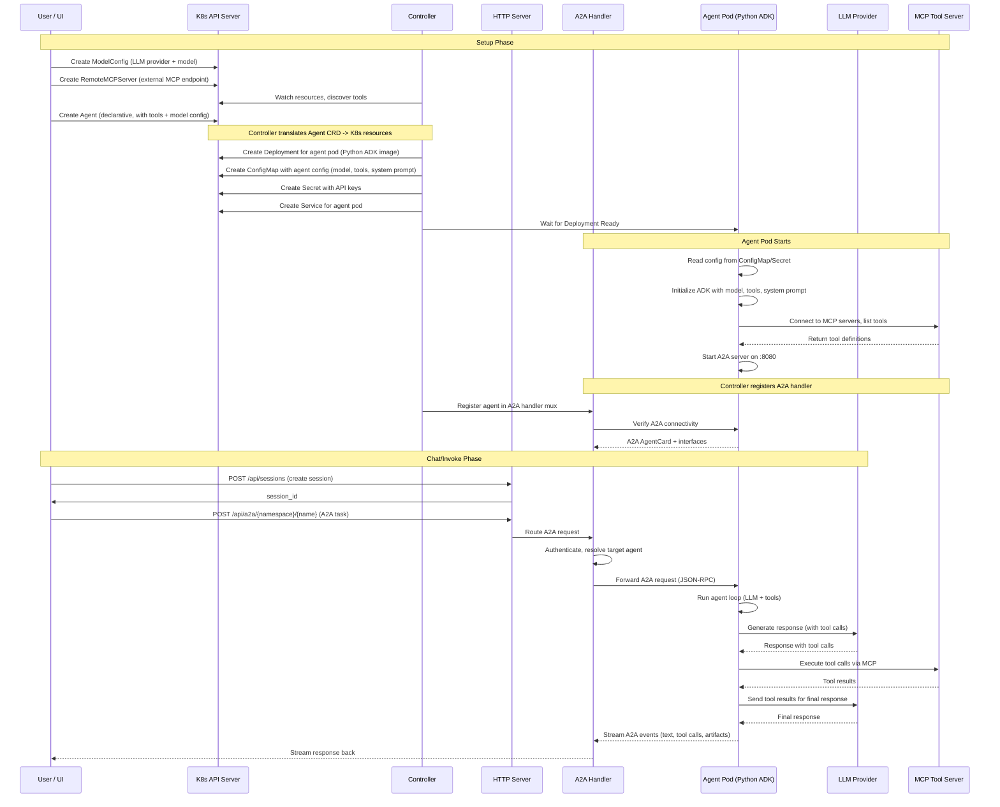

# Kagent Project Research

## 1. What is this project?

**kagent** is a Kubernetes-native framework for building, deploying, and managing AI agents. It is a CNCF (Cloud Native Computing Foundation) project that makes Kubernetes the orchestration layer for agentic AI workloads. The project provides a complete platform -- from declarative CRDs that describe agents, to controllers that materialize them, to runtimes that execute them against LLMs.

- **Module path (Go controller)**: `github.com/kagent-dev/kagent/go`
- **API version**: `v1alpha2` (current), `v1alpha1` (legacy/deprecated)
- **Language**: Go (controller, CLI, ADK), Python (agent runtime, ADK), TypeScript (UI)
- **License**: Apache 2.0
- **Repository**: `https://github.com/kagent-dev/kagent`
- **Latest release**: v0.10.0-beta6 (as of July 2026)
- **CNCF Status**: CNCF project (sandbox/nursery stage)
- **Stars**: Growing (see star history in README)

### Maintainers and Community

The project is developed by a community of contributors with maintainers from various organizations. Key areas of contribution include:
- **Core controller and CRDs** -- kagent-dev core team
- **Python ADK runtime** -- Google ADK integration team
- **UI** -- Community contributors
- **Agent Substrate integration** -- ate-dev team

The project has an active Discord, CNCF Slack channel (#kagent), and regular community meetings.

## 2. Terminology and Core Concepts

| Term | Definition |
|---|---|
| **Agent** | Core CRD. Represents an AI agent with a system prompt, tool set, LLM configuration, and optional skills. Two types: **Declarative** (fully described in the CRD, runs on built-in runtimes) and **BYO** ("bring your own" container image serving the agent over A2A). |
| **Declarative Agent** | An agent whose behavior is fully defined by the Agent resource (system message, model config, tools, skills). The controller deploys the appropriate runtime (Python ADK or Go ADK) and configures it from the spec. |
| **BYO Agent** | An agent backed by a user-provided container image. The controller deploys the image and expects it to serve the Agent-to-Agent (A2A) protocol on port 8080. |
| **ModelConfig** | CRD that describes an LLM provider and model configuration. Supports OpenAI, Anthropic, Azure OpenAI, Ollama, Gemini, Gemini Vertex AI, Anthropic Vertex AI, AWS Bedrock, and SAP AI Core. |
| **RemoteMCPServer** | CRD representing an external MCP (Model Context Protocol) tool server. The controller discovers tools from it and makes them available to agents. |
| **Tool** | A reference within an Agent spec to either an MCP server or another Agent (sub-agent pattern). Agents gain capabilities through tools. |
| **MCPServer** | A CRD from the `kmcp` (kagent MCP) sub-project representing a locally-managed MCP server. Managed via the `kagent mcp` CLI commands. |
| **A2A (Agent-to-Agent)** | Protocol for agent-to-agent communication (based on Google's A2A specification). kagent routes A2A requests between agents through its HTTP server. |
| **ADK (Agent Development Kit)** | The runtime that actually executes agent logic against the LLM. kagent has both a **Python ADK** (based on Google ADK) and a **Go ADK** (native Go implementation). |
| **SandboxAgent** | An agent that runs in an isolated sandbox on Agent Substrate, with configurable outbound network access. |
| **AgentHarness** | A generic remote execution environment (VM-like) provisioned by a backend (OpenClaw or Hermes) on Agent Substrate. Has no agent runtime baked in -- it stays ready to accept incoming commands via SSH or exec. Supports Telegram and Slack channel integrations. |
| **Skills** | Reusable prompt templates and tool sets packaged as container images or Git repositories. Loaded into an agent at startup via the skills-init init container. |
| **Session** | A conversation thread with an agent. Stored in PostgreSQL with event history. |
| **MCP (Model Context Protocol)** | Open protocol for connecting LLMs to external tools. kagent implements both MCP client (agent-side) and MCP server (tool-side). |

### CRD Overview

| CRD | API Group | Scope | Short Name | Purpose |
|---|---|---|---|---|
| Agent | `kagent.dev` | Namespaced | -- | AI agent with system prompt, tools, model config |
| SandboxAgent | `kagent.dev` | Namespaced | -- | Sandboxed AI agent on Agent Substrate |
| AgentHarness | `kagent.dev` | Namespaced | `ahr` | Remote execution environment (VM) for agents |
| ModelConfig | `kagent.dev` | Namespaced | `mc` | LLM provider and model configuration |
| RemoteMCPServer | `kagent.dev` | Namespaced | `rmcps` | External MCP tool server endpoint |
| MCPServer | `kagent.dev` via kmcp | Namespaced | -- | Locally-managed MCP server |
| ModelProviderConfig | `kagent.dev` | Namespaced | -- | Provider-level configuration (API keys, endpoints) |

## 3. Overall Architecture

### High-Level Architecture

```mermaid
flowchart TB
    subgraph UserInteraction["User Interaction"]
        KCLI["kagent CLI\n(Go / TUI)"]
        WEBUI["Web UI\n(Next.js/React)"]
        KUBECTL["kubectl / Helm"]
    end

    subgraph ControllerLayer["Control Plane (Go)"]
        CTRL["Controller Manager\n(controller-runtime)"]
        SUB["HTTP Server\n(:8083 / Gorilla Mux)"]
        A2A_MUX["A2A Handler Mux"]
        MCP_HANDLER["MCP Handler"]
        
        subgraph Reconcilers["Reconcilers"]
            AGT_CTRL["Agent Controller"]
            SB_CTRL["SandboxAgent Controller"]
            MC_CTRL["ModelConfig Controller"]
            RMS_CTRL["RemoteMCPServer Controller"]
            MCP_SRV_CTRL["MCPServer Tool Controller"]
            AH_CTRL["AgentHarness Controller"]
            SVC_CTRL["Service Controller"]
        end
        
        subgraph Translator["ADK API Translator"]
            TRANS_M["Manifest Builder"]
            TRANS_D["Deployment Builder"]
            TRANS_A2A["A2A Agent Card Builder"]
        end
        
        subgraph A2A["A2A Layer"]
            A2A_REG["A2A Registrar\n(K8s Informer-based)"]
            CLIENT_REG["Agent Client Registry"]
            A2A_PASS["Passthrough Request Handler"]
        end
        
        CTRL --> Reconcilers
        AGT_CTRL --> Translator
        A2A_REG --> A2A_MUX
        A2A_MUX --> A2A_PASS
    end

    subgraph DataLayer["Data Layer"]
        DB[("PostgreSQL\n(+ pgvector)")]
        K8S_API["Kubernetes API Server"]
        K8S_ETCD[("etcd")]
    end

    subgraph RuntimeLayer["Agent Runtimes"]
        PY_ADK["Python ADK\n(Google ADK-based)\n:8080"]
        GO_ADK["Go ADK\n:8080"]
        BYO_IMG["BYO Container\n(User Image)\n:8080"]
    end

    subgraph ToolsLayer["Tool Ecosystem"]
        MCP_TOOLS["MCP Servers\n(istio, k8s, helm,\nargo, prometheus,\ngrafana, cilium, etc.)"]
        AGENT_TOOLS["Sub-Agent Tools\n(A2A protocol)"]
        REMOTE_MCP["Remote MCP Servers\n(External)"]
    end

    subgraph SandboxLayer["Sandbox Execution"]
        SUBSTRATE["Agent Substrate\n(ate.dev)"]
        OPENCLAW["OpenClaw Backend"]
        HERMES["Hermes Backend"]
    end

    KCLI -->|"kagent agent/chat"| SUB
    KCLI -->|"kagent mcp"| K8S_API
    WEBUI -->|"HTTP REST"| SUB
    KUBECTL -->|"CRDs"| K8S_API

    K8S_API -->|"watch/reconcile"| CTRL
    CTRL -->|"create Deployments, Services, Secrets"| K8S_API
    
    SUB -->|"REST API"| DB
    SUB -->|"LLM config, tool discovery"| K8S_API
    
    A2A_REG -->|"watch Agent CRDs"| K8S_API
    A2A_MUX -->|"proxy A2A requests"| RuntimeLayer
    A2A_MUX -->|"proxy A2A requests"| Agent_TOOLS
    
    SUB -->|"session/task persistence"| DB
    SUB -->|"memory search (pgvector)"| DB
    
    PY_ADK -->|"MCP client"| MCP_TOOLS
    PY_ADK -->|"MCP client"| REMOTE_MCP
    GO_ADK -->|"MCP client"| MCP_TOOLS
    GO_ADK -->|"MCP client"| REMOTE_MCP
    
    RuntimeLayer -->|"A2A"| AGENT_TOOLS
    
    SUBSTRATE -->|"sandbox VMs"| SB_CTRL
    SUBSTRATE -->|"harness VMs"| AH_CTRL
    OPENCLAW -->|"sandbox backend"| SUBSTRATE
    HERMES -->|"sandbox backend"| SUBSTRATE
```



### Component Interactions - Request Flow



## 4. Core Algorithm: Controller Reconciliation Loop

The heart of kagent is the **Kubernetes controller reconciliation loop**. When a user creates or updates an Agent CRD, the controller translates it into running Kubernetes resources (Deployments, ConfigMaps, Secrets, Services) that run the agent.

```pseudocode
FUNCTION ReconcileAgent(agent):
    // 1. VALIDATE the agent spec
    accepted = ValidateAgentSpec(agent)
    IF NOT accepted:
        SetCondition(agent, "Accepted", False)
        RETURN error  // Requeue with backoff
    SetCondition(agent, "Accepted", True)

    // 2. TRANSLATE agent CRD to Kubernetes manifests
    //    The AdkApiTranslator is the core translation engine
    config, card = BuildAgentConfig(agent)  // system message, tools, model config
    deployment = ResolveDeployment(agent)   // image, resources, env, volumes
    manifest = BuildManifest(agent, config, deployment)
    //    - Creates ConfigMap with serialized agent configuration
    //    - Creates Secret for API keys (from ModelConfig references)
    //    - Creates Deployment for the agent pod
    //    - Creates Service for pod discovery
    //    - Creates ServiceAccount (optional)
    //    - Creates ConfigMap for skills-init (if skills configured)

    // 3. APPLY manifests to Kubernetes (create or update)
    FOR EACH resource IN manifest.resources:
        ApplyResource(resource)  // Create or update on the K8s API

    // 4. REGISTER in A2A handler mux (for agent-to-agent communication)
    //    The A2ARegistrar watches Agent CRDs via Kubernetes informers
    //    and maintains an in-memory map of agent handlers
    handler = CreateA2AHandler(agent, client)
    a2aRegistrar.Register(agent.namespace/agent.name, handler)

    // 5. UPDATE status
    CheckDeploymentReady(agent)
    IF deployment.Ready:
        SetCondition(agent, "Ready", "DeploymentReady")
    ELSE:
        SetCondition(agent, "Ready", False)

    RETURN success  // No requeue (watch handles updates)
```

### Detailed Component Data Flow

```pseudocode
FUNCTION BuildManifest(agent, inputs):
    // The AdkApiTranslator.BuildManifest is the central translation function
    
    // 1. Build agent configuration secret
    agentConfig = BuildAgentConfig(agent, inputs)
    //    - Serializes model config, tools, system message, memory config
    //    - Resolves secret references for API keys
    //    - Builds A2A agent card for inter-agent discovery
    
    // 2. Build deployment spec
    deployment = ResolveDeployment(agent, inputs)
    //    - Merges SharedDeploymentSpec (volumes, env, resources, labels)
    //    - Resolves image references (python ADK or go ADK)
    //    - Configures port (8080 for A2A)
    
    // 3. Build skills init config (if skills configured)
    IF agent.Spec.Skills IS NOT NULL:
        skillsConfig = BuildSkillsConfig(agent.Spec.Skills)
        //    - Pulls skill images via krane (container image fetcher)
        //    - Clones git repos for git-based skills
        //    - Mounts skills into /skills directory
    
    // 4. Build complete manifest
    manifest = {
        configSecret: CreateConfigSecret(agentConfig),
        deployment: CreateDeployment(agent, deployment, configSecret),
        service: CreateService(agent),
        configMap: skillsConfig (if skills),
        serviceAccount: CreateServiceAccount(agent)
    }
    
    // 5. Set config hash annotation for rollout detection
    configHash = Hash(agentConfig.serialized)
    manifest.deployment.Annotations["kagent.dev/config-hash"] = configHash
    
    RETURN manifest
```

## 5. Components in Detail

### 5.1 Controller Component (Go)

The controller is the heart of the system, built on `sigs.k8s.io/controller-runtime`. It runs as a Deployment in the `kagent` namespace.

**Key Controllers:**

- **AgentController** -- Watches Agent CRDs, translates them into Deployments, Services, ConfigMaps, and Secrets. Uses the AdkApiTranslator to convert the high-level agent spec (system message, tools, model config) into low-level K8s resources. Also watches related resources (ModelConfig, RemoteMCPServer, ConfigMaps) for changes that trigger re-reconciliation.

- **SandboxAgentController** -- Manages SandboxAgent CRDs. Similar to AgentController but creates Substrate Actors instead of standard K8s Deployments.

- **AgentHarnessController** -- Provisions remote execution environments on Agent Substrate (OpenClaw/Hermes backends). Creates WorkerPools, ActorTemplates, and Actors.

- **ModelConfigController** -- Watches ModelConfig CRDs, validates them, and reconciles their status.

- **RemoteMCPServerController** -- Connects to external MCP servers, discovers their tools, and updates the RemoteMCPServer status with discovered tool listings.

- **MCPServerToolController** -- Watches MCPServer CRDs (from kmcp) and mirrors their tool definitions for agent consumption.

- **ServiceController** -- Manages aggregation of Service endpoints for MCP tool discovery.

**Reconciler** (`go/core/internal/controller/reconciler/reconciler.go`):

The `KagentReconciler` interface defines the core reconciliation methods:
- `ReconcileKagentAgent()` -- The primary reconciliation logic for Agent CRDs
- `ReconcileKagentSandboxAgent()` -- For sandboxed agents
- `ReconcileKagentModelConfig()` -- For LLM model configurations
- `ReconcileKagentRemoteMCPServer()` -- For external MCP tool servers
- `ReconcileKagentMCPService()` -- For internal MCP services
- `ReconcileKagentMCPServer()` -- For kmcp-managed MCP servers
- `ReconcileKagentModelProviderConfig()` -- For provider-level configuration

### 5.2 HTTP Server (Go)

The HTTP server (`go/core/internal/httpserver/server.go`) runs on `:8083` and provides:
- **REST API** for UI and CLI interaction (agents, sessions, tools, model configs, memories, feedback, etc.)
- **A2A endpoint** (`/api/a2a/{namespace}/{name}`) -- routes agent-to-agent requests to the correct agent handler
- **MCP endpoint** (`/mcp`) -- serves MCP protocol for tool connectivity
- **Session management** -- CRUD operations with PostgreSQL persistence
- **Memory management** -- Long-term memory with pgvector similarity search

### 5.3 A2A Handler Layer (Go)

The A2A layer handles inter-agent communication:

- **A2ARegistrar** (`a2a_registrar.go`) -- Uses Kubernetes informers to watch Agent and SandboxAgent CRDs. When an agent changes, it registers/updates/removes the corresponding A2A handler in the handler mux.

- **A2AHandlerMux** (`a2a_handler_mux.go`) -- An in-memory HTTP handler map keyed by `namespace/name`. Routes incoming A2A requests to the correct agent's handler. Supports both legacy A2A 0.3 (JSON-RPC) and A2A 1.0 (JSON-RPC) wire protocols.

- **PassthroughRequestHandler** (`passthrough_handler.go`) -- Forwards A2A requests from the controller to the actual agent pod by making A2A client calls.

- **AgentClientRegistry** (`agent_client_registry.go`) -- Maintains a registry of A2A clients pointing to running agent pods.

### 5.4 ADK API Translator (Go)

The translator (`go/core/internal/controller/translator/agent/`) converts the declarative Agent CRD spec into concrete K8s manifests:

- **adk_api_translator.go** -- Main entry point. Orchestrates the translation of Agent CRD -> K8s resources.
- **manifest_builder.go** -- Builds the complete set of Kubernetes manifests (ConfigMap, Secret, Deployment, Service).
- **deployments.go** -- Resolves deployment configuration (image, resources, env, volumes, security context).
- **compiler.go** -- Compiles the agent configuration into a serialized format consumed by the ADK runtime.
- **template.go** -- Handles Go text/template processing for system messages with include functions.

### 5.5 ADK Runtimes

**Python ADK** (`python/packages/kagent-adk/`):
Based on Google's ADK (google.adk). Runs as a container serving A2A on port 8080. Key files:
- `_agent_executor.py` -- Custom A2A agent executor that bridges Google ADK's internal agent loop with kagent's A2A protocol.
- `_config_materialize.py` -- Reads agent configuration from environment variables (set by the controller).
- `_mcp_toolset.py` -- Connects to MCP servers and exposes their tools to the ADK agent.
- `_session_service.py` -- Session persistence via kagent's REST API.
- `_memory_service.py` -- Long-term memory via pgvector embeddings.
- `converters/` -- Converts between A2A wire format and Google ADK internal types.
- `models/` -- Provider-specific model clients (Anthropic, OpenAI, Bedrock, Gemini, Ollama, SAP AI Core).
- `tools/` -- Built-in tools (bash, file operations, ask_user, memory, skills, share).

**Go ADK** (`go/adk/`):
A native Go implementation of the agent runtime. Provides:
- A2A server implementation
- Session and task store integration with kagent's HTTP API
- Model provider clients
- MCP tool connectivity

### 5.6 MCP Tool Ecosystem

kagent ships with pre-built MCP tool servers for common cloud-native infrastructure:
- **Kubernetes** -- Pod, deployment, service, configmap management
- **Istio** -- Virtual services, destination rules, authorization policies
- **Helm** -- Chart management, releases
- **Argo Rollouts** -- Rollout management
- **Cilium** -- Network policies, endpoints
- **Grafana** -- Dashboard, datasource management (via grafana-mcp)
- **Observability** -- Monitoring and alerting tools
- **PromQL** -- Prometheus query execution

These are packaged as Helm charts under `helm/tools/` and `helm/agents/`.

### 5.7 CLI (Go)

The CLI (`go/core/cli/`) provides:
- `kagent agent init` -- Scaffold new agent projects using templates
- `kagent agent build` -- Build agent container images
- `kagent agent deploy` -- Deploy agents to Kubernetes
- `kagent agent chat` -- Interactive TUI chat with agents (bubbletea-based)
- `kagent agent invoke` -- One-shot agent invocation
- `kagent agent get` -- List deployed agents
- `kagent mcp init/build/deploy/run` -- MCP server management
- `kagent mcp add-tool` -- Add tools to MCP servers
- `kagent dashboard` -- Open the web UI

### 5.8 Web UI (TypeScript/Next.js)

The UI (`ui/`) is a Next.js application with:
- Agent management (create, view, edit, delete)
- Chat interface for interacting with agents
- Session management (view history, share sessions)
- Model configuration management
- MCP tool server management
- Memory and feedback browsing

### 5.9 Database Layer (Go + PostgreSQL)

The database layer (`go/core/internal/database/`) uses PostgreSQL with:
- **pgx** driver with connection pooling
- **sqlc** for type-safe query generation
- **pgvector** extension for vector similarity search (long-term memory)
- **golang-migrate** for schema migrations
- Full text search support
- LangGraph checkpoint storage for agent state persistence

### 5.10 Sandbox Execution (Agent Substrate)

For sandboxed execution, kagent integrates with **Agent Substrate** (`agent-substrate/substrate`), a project that provides isolated execution environments:
- **SandboxAgent** -- Runs declarative agents in sandboxed environments with configurable outbound network access
- **AgentHarness** -- Provisions remote execution VMs (OpenClaw or Hermes backends) for agents with channel integrations (Telegram, Slack)
- **Substrate Client** (`go/core/pkg/sandboxbackend/substrate/`) -- gRPC client for the Substrate ate-api control plane
- **Worker Pools** -- Pre-provisioned capacity for sandbox execution

## 6. Key Dependencies and Frameworks

### Go Dependencies
| Dependency | Purpose |
|---|---|
| `sigs.k8s.io/controller-runtime` | Kubernetes controller framework |
| `k8s.io/client-go`, `k8s.io/api`, `k8s.io/apimachinery` | Kubernetes client and types |
| `github.com/gorilla/mux` | HTTP routing |
| `github.com/gorilla/websocket` | WebSocket support |
| `github.com/jackc/pgx/v5` | PostgreSQL driver |
| `github.com/pgvector/pgvector-go` | Vector similarity search |
| `github.com/golang-migrate/migrate/v4` | Database migrations |
| `github.com/spf13/cobra` | CLI framework |
| `github.com/spf13/viper` | Configuration management |
| `github.com/charmbracelet/bubbletea` | TUI framework (CLI chat) |
| `github.com/modelcontextprotocol/go-sdk` | MCP SDK |
| `github.com/a2aproject/a2a-go/v2` | A2A protocol SDK |
| `github.com/anthropics/anthropic-sdk-go` | Anthropic API client |
| `github.com/openai/openai-go/v3` | OpenAI API client |
| `github.com/ollama/ollama` | Ollama API client |
| `github.com/aws/aws-sdk-go-v2` | AWS SDK (Bedrock) |
| `google.golang.org/adk` | Google ADK Go bindings |
| `go.opentelemetry.io/otel` | OpenTelemetry tracing |
| `github.com/prometheus/client_golang` | Metrics |
| `github.com/google/go-containerregistry` | Container image handling (skills) |
| `github.com/kagent-dev/kmcp` | kagent MCP server sub-project |
| `github.com/agent-substrate/substrate` | Agent Substrate integration |

### Python Dependencies
| Dependency | Purpose |
|---|---|
| `google.adk` | Google Agent Development Kit |
| `a2a` | A2A protocol (Google's a2a package) |
| `kagent-core` | Shared kagent Python core |
| `agentsts-adk` | STS token propagation |
| `pydantic` | Data validation |
| `typer` | CLI framework |
| `uvicorn` | ASGI server |

### TypeScript/UI Dependencies
| Dependency | Purpose |
|---|---|
| Next.js | React framework |
| React | UI library |
| Tailwind CSS | Styling |

## 7. Repository Structure

```
kagent/
├── go/                          # Go workspace
│   ├── api/                     # Shared types
│   │   ├── v1alpha1/            # Legacy CRD types (deprecated)
│   │   ├── v1alpha2/            # Current CRD types
│   │   ├── adk/                 # ADK API types
│   │   ├── client/              # HTTP API client
│   │   ├── config/              # CRD configuration generation
│   │   ├── database/            # Database interface definition
│   │   ├── httpapi/             # HTTP API types
│   │   └── utils/               # Shared utilities
│   ├── core/                    # Controller, HTTP server, CLI
│   │   ├── cmd/
│   │   │   ├── controller/      # Controller main entrypoint
│   │   │   ├── acp-shim/        # Anthropic ACP sandbox shim
│   │   │   └── skills-init/     # Skills init container
│   │   ├── internal/
│   │   │   ├── a2a/             # A2A handler implementations
│   │   │   ├── controller/      # K8s controllers + reconcilers + translator
│   │   │   ├── database/        # PostgreSQL implementation
│   │   │   ├── httpserver/      # HTTP server + handlers
│   │   │   ├── mcp/             # MCP endpoint handler
│   │   │   ├── metrics/         # Prometheus metrics
│   │   │   ├── skillsinit/      # Skills init logic
│   │   │   ├── telemetry/       # OpenTelemetry
│   │   │   └── utils/           # Internal utilities
│   │   ├── cli/                 # CLI tool (kagent)
│   │   │   ├── cmd/kagent/      # CLI main entrypoint
│   │   │   ├── internal/cli/    # CLI command implementations
│   │   │   └── internal/tui/    # Terminal UI (bubbletea)
│   │   ├── pkg/                 # Shared packages
│   │   │   ├── app/             # App bootstrap
│   │   │   ├── auth/            # Authentication
│   │   │   ├── sandboxbackend/  # Substrate integration
│   │   │   └── translator/      # CRD-to-manifest translation helpers
│   │   └── test/                # E2E tests
│   └── adk/                     # Go ADK runtime
│       ├── cmd/                 # ADK CLI
│       ├── examples/            # Example agents
│       └── pkg/                 # ADK packages (a2a, agent, config, mcp, etc.)
├── python/                      # Python workspace
│   ├── packages/
│   │   ├── kagent-adk/          # Python ADK runtime (Google ADK-based)
│   │   ├── kagent-core/         # Shared Python core (A2A types, tracing)
│   │   ├── kagent-openai/       # OpenAI Agents SDK integration
│   │   ├── kagent-langgraph/    # LangGraph integration
│   │   ├── kagent-crewai/       # CrewAI integration
│   │   ├── kagent-skills/       # Skills framework
│   │   ├── agentsts-core/       # STS token propagation core
│   │   └── agentsts-adk/        # STS ADK integration
│   └── samples/                 # Example agents
│       ├── adk/                 # ADK samples
│       ├── langgraph/           # LangGraph samples
│       ├── crewai/              # CrewAI samples
│       └── openai/              # OpenAI Agents SDK samples
├── ui/                          # Next.js web UI
│   └── src/
│       ├── app/                 # Next.js pages
│       └── components/          # React components
├── helm/                        # Kubernetes Helm charts
│   ├── kagent-crds/             # CRD installation chart
│   ├── kagent/                  # Main application chart
│   ├── agents/                  # Pre-built agent Helm charts
│   ├── tools/                   # MCP tool server Helm charts
│   └── files/                   # Static files for Helm
├── docker/                      # Dockerfiles
├── design/                      # Design documents (EPs)
├── docs/                        # Architecture documentation
├── examples/                    # Usage examples
├── img/                         # Images (architecture diagrams, screenshots)
├── scripts/                     # Build and utility scripts
├── contrib/                     # Community contributions
└── .github/                     # CI/CD workflows
```

## 8. User Experience

### How Users Interact with kagent

A typical user workflow follows these patterns:

**1. Declarative Agent Setup (infrastructure engineer)**:
```yaml
apiVersion: kagent.dev/v1alpha2
kind: ModelConfig
metadata:
  name: my-model
spec:
  provider: Anthropic
  model: claude-sonnet-4-20250514
  anthropic:
    maxTokens: 8192
---
apiVersion: kagent.dev/v1alpha2
kind: Agent
metadata:
  name: my-k8s-agent
spec:
  type: Declarative
  declarative:
    runtime: python
    systemMessage: "You are a Kubernetes expert..."
    modelConfig: my-model
    tools:
    - type: McpServer
      mcpServer:
        name: k8s-tools
```

Applied with `kubectl apply -f agent.yaml`. The controller translates this into a running agent pod.

**2. Chat with agent (operator/developer)**:
- Via UI at `http://kagent-ui:8080`
- Via CLI: `kagent agent chat my-k8s-agent`
- Via API: POST to `/api/a2a/{namespace}/{name}` with A2A task messages

**3. BYO agent (advanced developer)**:
Build a custom agent image serving the A2A protocol, then define it as:
```yaml
apiVersion: kagent.dev/v1alpha2
kind: Agent
metadata:
  name: my-custom-agent
spec:
  type: BYO
  byo:
    deployment:
      image: myregistry/my-agent:latest
```

**4. MCP tool management**:
- Scaffold: `kagent mcp init --language go --directory my-tools`
- Build: `kagent mcp build`
- Deploy: `kagent mcp deploy`
- Use existing tools: Install Helm charts for pre-built tool servers (k8s, istio, prometheus, etc.)

### Key User Benefits

- **Kubernetes-native**: Manage AI agents with familiar `kubectl` workflows, GitOps, RBAC, and namespacing
- **Multi-provider**: Use any major LLM provider (OpenAI, Anthropic, Bedrock, Gemini, Ollama, etc.)
- **MCP ecosystem**: Connect to the growing MCP tool ecosystem for accessing databases, APIs, infrastructure
- **Inter-agent communication**: Agents can call other agents via the A2A protocol
- **Observability**: Built-in OpenTelemetry tracing, Prometheus metrics
- **Extensible**: BYO agents, custom tools, multi-framework support (ADK, LangGraph, CrewAI, OpenAI Agents SDK)
- **Declarative**: GitOps-friendly YAML definitions for all agent configurations

## 9. Current Repository State

### Git Status (main branch)

- **Default branch**: `main`
- **Upstream**: `git@github.com:kagent-dev/kagent.git`
- **Latest release**: v0.10.0-beta6
- **Active branches**: main, release/v0.7.x, release/v0.8.x, release/v0.9.x, several feature branches

### Recent commit themes (from top ~30):
- Helm and deployment improvements (UI HTTPRoute, nodeSelector, deployment annotations)
- Sandbox agent enhancements (session state persistence, actor readiness gating)
- ADK fixes and version bumps (Google ADK, Anthropic SDK)
- Database reliability (Postgres deadlock fix for concurrent memory searches)
- CI/CD updates (dependency bumps, release workflow fixes)
- Documentation improvements

### Build System

- **Makefile** at root with comprehensive targets for:
  - `make create-kind-cluster` -- Local dev cluster
  - `make helm-install` -- Full deployment
  - `make build` -- Build all components
  - `make test` -- Run all tests
  - `make -C go e2e` -- E2E tests
- Docker Buildx multi-architecture builds (amd64, arm64)
- GitHub Actions CI pipeline
- Helm chart distribution via OCI registry

## 10. Design Philosophy and Industry Context

### Origin and Motivation

kagent's origin is the observation that Kubernetes has become the standard orchestration layer for cloud-native workloads, but AI agents lacked a similar standardized platform. The project aims to fill this gap by providing:

1. **Kubernetes-native agent management** -- CRDs, controllers, and reconcilers in the Kubernetes ecosystem
2. **Declarative agent configuration** -- YAML-defined agents that fit into GitOps workflows
3. **Tool ecosystem** -- MCP protocol for connecting agents to infrastructure tools
4. **Multi-runtime support** -- Python ADK (Google), Go ADK, LangGraph, CrewAI, OpenAI Agents SDK

### Industry Standing

- **CNCF project** -- Part of the Cloud Native Computing Foundation ecosystem
- **Active community** -- Discord, CNCF Slack, community meetings, regular releases
- **Rapid development** -- Alpha stage with frequent releases (v0.10.0-beta series)
- **Ecosystem integrations** -- Google ADK, A2A protocol, MCP protocol, OpenTelemetry, Agent Substrate

### Relationship to Other Projects

- **kmcp** (`github.com/kagent-dev/kmcp`) -- Sub-project providing MCPServer CRD for local MCP server management
- **Agent Substrate** (`github.com/agent-substrate/substrate`) -- Sandbox execution environment for isolated agent runtimes
- **A2A Protocol** (Google) -- Standard protocol for agent-to-agent communication
- **MCP Protocol** (Anthropic) -- Standard protocol for LLM-to-tool connectivity
