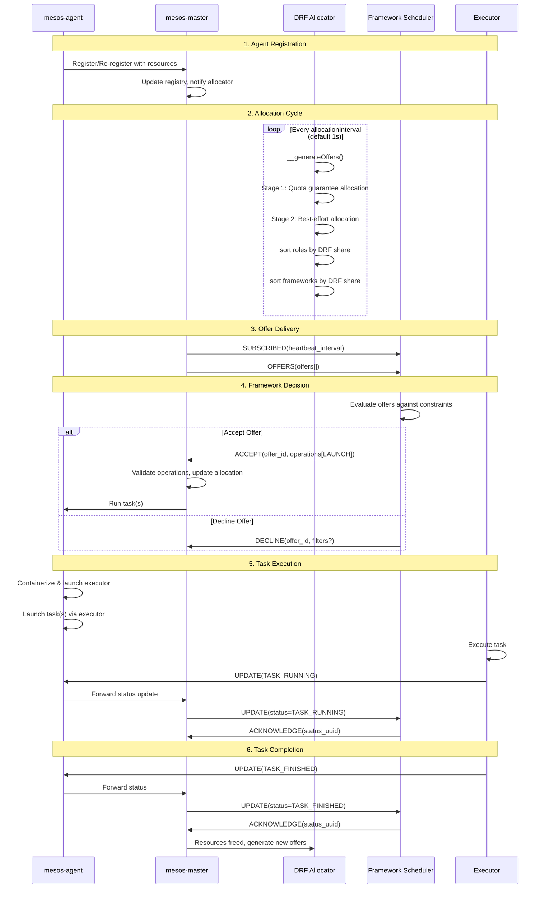
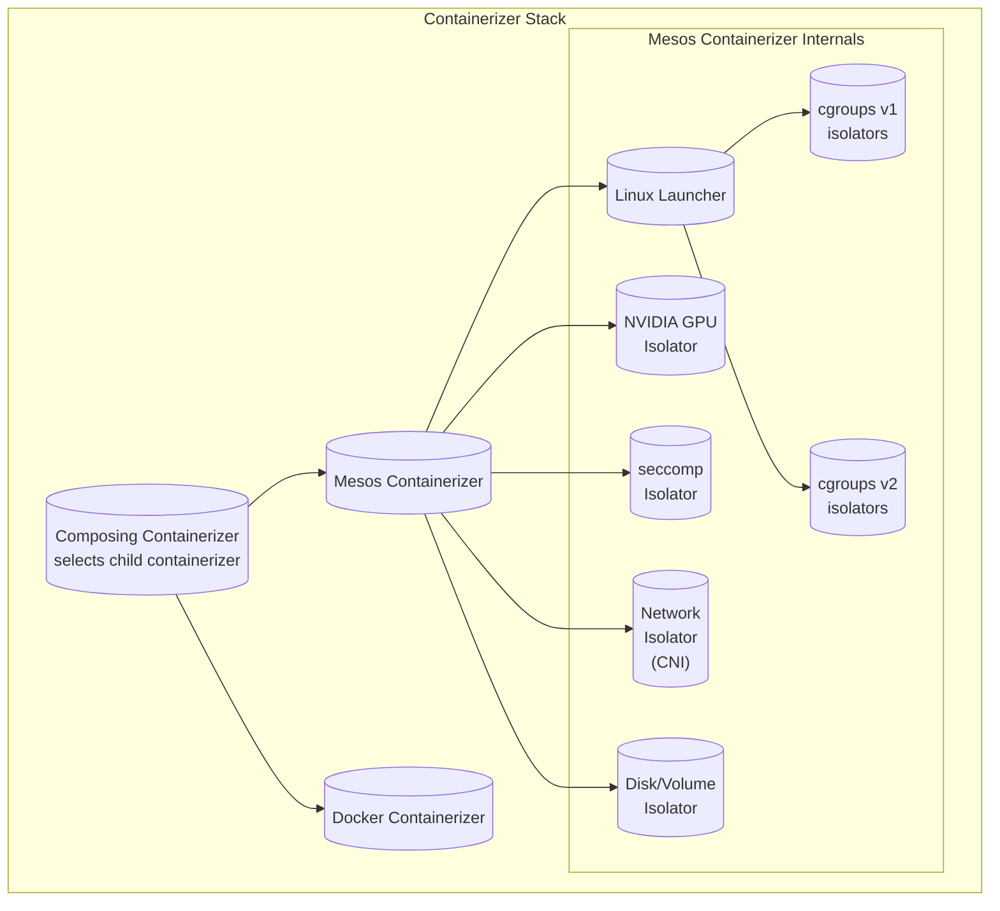

# Apache Mesos Project Research

## 1. What is this project?

**Apache Mesos** is a distributed systems kernel -- a cluster manager that abstracts CPU, memory, storage, and other compute resources across a pool of machines into a single unified resource pool. It provides efficient resource isolation and sharing across distributed applications (called "frameworks"), enabling multiple workload types (e.g., Hadoop, Spark, Jenkins, Aurora, Marathon) to run on a dynamically shared cluster with high utilization.

The key innovation of Mesos is its **two-level scheduling** model: the Mesos master decides _how many_ resources to offer to each framework using a pluggable allocation policy, while each framework's scheduler decides _which_ resources to accept and which tasks to run on them. This thin interface allows Mesos to scale to thousands of nodes while keeping framework evolution independent.

- **Current version:** 1.12.0 (from CMakeLists.txt: `MESOS_MAJOR_VERSION=1`, `MINOR=12`, `PATCH=0`)
- **License:** Apache License 2.0
- **Language:** C++ (primary, with Java, Python, Go bindings for frameworks)
- **Home page:** https://mesos.apache.org
- **Maintainer:** Apache Software Foundation (community-driven, top-level Apache project)
- **Repository:** https://github.com/apache/mesos
- **Academic origin:** Originally developed at UC Berkeley (NSDI 2011 paper: "Mesos: A Platform for Fine-Grained Resource Sharing in the Data Center")

### What Mesos is NOT

Mesos is not a scheduler itself -- it is a resource manager that delegates scheduling decisions to individual application frameworks. This distinguishes it from monolithic schedulers like Slurm (primarily HPC-oriented) or Kubernetes (container-orchestration with built-in scheduling).

---

## 2. High-Level Architecture

### Top-Level Directory Layout

| Directory | Purpose |
|---|---|
| `src/` | **All source code** -- master, agent, scheduler, executor, allocator, containerizer, tests |
| `include/` | **Public C++ API headers** and protobuf definitions (`mesos/mesos.proto` is the core data model) |
| `docs/` | Documentation in Markdown format (~150 docs on architecture, configuration, APIs, development) |
| `3rdparty/` | Bundled third-party dependencies (libprocess, stout, protobuf, boost, glog, leveldb, libev, http-parser, etc.) |
| `cmake/` | CMake build infrastructure |
| `m4/` | Autotools macros (autoconf) |
| `site/` | Mesos website source (Jekyll-based) |
| `support/` | Release and CI support scripts |

### Source Directory Layout (`src/`)

| Package | Path | Purpose |
|---|---|---|
| **master** | `src/master/` | Master daemon implementation: cluster state, framework/agent management, HTTP API, registrar, quota, maintenance |
| **slave** (agent) | `src/slave/` | Agent daemon: task execution, container management, health monitoring, GC, resource monitoring |
| **sched** | `src/sched/` | Scheduler driver (the old C++ API -- connects scheduler to master) |
| **scheduler** | `src/scheduler/` | v1 HTTP Scheduler API implementation |
| **exec** | `src/exec/` | Executor driver (old C++ API -- connects executor to agent) |
| **executor** | `src/executor/` | v1 HTTP Executor API implementation |
| **allocator** | `src/master/allocator/mesos/` | Hierarchical DRF allocator (pluggable, modules-based) |
| **containerizer** | `src/slave/containerizer/` | Container isolation: Mesos containerizer, Docker containerizer, composing containerizer |
| **messages** | `src/messages/` | Internal protocol buffer messages for master-agent, master-scheduler communication |
| **tests** | `src/tests/` | Comprehensive test suite (unit, integration, cluster tests) |
| **linux** | `src/linux/` | Linux-specific features: cgroups (v1 and v2), namespaces, perf, NVML GPU isolation, seccomp |
| **posix** | `src/posix/` | POSIX-specific process isolation |
| **authentication** | `src/authentication/` | SASL-based and HTTP authentication |
| **authorizer** | `src/authorizer/` | Access control lists (ACLs) and authorization |
| **hook** | `src/hook/` | Hook module system for extending Mesos |
| **module** | `src/module/` | Module loading infrastructure |
| **uri** | `src/uri/` | URI fetching and parsing (used for artifact download) |
| **log** | `src/log/` | Replicated log implementation (used for registry durability) |
| **state** | `src/state/` | State storage abstractions (in-memory, LevelDB, ZooKeeper-backed log) |
| **zookeeper** | `src/zookeeper/` | ZooKeeper integration for leader election and group membership |
| **resource_provider** | `src/resource_provider/` | CSI-based external resource providers (storage, GPU) |
| **checks** | `src/checks/` | Health and readiness checking for tasks |
| **v1** | `src/v1/` | v1 HTTP API protocol buffers (scheduler, executor, agent, master, resource provider) |
| **webui** | `src/webui/` | Master web UI (AngularJS-based) |

### Key Binaries and Daemons

| Binary | Source | Purpose |
|---|---|---|
| **mesos-master** | `src/master/main.cpp` | Master daemon -- manages agents, frameworks, and resource allocation. Default port 5050. |
| **mesos-agent** | `src/slave/main.cpp` | Agent daemon -- runs on each cluster node, launches and monitors executors/tasks. Default port 5051. |
| **mesos-local** | `src/local/local.cpp` | Single-machine Mesos cluster for development/testing (runs master+agent in one process) |
| **mesos-execute** | `src/cli/execute.cpp` | CLI command to run a task directly |
| **GLOG log libs** | `src/log/` | Replicated log library (used for registry persistence) |

### API Versions

Mesos provides two API generations:

1. **Scheduler/Executor Driver API (deprecated, v0)** -- Native C++ `MesosSchedulerDriver`/`MesosExecutorDriver` classes, using PID-based libprocess communication. Python and Java bindings wrap these drivers.

2. **v1 HTTP API (current)** -- Pure HTTP/JSON or HTTP/Protocol Buffers API. Frameworks connect via HTTP long-polling or streaming. Defined in `include/mesos/v1/` protobuf files:
   - `mesos/v1/scheduler/scheduler.proto` -- Scheduler Call/Event types
   - `mesos/v1/executor/executor.proto` -- Executor Call/Event types
   - `mesos/v1/agent/agent.proto` -- Agent API
   - `mesos/v1/master/master.proto` -- Master API
   - `mesos/v1/resource_provider/resource_provider.proto` -- Resource Provider API

### Plugin and Module System

Mesos uses a **loadable module system** for extensibility. Modules are shared objects (`.so`) loaded at runtime. Plugable interfaces include:

| Module Type | Purpose |
|---|---|
| **Allocator** | Resource allocation policy (default: Hierarchical DRF) |
| **Isolator** | Resource isolation for containers (cgroups, Docker, disk/volume) |
| **Containerizer** | Container runtime (Mesos, Docker, composing) |
| **Authenticator** | Authentication mechanism (SASL, HTTP Basic, JWT) |
| **Authorizer** | ACL-based authorization |
| **Hook** | Lifecycle hooks for extending master/agent behavior |
| **QoS Controller** | Quality-of-service enforcement for oversubscription |
| **Resource Estimator** | Estimating available resources for oversubscription |
| **Master Contender/Detector** | Leader election (ZooKeeper, standalone) |
| **Anonymous** | Sidecar modules without a specific interface |
| **Disk Profile Adaptor** | CSI storage profile management |

Modules are loaded via the `--modules` flag (JSON configuration) or `--modules_dir` flag (directory of module JSON files).

---

## 3. Main Entry Points and Core Abstractions

### Core Data Model (defined in `include/mesos/mesos.proto`, 4073 lines)

The entire Mesos universe is defined by Protocol Buffer messages:

| Message | Purpose |
|---|---|
| `FrameworkInfo` | Describes a framework: user, name, roles, capabilities, failover timeout, offer filters |
| `FrameworkID` | Unique framework identifier assigned by master |
| `MasterInfo` | Master identity: id, IP, port, version, domain |
| `SlaveInfo` (AgentInfo) | Agent identity: hostname, resources, attributes, capabilities |
| `SlaveID` (AgentID) | Unique agent identifier |
| `Resource` | A resource on a machine: name, type (SCALAR/RANGES/SET), value, role reservation, disk info |
| `Offer` | A set of resources on an agent offered to a framework |
| `InverseOffer` | A request to reclaim resources from a framework (for maintenance) |
| `TaskInfo` | Task description: name, id, slave, resources, executor, command, container, health check |
| `TaskStatus` | Status update from executor to scheduler: state, data, message, reason, source |
| `ExecutorInfo` | Executor description: type (DEFAULT/CUSTOM), command, resources, container |
| `CommandInfo` | Command to run: shell bool, value, arguments, URIs, environment, user |
| `ContainerInfo` | Container configuration: Mesos or Docker, volumes, network info |
| `HealthCheck` | Health check specification (HTTP, TCP, Command) |
| `TaskGroupInfo` | Group of tasks atomically delivered to an executor |
| `ResourceProviderInfo` | External resource provider (e.g., CSI storage) |
| `OfferFilters` / `OfferConstraints` | Per-role filtering of which agents/resources to offer |

**Task states** (the task lifecycle in `TaskState` enum):
```
TASK_STAGING -> TASK_STARTING -> TASK_RUNNING -> TASK_FINISHED
                                                     TASK_FAILED
                                                     TASK_KILLED
                                                     TASK_ERROR
                          (on agent loss) -> TASK_LOST / TASK_UNREACHABLE
                                              TASK_DROPPED / TASK_GONE / TASK_UNKNOWN
```

### Two-Level Scheduling Model

The fundamental Mesos concept:

```
                     +-----------+
                     |  Master   |
                     |           |
                     | Allocator |
                     +-----+-----+
                           |
            +--------------+--------------+
            |  resource offers            |  framework
            v                              v
     +-------------+              +------------------+
     | Framework 1 |              |   Framework 2    |
     | Scheduler   |              |   Scheduler      |
     +------+------+              +--------+---------+
            |                              |
            | accepts offer, sends tasks    |
            v                              v
     +--------------------------------------------------+
     | Agent 1 (Node)          Agent 2 (Node)            |
     | Executor + tasks        Executor + tasks           |
     +--------------------------------------------------+
```

1. The **master** runs a pluggable **allocator** that decides how to distribute cluster resources.
2. The allocator generates **resource offers** -- bundles of resources (CPU, RAM, disk, etc.) from specific agents -- and pushes them to framework schedulers.
3. Each **framework scheduler** can accept or reject offers. Accepted offers result in tasks being launched on agents.
4. **Agents** run **executors** that manage individual tasks. Tasks send status updates back through the agent to the master.

### Scheduler API (v1 HTTP)

**Events (master -> scheduler):**
- `SUBSCRIBED` -- Initial subscription confirmation with `FrameworkID`
- `OFFERS` -- New resource offers
- `INVERSE_OFFERS` -- Resources requested back (maintenance)
- `RESCIND` / `RESCIND_INVERSE_OFFER` -- Offer revocation
- `UPDATE` -- Task status update
- `UPDATE_OPERATION_STATUS` -- Operation status update (experimental)
- `MESSAGE` -- Custom executor message
- `FAILURE` -- Agent or executor failure
- `ERROR` -- Unrecoverable error
- `HEARTBEAT` -- Periodic liveness signal

**Calls (scheduler -> master):**
- `SUBSCRIBE` -- Initialize subscription
- `TEARDOWN` -- Shut down framework
- `ACCEPT` -- Accept offers with operations (LAUNCH, LAUNCH_GROUP, RESERVE, CREATE, etc.)
- `DECLINE` -- Reject offers
- `ACCEPT_INVERSE_OFFERS` / `DECLINE_INVERSE_OFFERS` -- Accept/decline inverse offers
- `REVIVE` -- Remove previous filters, resume offer delivery
- `KILL` -- Kill a task
- `SHUTDOWN` -- Shutdown an executor
- `ACKNOWLEDGE` -- Acknowledge a task status update
- `RECONCILE` -- Reconcile task state
- `MESSAGE` -- Send message to executor
- `REQUEST` -- Request resources
- `SUPPRESS` -- Stop receiving offers
- `UPDATE_FRAMEWORK` -- Update framework info (roles, offer constraints)

### Offer Operations (the "ACCEPT" call body)

When a framework accepts offers, it specifies a sequence of operations:

| Operation | Purpose |
|---|---|
| `LAUNCH` | Launch individual tasks |
| `LAUNCH_GROUP` | Atomically launch a group of tasks sharing an executor |
| `RESERVE` | Dynamically reserve resources for a role |
| `UNRESERVE` | Release a dynamic reservation |
| `CREATE` | Create a persistent volume |
| `DESTROY` | Destroy a persistent volume |
| `GROW_VOLUME` | Grow a volume (experimental) |
| `SHRINK_VOLUME` | Shrink a volume (experimental) |
| `CREATE_DISK` | Provision a CSI-backed disk (experimental) |
| `DESTROY_DISK` | Deprovision a CSI-backed disk (experimental) |

### Core Scheduling Algorithm: Hierarchical DRF Allocator

The default allocator (`HierarchicalDRFAllocatorProcess`) implements **Dominant Resource Fairness (DRF)** with two-level hierarchy (roles and frameworks within roles) and quota support.

```
Algorithm: __generateOffers() (two-stage allocation)
Input:  Set of candidate agents, registered frameworks with roles
Output: Map of FrameworkID -> {Role -> {AgentID -> Resources}} (the "offerable" map)

Stage 1 -- Quota-aware allocation for roles with non-default guarantees:
  For each agent (randomized order):
    For each role sorted by DRF (roleSorter->sort()):
      Skip if role has no active frameworks
      Skip if role has no unsatisfied quota guarantees
      For each framework in role sorted by DRF (frameworkSorter->sort()):
        Calculate offerable resources from this agent for this role+framework:
          - Reservations for the role (always included)
          - Non-scalar and revocable resources (always included)
          - Guarantee-satisfying unreserved resources (if any)
          - Additional unreserved resources (subject to quota limits + headroom)
        If resources are not filtered by framework:
          Add to offerable map
          Update consumed quota tracking
          Update headroom tracking

Stage 2 -- Best-effort allocation for all roles:
  For each agent (re-randomized order):
    For each role sorted by DRF (roleSorter->sort()):
      For each framework in role sorted by DRF (frameworkSorter->sort()):
        Calculate remaining offerable resources:
          - Reservations always included
          - Non-scalar and revocable resources always included
          - Unreserved scalar resources subject to:
            quota limits enforcement + global headroom enforcement
        If not filtered, add to offerable map

  Offer: Invoke offerCallback for each framework with its offers.
```

**Dominant Resource Fairness (DRF)** works as follows:
- Each framework/role has a dominant share -- the maximum of its fractional shares of any resource (e.g., `max(cpu_share, mem_share, disk_share)`).
- The sorter sorts clients by dominant share ascending (the "poorest" gets resources first).
- When resources are allocated, the recipient's dominant share increases, moving them down the priority list.
- This ensures max-min fairness across multiple resource dimensions.

The sorter uses a **tree structure** to support hierarchical roles (e.g., `eng/front_end` refines `eng`), so that allocations at sub-roles aggregate upward.

### Resource Model

Resources are Protocol Buffers with:
- **name** (e.g., "cpus", "mem", "disk", "gpus", "ports")
- **type** (SCALAR, RANGES, SET)
- **value** (Scalar, Ranges, or Set)
- **role** -- owning role for reservations
- **reservations** -- stack of ReservationInfo for refined reservations
- **disk** -- DiskInfo with persistence and volume specifications
- **revocable** -- flagged for oversubscription (best-effort resources)
- **provider_id** -- references a ResourceProvider (e.g., CSI storage)

### Resource Reservation Model

Mesos supports three types of reservations:

1. **Static reservations** -- Configured via `--resources` agent flag, immutable without restart
2. **Dynamic reservations** -- Created via `RESERVE` operation in the offer cycle, or `/reserve` HTTP endpoint
3. **Refined reservations** -- Dynamic reservation that further specializes an existing reservation (e.g., `eng` -> `eng/front_end`), requiring the `RESERVATION_REFINEMENT` framework capability

### Framework Capabilities

Frameworks advertise capabilities at registration time:
- `REVOCABLE_RESOURCES` -- Accept best-effort resources
- `GPU_RESOURCES` -- GPU-aware scheduling
- `PARTITION_AWARE` -- Handle partitioned agents gracefully
- `MULTI_ROLE` -- Multi-tenant framework with multiple roles
- `RESERVATION_REFINEMENT` -- Support refined reservation format
- `REGION_AWARE` -- Accept offers from remote regions

### Agent Capabilities

Agents also advertise capabilities:
- Multi-role resources
- Hierarchical resource reservations
- Resource provider support

---

## 4. External Dependencies and Frameworks

### Bundled Third-Party Libraries (in `3rdparty/`)

| Library | Version | Purpose |
|---|---|---|
| **libprocess** | (bundled, git submodule) | Actor-based event-driven networking library (HTTP, sockets, async I/O, protobuf RPC) -- the core communication substrate |
| **stout** | (bundled, git submodule) | C++ utility library: type-safe wrappers, result/try, hashmap, filesystem, OS abstractions |
| **protobuf** | 3.5.0 | Protocol Buffers for all data model and API definitions |
| **boost** | 1.81.0 | C++ standard library extensions (shared_ptr, hash, etc.) |
| **glog** | 0.4.0 | Google logging library |
| **googletest** | 1.8.0 | Unit test framework |
| **gperftools** | 2.5 | Google performance tools (heap profiling, tcmalloc) |
| **libev** | 4.22 | High-performance event loop (used by libprocess) |
| **http-parser** | 2.6.2 | HTTP request/response parsing (used by libprocess) |
| **leveldb** | 1.19 | Embedded key-value store (optional state backend) |
| **zookeeper** | 3.4.8 | ZooKeeper client for leader election and group membership |
| **libevent** | 2.0.22 | Event notification (used for DNS, etc.) |
| **rapidjson** | 1.1.0 | Fast JSON parser/generator |
| **picojson** | 1.3.0 | Lightweight JSON parser |
| **re2** | 2020-07-06 | Google RE2 regular expression library (for offer constraints) |
| **bzip2** | 1.0.6 | Compression support |
| **libarchive** | 3.3.2 | Archive extraction (for sandbox files) |
| **libseccomp** | 2.3.3 | Seccomp BPF filtering for container security |
| **jemalloc** | 5.0.1 | Memory allocator (optional) |
| **NVML** | 352.79 | NVIDIA Management Library headers (GPU isolation) |
| **CSI** | 0.2.0, 1.1.0 | Container Storage Interface protobufs |
| **grpc** | 1.11.1 | gRPC framework (for CSI communication) |
| **curl** | (system) | HTTP client (for health checks, artifact fetching) |
| **SSL/TLS** | (system: openssl) | TLS support for libprocess HTTP |
| **SASL** | (system: cyrus-sasl) | Authentication framework |

### Runtime Dependencies

- **Linux kernel** with cgroups support (for resource isolation in production)
- **Java** (optional, for Java framework bindings)
- **Python** (optional, for Python bindings and CLI)
- **Docker** (optional, for Docker containerizer)
- **MySQL** (optional, for Mesos Framework-specific accounting)

---

## 5. Current Repository State

### Version and Branches

- **Current version:** 1.12.0 (from `CMakeLists.txt`)
- **Active release branches:** 1.10.x, 1.11.x (plus archived: 1.4.x through 1.9.x)
- **Default branch:** `master`
- **Latest commits focus:** Cgroups v2 support (nested containers, OOM listener, device manager), GPU isolation improvements, build fixes

### Recent Commit History (top of `master`)

The 30 most recent commits (as of the repository snapshot) show active development focused on:

| Area | Recent Work |
|---|---|
| **Cgroups v2** | Nested container support, OOM listener, device manager recovery, isolator refactoring, chown, cgroup destroy retry |
| **GPU isolation** | `NvidiaGpuIsolatorProcess` nesting support |
| **Build system** | CMake build fixes, compilation warning fixes |
| **libprocess** | `io::Watcher` for filesystem notifications |
| **Documentation** | Public docs for cgroups v2 |

The development cycle appears to be in a maintenance/evolution phase with major new features landing for cgroups v2 and continued stability improvements.

### Build System

Mesos supports two build systems:

1. **Autotools** (`configure.ac` + `Makefile.am`):
   - Traditional: `./bootstrap && ./configure && make`
   - Use `make check` to run tests
   - Produces `mesos-master`, `mesos-agent`, `mesos-local` binaries

2. **CMake** (`CMakeLists.txt` + `src/CMakeLists.txt`):
   - `mkdir build && cd build && cmake .. && make`
   - Use `make check` or `ctest -V` to run tests
   - Supported on Linux, macOS, Windows

Platform support: **Linux** (primary), **macOS** (experimental/development), **Windows** (partial, CMake-based).

### Testing Infrastructure

- **Test framework:** Google Test (googletest 1.8.0)
- **Test locations:** `src/tests/` (hundreds of test files)
- **Test types:**
  - Unit tests (test individual components: allocator, sorter, isolator, protobuf utils)
  - Integration tests (test master-agent-framework interaction with real or mock components)
  - Cluster tests (multi-node cluster simulation in a single process)
  - Containerizer tests (Docker, Mesos containerizer)
- **Test command:** `make check` (via `ctest`)

### Release Model

Mesos follows a semantic versioning model with MAJOR.MINOR.PATCH:
- Major releases (rare): breaking API changes
- Minor releases: feature additions, backward-compatible API additions
- Patch releases: bug fixes on stable branches (1.10.x, 1.11.x)

Release branches follow the pattern `MAJOR.MINOR.x`. Maintenance releases are cut from release branches.

---

## 6. Deep Dive

### 6.1 System Topology Diagram

```mermaid
graph TB
    subgraph "Mesos Cluster"
        M[("mesos-master<br/>port 5050<br/>Allocator + Registry")]

        subgraph "Node 1"
            A1[("mesos-agent<br/>port 5051")]
            subgraph "Executor Container"
                E1[("Executor<br/>Task 1<br/>Task 2")]
            end
        end

        subgraph "Node 2"
            A2[("mesos-agent<br/>port 5051")]
            subgraph "Docker Container"
                E2[("Executor<br/>Task 3")]
            end
        end

        subgraph "Node N"
            A3[("mesos-agent<br/>port 5051")]
            subgraph "Mesos Default Executor"
                T4[("Task 4")]
                T5[("Task 5")]
            end
        end
    end

    subgraph "Frameworks"
        S1[("Framework 1<br/>Scheduler<br/>(e.g., Spark)"]
        S2[("Framework 2<br/>Scheduler<br/>(e.g., Marathon)"]
    end

    subgraph "External Systems"
        ZK[("ZooKeeper<br/>Leader Election")]
        KV[("Registry<br/>(Replicated Log<br/>or LevelDB)")]
    end

    M --- ZK
    M --- KV
    M <-->|"Resource Offers<br/>Task Updates"| S1
    M <-->|"Resource Offers<br/>Task Updates"| S2
    M <-->|"Agent Reregistration<br/>Status Updates"| A1
    M <-->|"Agent Reregistration<br/>Status Updates"| A2
    M <-->|"Agent Reregistration<br/>Status Updates"| A3

    A1 --> E1
    A2 --> E2
    A3 --> T4
    A3 --> T5

    E1 <-->|"Status Updates"| A1
    E1 <-->|"Custom Messages"| S1
```

### 6.2 Resource Offer Flow (Detailed)



### 6.3 Master-Agent Communication Protocol

The master-agent communication uses the libprocess actor framework for asynchronous message passing. Key internal messages (defined in `src/messages/messages.proto`):

- **Registration:** `RegisterAgentMessage`, `ReregisterAgentMessage`, `AgentRegisteredMessage`, `AgentReregisteredMessage`
- **Heartbeats:** `PingSlaveMessage`, `PongSlaveMessage` (detecting agent health)
- **Task management:** `RunTaskMessage`, `KillTaskMessage`, `ShutdownExecutorMessage`
- **Status updates:** `StatusUpdateMessage`, `StatusUpdateAcknowledgementMessage`
- **Framework messages:** `FrameworkToExecutorMessage`, `ExecutorToFrameworkMessage`
- **Resource management:** `UpdateSlaveMessage`, `ResourceProviderMessage`
- **Recovery:** `RecoverResourcesMessage`

### 6.4 Registry and State Persistence

The master's registry (persistent cluster state) is stored via:
1. **In-memory** (development/testing)
2. **Replicated log** (production) -- backed by either:
   - ZooKeeper-based replicated log (multi-master HA)
   - Local file-based replicated log (single master)
3. **LevelDB** (production, alternative)

The registry stores:
- Agent membership (agent ID, hostname, resources, capabilities)
- Framework membership
- Quota configurations
- Weight configurations
- Maintenance schedules

### 6.5 Container Isolation



The Mesos containerizer (default) uses Linux kernel features:
- **cgroups v1** -- CPU, memory, devices, freezer, net_cls controllers
- **cgroups v2** -- Unified hierarchy, OOM listener, nested containers, device manager
- **namespaces** -- PID, mount, network, IPC, UTS isolation
- **seccomp** -- System call filtering for security
- **CNI** -- Container Network Interface for network plumbing
- **NVML** -- NVIDIA GPU discovery and isolation
- **Disk isolators** -- per-container disk usage tracking (with XFS project quotas)

For Docker workloads, the Docker containerizer delegates to the Docker daemon.

### 6.6 Oversubscription Architecture

Mesos supports oversubscription through:
1. **Resource Estimator** plugins -- estimate available revocable resources on each agent (e.g., when tasks are not using their full allocation)
2. **QoS Controller** plugins -- monitor and correct performance degradation when revocable resources are revoked

The `ResourceEstimator` runs on agents and periodically estimates resources that can be oversubscribed. These are reported as **revocable resources** to the master. The `QoSController` monitors running tasks and can kill revocable tasks if resource pressure is detected.

### 6.7 Fault Tolerance

- **Master HA:** Multiple masters run with ZooKeeper leader election. Only the leading master processes offers. A contender library handles election, and a detector library notifies agents/schedulers of leader changes.
- **Framework failover:** Frameworks set `failover_timeout` in `FrameworkInfo`. If the scheduler disconnects, the master waits for reconnection within the timeout before killing tasks.
- **Agent recovery:** With checkpointing enabled, agents write framework/executor/task state to disk. On restart, the agent recovers state and reconnects to executors without losing tasks.
- **Partition awareness:** Frameworks with the `PARTITION_AWARE` capability receive `TASK_UNREACHABLE` instead of `TASK_LOST` when agents are partitioned, allowing them to manage the situation gracefully.

### 6.8 Pseudocode for Core Scheduling Algorithm

```
PROCEDURE TwoStageAllocation(agents, frameworks, roles):
    // Stage 1: Quota-aware allocation for roles with guarantees
    shuffle(agents)
    FOR agent IN agents:
        role_order = roleSorter.sort()  // DRF order
        FOR role IN role_order:
            quota = getQuota(role)
            IF quota.guarantees IS EMPTY:
                CONTINUE  // no guarantees, handle in Stage 2
            IF role has no active frameworks:
                CONTINUE

            unsatisfied = quota.guarantees - role.quotaConsumed
            IF unsatisfied IS EMPTY:
                CONTINUE  // quota satisfied

            framework_order = frameworkSorter[role].sort()  // DRF order
            FOR framework IN framework_order:
                available = agent.available - offeredShared
                available = filterByCapabilities(available, framework)
                to_offer = EMPTY

                // Always include: reservations, non-scalar, revocable
                to_offer += available.reserved(role)
                to_offer += available.nonScalar()
                to_offer += available.revocable()

                // Guarantee-fulfilling unreserved resources
                guarantee_chunk = shrink(available.unreservedScalar(),
                                          unsatisfied)
                IF guarantee_chunk IS EMPTY:
                    CONTINUE  // cannot help satisfy quota

                to_offer += guarantee_chunk

                // Additional unreserved resources (burst up to limit)
                additional = available.unreservedScalar() - guarantee_chunk
                IF quota.limits NOT EMPTY:
                    cap = quota.limits - role.quotaConsumed - guarantee_chunk
                    additional = shrink(additional, cap)
                IF requiredHeadroom > 0:
                    surplus = availableHeadroom - requiredHeadroom
                    additional = shrink(additional, surplus)

                to_offer += additional

                IF NOT isFiltered(framework, role, agent, to_offer):
                    agent.decreaseAvailable(to_offer)
                    trackAllocation(agent, framework, role, to_offer)
                    offerable[framework][role][agent] += to_offer
                    updateQuotaTracking(role, to_offer)
                    updateHeadroomTracking(to_offer)

    // Stage 2: Best-effort allocation for all remaining
    shuffle(agents)
    FOR agent IN agents:
        role_order = roleSorter.sort()
        FOR role IN role_order:
            framework_order = frameworkSorter[role].sort()
            FOR framework IN framework_order:
                available = agent.available - offeredShared
                IF available IS EMPTY: BREAK
                available = filterByCapabilities(available, framework)

                to_offer = EMPTY
                to_offer += available.reserved()  // all reservations
                to_offer += available.nonScalar()
                to_offer += available.revocable()

                additional = available.unreservedScalar()
                IF quota.limits NOT EMPTY:
                    cap = quota.limits - role.quotaConsumed
                    additional = shrink(additional, cap)
                IF requiredHeadroom > 0 AND additional NOT EMPTY:
                    surplus = availableHeadroom - requiredHeadroom
                    held_back = additional - shrink(additional, surplus)
                    additional = shrink(additional, surplus)

                to_offer += additional

                IF NOT isFiltered(framework, role, agent, to_offer):
                    offerable[framework][role][agent] += to_offer
                    agent.decreaseAvailable(to_offer)
                    trackAllocation(agent, framework, role, to_offer)

    // Deliver offers
    FOR EACH (framework_id, role_offers) IN offerable:
        offerCallback(framework_id, role_offers)
```

### 6.9 libprocess Actor Framework

Mesos is built on **libprocess**, an actor-based event-driven C++ library that provides:
- **PID-based addressing** -- actors are identified by `UPID` (protocol + hostname + port + ID)
- **Asynchronous message passing** -- `send()`, `dispatch()`, `Future<T>` for promises
- **HTTP server** -- built-in HTTP handling with routing, query parameters, body parsing
- **Protobuf integration** -- typed message passing with Protocol Buffers
- **Event loop** -- built on libev, with async DNS, SSL, socket management

Key libprocess patterns used throughout Mesos:
- `Process<T>` base class for all actors (Master, Slave, allocator processes)
- `dispatch(self(), &Class::method, args...)` for async invocation within an actor
- `Future<T>` for composable asynchronous operations
- `Owned<T>` / `Shared<T>` for memory management

### 6.10 Resource Quantities Model

Mesos 1.x introduced **ResourceQuantities** as a way to reason about aggregated resource amounts independently of reservation metadata. This is used by:
- Quota guarantees and limits
- Headroom calculations
- DRF share calculations

A `ResourceQuantity` is a map of resource name to scalar value (e.g., `{"cpus": 10.5, "mem": 2048.0}`). Operations include addition, subtraction, and comparison (fully satisfied, partially satisfied).

---

## Summary

Apache Mesos is a mature, production-proven cluster resource manager that pioneered the two-level scheduling concept. Its architecture separates resource allocation (master/allocator) from task scheduling (framework schedulers), enabling multiple diverse workloads to efficiently share a cluster. The project is written primarily in C++, uses Protobuf for all data models and APIs, and employs an actor-based networking layer (libprocess) for asynchronous communication. Current development focuses on cgroups v2 support, GPU isolation improvements, and ongoing stability maintenance. With the rise of Kubernetes, Mesos has seen decreased adoption in the container-orchestration space, but its architectural ideas (two-level scheduling, resource offers, modular allocators) remain influential in distributed systems design.

### Key Files Reference

| File | Purpose |
|---|---|
| `include/mesos/mesos.proto` | Core data model (4073 lines, all fundamental types) |
| `include/mesos/v1/scheduler/scheduler.proto` | v1 Scheduler HTTP API (Call/Event types) |
| `include/mesos/v1/executor/executor.proto` | v1 Executor HTTP API |
| `include/mesos/allocator/allocator.hpp` | Allocator interface |
| `src/master/master.cpp` | Master daemon implementation |
| `src/slave/slave.cpp` | Agent daemon implementation |
| `src/master/allocator/mesos/hierarchical.cpp` | Hierarchical DRF allocator (3345 lines) |
| `src/master/allocator/mesos/sorter/drf/sorter.cpp` | DRF sorter implementation |
| `src/master/registrar.cpp` | Registry persistence |
| `src/master/main.cpp` | Master entry point (component initialization) |
| `src/slave/main.cpp` | Agent entry point |
| `src/messages/messages.proto` | Internal master-agent protocol messages |
| `3rdparty/libprocess/` | Actor-based networking library |
| `3rdparty/stout/` | C++ utility library |
| `src/linux/cgroups2/` | Cgroups v2 isolator implementation |
| `src/tests/` | Test suite |
