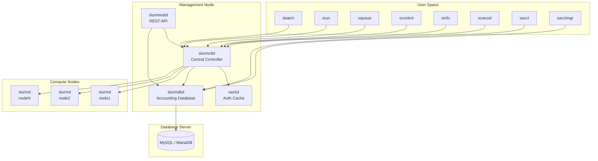
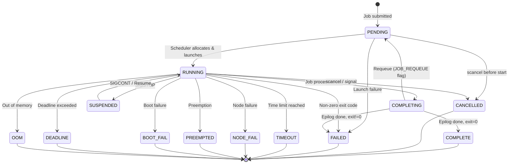
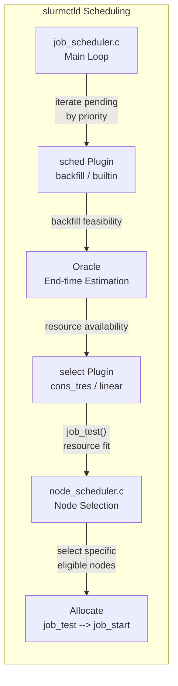
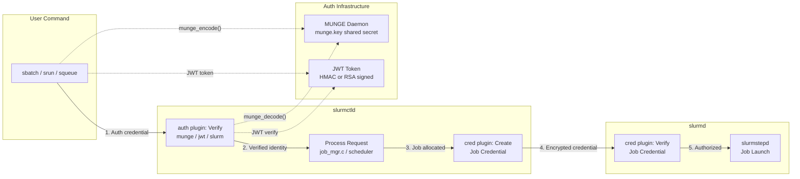
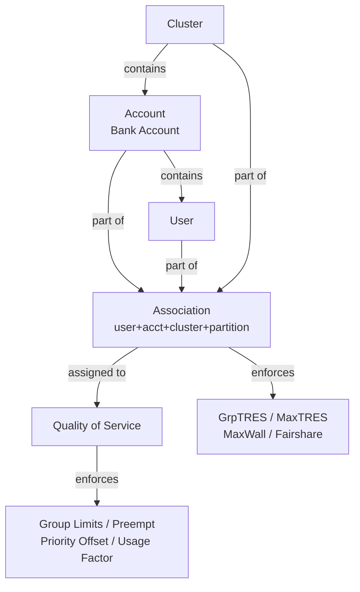

# Slurm Workload Manager Project Research

## 1. What is this project?

**Slurm** (Simple Linux Utility for Resource Management) is an open-source cluster resource management and job scheduling system. It is the workload manager of choice for many of the world's top supercomputers and HPC (High Performance Computing) clusters.

Slurm provides three key functions:
1. **Resource allocation** -- allocates exclusive and/or non-exclusive access to compute nodes to users for a duration of time.
2. **Job framework** -- provides a framework for starting, executing, and monitoring work (normally parallel jobs) on the set of allocated nodes.
3. **Queue arbitration** -- arbitrates conflicting requests for resources by managing a queue of pending work.

The project originated at Lawrence Livermore National Laboratory (LLNL) and is now primarily maintained by **SchedMD LLC**. It is tested only under Linux.

- Version: 26.11.0-0rc1 (pre-release of the next major version)
- API version: 46.0.0 (declared in META)
- License: GNU General Public License v2+ (with OpenSSL exception)
- Protocol: SLURM_PROTOCOL_VERSION (maintained in `src/common/slurm_protocol_common.h`)
- Language: C (with some Perl, Lua, Python for extensions/testing)
- Home page: <https://slurm.schedmd.com/>

## 2. High-Level Architecture

### Top-Level Directory Layout

| Directory | Purpose |
|---|---|
| `src/` | **All source code** -- daemons, user commands, plugins, API, common libraries |
| `slurm/` | Installed include files (public API headers: `slurm.h`, `slurm_errno.h`, `slurmdb.h`, `spank.h`) |
| `doc/` | Documentation: HTML (`doc/html/`), man pages (`doc/man/` in man1/man5/man8 sections) |
| `etc/` | Sample configuration files (`slurm.conf.example`, `slurmdbd.conf.example`, init scripts, systemd service files) |
| `testsuite/` | Test suite: Expect tests (`expect/`), Python tests (`python/`), unit tests (`slurm_unit/`), C test source (`src/`) |
| `contribs/` | Optional contributed tools: Perl API, PAM module, PMI/PMI2 libraries, lua bindings, Torque/PBS compatibility wrappers, seff/sreport tools |
| `auxdir/` | Autotools helper scripts (`ax_*.m4`, `x_ac_*.m4` for feature detection) |
| `CHANGELOG/` | Per-release changelogs (e.g., `slurm-26.05.md`) |
| `debian/` | Debian packaging (produces ~20 .deb packages) |
| `tools/` | Code quality config (codespell, flake8, gitlint configurations) |
| `META` | Version metadata consumed by configure.ac and RPM |

### Key Daemon Binary Entry Points (`src/`)

| Daemon | Directory | Purpose |
|---|---|---|
| **slurmctld** | `src/slurmctld/` | **Central controller daemon** -- the brain of Slurm. Manages jobs, nodes, partitions, reservations, scheduling decisions. Single point of coordination per cluster (with backup). |
| **slurmd** | `src/slurmd/` | **Node daemon** -- runs on every compute node. Executes and monitors jobs, manages prolog/epilog, handles local resource enforcement. Sub-components: `slurmd/slurmd` (main daemon), `slurmd/common/` (shared helpers), `slurmd/slurmstepd/` (job step launcher). |
| **slurmdbd** | `src/slurmdbd/` | **Database daemon** -- stores accounting and job history data in a relational database (MySQL). Acts as the centralized accounting tier. |
| **slurmrestd** | `src/slurmrestd/` | **REST API daemon** -- provides a RESTful HTTP API (OpenAPI v0.0.45) for interacting with Slurm. Supports JSON and YAML serialization. |
| **sackd** | `src/sackd/` | **Auth cache daemon** -- caches authentication credentials to reduce authentication overhead. |
| **slurmstepd** | `src/slurmd/slurmstepd/` | **Job step daemon** -- launched per-job-step on compute nodes, manages I/O, cgroups, and signal delivery for job steps. |
| **stepmgr** | `src/stepmgr/` | **Step manager** -- manages job step lifecycle (launch, I/O forwarding, GRES tracking). Used by srun for direct step management. |

### User Command Entry Points (`src/`)

| Command | Directory | Purpose |
|---|---|---|
| `sbatch` | `src/sbatch/` | Submit a batch job script for later execution |
| `srun` | `src/srun/` | Submit and launch a job step (interactive or within a job allocation) |
| `salloc` | `src/salloc/` | Allocate resources for an interactive job session |
| `scancel` | `src/scancel/` | Cancel a pending or running job/job step |
| `squeue` | `src/squeue/` | Report job state and queue information |
| `sinfo` | `src/sinfo/` | Report node and partition state information |
| `scontrol` | `src/scontrol/` | Administrative control interface (job/node/partition/reservation management) |
| `sacct` | `src/sacct/` | Display accounting data for completed jobs |
| `sacctmgr` | `src/sacctmgr/` | Manage accounting database (accounts, users, QOS, associations) |
| `sreport` | `src/sreport/` | Generate resource utilization reports from accounting data |
| `sdiag` | `src/sdiag/` | Display scheduler diagnostic information |
| `sshare` | `src/sshare/` | Report fair-share information |
| `sprio` | `src/sprio/` | Display job priority components |
| `sstat` | `src/sstat/` | Display live job step statistics |
| `sattach` | `src/sattach/` | Attach standard I/O to a running job step |
| `strigger` | `src/strigger/` | Set event triggers (for email notifications, etc.) |
| `sview` | `src/sview/` | Graphical view of cluster state |
| `sbcast` | `src/sbcast/` | Broadcast files to allocated nodes |
| `scrontab` | `src/scrontab/` | Manage crontab entries for Slurm jobs |
| `scrun` | `src/scrun/` | OCI-compliant runtime integration (container support) |

### Plugin Architecture

Slurm uses a **loadable plugin system** for nearly all subsystems. This is the core architectural pattern. Plugins are shared objects (`.so` files) loaded at runtime. There are approximately **40 plugin types**, each with multiple implementations.

Plugin types are defined as interfaces in `src/interfaces/` (e.g., `sched_plugin.h`, `select.h`, `auth.h`). Implementations live in `src/plugins/<type>/<implementation>/`.

**Key plugin categories and their implementations:**

| Plugin Type | Interface Header | Implementations |
|---|---|---|
| **sched** (scheduler) | `sched_plugin.h` | `backfill` (~5k LOC), `builtin` |
| **select** (resource selection) | `select.h` | `cons_tres` (consumable TRES, ~11.5k LOC), `linear` (whole-node) |
| **auth** (authentication) | `auth.h` | `munge`, `jwt`, `slurm`, `none` |
| **cred** (credential) | `cred.h` | `munge`, `none` |
| **topology** | `topology.h` | `block`, `flat`, `ring`, `tree`, `torus3d` |
| **preempt** | `preempt.h` | `partition_prio`, `qos` |
| **priority** | `priority.h` | `basic`, `multifactor` |
| **gres** (generic resources) | `gres.h` | `gpu`, `mps`, `nic`, `shard` |
| **gpu** (GPU management) | `gpu.h` | `nvml`, `rsmi`, `oneapi`, `nrt`, `generic` |
| **accounting_storage** | `accounting_storage.h` | `mysql`, `slurmdbd` |
| **accounting_gather** | `accounting_gather.h` | `energy` variants (gpu, ipmi, rapl, etc.) |
| **job_submit** | `job_submit.h` | `lua` (user-defined submit filters) |
| **jobcomp** (job completion) | `jobcomp.h` | `filetxt`, `elasticsearch`, `kafka`, `lua`, `mysql`, `script` |
| **mpi** | `mpi.h` | `pmi2`, `pmix`, `cray_shasta` |
| **task** (task launch) | `task.h` | `affinity`, `cgroup` |
| **cgroup** | `cgroup.h` | (cgroup v1/v2 resource constraint management) |
| **switch** (network) | `switch.h` | (HPE Slingshot, InfiniBand) |
| **data_parser** | `data_parser.h` | REST API data serialization (v0.0.42 through v0.0.46) |
| **spank** | (no interface header) | SPANK plugins loaded via `plugstack.conf.d/` (all user-defined) |

### Source Code Packages (`src/`)

| Package | Purpose |
|---|---|
| `src/common/` | Shared library code -- data structures (`job_record.h`, `bitstring.h`, `list.h`), protocol definitions (`slurm_protocol_defs.h`), utilities (`xmalloc.c`, `xstring.c`, `xhash.c`, `timers.c`) |
| `src/api/` | Public C API for Slurm (libslurm) -- exposes functions like `slurm_submit_batch_job()`, `slurm_load_jobs()`, `slurm_load_nodes()`, etc. |
| `src/interfaces/` | Plugin interface definitions (one `.h`/`.c` pair per plugin type) |
| `src/plugins/` | All plugin implementations organized by type |
| `src/database/` | MySQL common database code shared between plugins |
| `src/conmgr/` | Connection manager -- event-driven I/O multiplexer (epoll/poll-based). Handles RPC dispatch, connection lifecycle, TLS, and worker threads. This is the low-level networking layer. |
| `src/lua/` | Lua scripting integration for job_submit, jobcomp, CLI filter plugins |
| `src/curl/` | cURL integration for HTTP-based data transfers |

### System Topology

The following diagram shows the daemon topology and communication paths between Slurm components:



### Job State Machine

The following state diagram shows the 12 base job states and their key transitions, including the COMPLETING intermediate flag state:



### Scheduling Flow

The scheduling flow shows how the main scheduling loop interacts with the scheduler plugin, select plugin, and node selection logic:



### Authentication Flow

The authentication flow shows how user commands authenticate with slurmctld and how job credentials are created and verified:



### Accounting Data Model

The accounting data model shows the hierarchy of entities and their relationships:



## 3. Main Entry Points and Core Abstractions

### Core Data Structures

All defined in `src/common/` headers:

**`job_record_t`** (`src/common/job_record.h`, line 256, ~325 fields) -- The central data structure for representing a job in the system. A very large C struct containing:
- Job identity and metadata (job_id, user_id, group_id, account, partition, name, array info)
- Resource specification (node_bitmap, cpu_cnt, gres_list_req, tres_req_cnt, licenses, network)
- State tracking (job_state, state_reason, start_time, end_time, suspend_time, time_limit)
- Priority and scheduling (priority, prio_factors, qos_ptr, last_sched_eval)
- Preemption details (preempt_time, preempt_in_progress, licenses_to_preempt)
- Accounting fields (assoc_ptr, db_index, billable_tres, tres_alloc_str)
- Execution context (alloc_node, batch_host, step_list, job_resrcs, switch_jobinfo)
- Federation fields (fed_siblings, sib_msg_type)

**`job_resources_t`** (`src/common/job_resources.h`) -- Details of allocated resources (cores, memory, GPUs per node).

**`node_record_t`** -- Represents a compute node (state, features, CPU/memory/disk capacity, energy data).

**`part_record_t`** -- Represents a partition (logical grouping of nodes with scheduling policies, limits, priority).

**`step_record_t`** -- Represents a job step (within a job allocation, has its own resource assignment and state).

### Daemon Architecture

#### slurmctld (Central Controller) -- `src/slurmctld/`

The slurmctld is a multi-threaded C daemon with these major components (source files in `src/slurmctld/`):

| Source File | Lines | Purpose |
|---|---|---|
| `controller.c` | 4,421 | Main controller loop, initialization, signal handling, reconfiguration |
| `job_mgr.c` | 19,759 | **Job lifecycle management** -- job submission, state transitions, suspend/resume, requeue, cancel, batch processing |
| `job_scheduler.c` | 5,785 | **Main scheduling loop** -- iterates pending jobs, interacts with the sched plugin to select jobs for initiation, handles backfill coordination |
| `node_mgr.c` | 5,383 | Node state management -- state transitions (UP, DOWN, DRAIN, FAIL, etc.), node registration |
| `node_scheduler.c` | 4,680 | Node selection within the scheduler -- chooses specific nodes for job allocation |
| `proc_req.c` | 7,517 | RPC request processing -- dispatches incoming RPCs from clients and slurmd nodes |
| `reservation.c` | 8,956 | Advanced reservation management |
| `partition_mgr.c` | 2,250 | Partition lifecycle management |
| `fed_mgr.c` | 6,213 | Federation management -- coordinates across multiple Slurm clusters |
| `acct_policy.c` | 5,654 | Accounting policy enforcement -- association and QOS limit checking |
| `power_save.c` | 1,795 | Power saving / idle node management (cloud bursting) |
| `licenses.c` | 2,903 | License management |
| `gang.c` | 1,427 | Gang scheduling support |
| `agent.c` | 2,783 | Asynchronous RPC agent for communication with slurmd nodes |
| `state_save.c` | 331 | State checkpointing to disk (periodic and on shutdown) |
| `backup.c` | 699 | Backup controller (hot standby) |
| `statistics.c` | 968 | Performance statistics tracking |
| `slurmctld.h` | 2,932 | Main header with global state declarations |

The scheduling flow works as:
1. `job_scheduler.c`'s main loop calls the **sched plugin** (either `backfill` or `builtin`)
2. The backfill scheduler (`src/plugins/sched/backfill/backfill.c`, ~5k LOC) implements:
   - **Conservative backfilling**: evaluates whether starting a lower-priority job would delay any higher-priority job. If not, it temporarily boosts the lower-priority job's effective priority.
   - Uses the **oracle** (`backfill/oracle.c`) for estimating job end times and resource availability.
   - Calls into `node_scheduler.c` for node selection and `select/cons_tres` plugin for resource allocation feasibility checking (`job_test()`).
3. The select plugin (`select/cons_tres` for modern deployments, or `select/linear`) handles the actual resource-to-job matching.

#### slurmd (Node Daemon) -- `src/slurmd/`

The node agent that runs on every compute node:
- `slurmd.c` -- main daemon loop, registration with controller, RPC handling
- `req.c` -- request processing (launch jobs, prolog/epilog, signal delivery)
- `job_mem_limit.c` -- per-job memory limit enforcement
- `launch_state.c` -- tracks launched job state on the node
- `common/slurmd_common.c` -- shared utilities
- `common/slurmstepd_init.c` -- initializes the slurmstepd environment
- `slurmstepd/slurmstepd_*.c` -- the per-step daemon that actually launches and monitors processes

#### slurmdbd (Accounting Database) -- `src/slurmdbd/`

- `slurmdbd.c` -- main daemon, connection management, protocol handling
- `proc_req.c` -- RPC processing for accounting queries (jobs, associations, accounts, QOS, reservations)
- `backup.c` -- backup/failover support
- Uses the `accounting_storage/mysql` plugin for MySQL persistence. The slurmctld connects to slurmdbd via the `accounting_storage/slurmdbd` plugin (a relay plugin that forwards accounting RPCs to slurmdbd).

#### slurmrestd (REST API) -- `src/slurmrestd/`

- `slurmrestd.c` -- HTTP daemon (supports both inetd and standalone modes)
- `http.c` -- HTTP request/response handling
- `openapi.c` -- OpenAPI specification handling and request routing
- `operations.c` -- maps REST operations to Slurm API calls
- `plugins/openapi/` -- OpenAPI version-specific plugins (data serialization)
- `plugins/auth/` -- authentication plugins for REST API

### Core Algorithms

#### 1. Backfill Scheduling Algorithm

**Source:** `src/plugins/sched/backfill/backfill.c` (~4,918 lines), `oracle.c` (~200 lines), `oracle.h`

The backfill scheduler is a **conservative backfilling** algorithm. It runs as a detached thread (`backfill_agent`) that periodically evaluates pending jobs. The core idea: if starting a lower-priority job on currently-idle resources would NOT delay the expected start time of any higher-priority job, start it immediately. This maximizes utilization without violating priority ordering.

**Key Data Structures:**

```c
// node_space_map_t -- The core planning abstraction. A linked list of time slices,
// each describing resource availability during that interval.
typedef struct {
    time_t begin_time;        // Start of this time slice
    time_t end_time;          // End of this time slice
    bitstr_t *avail_bitmap;   // Bitmap of available nodes during this interval
    bf_licenses_t *licenses;  // License availability during this interval
    uint32_t fragmentation;   // Topology fragmentation score (for bf_topopt)
    int next;                 // Index of next record in linked list (0 = end)
} node_space_map_t;

// bf_slot_t -- Used by the oracle for topology optimization
typedef struct {
    time_t start;
    bitstr_t *job_bitmap;     // Nodes the job will use
    bitstr_t *job_mask;       // Mask after topology constraints
    bitstr_t *cluster_bitmap; // Available cluster nodes
    uint32_t time_limit;
    uint32_t boot_time;
    uint32_t job_score;       // Fragmentation cost of this placement
    uint32_t cluster_score;   // Background fragmentation
} bf_slot_t;

// job_queue_rec_t -- Each entry in the sorted job queue tested by backfill
typedef struct {
    job_record_t *job_ptr;
    part_record_t *part_ptr;
    slurmdb_qos_rec_t *qos_ptr;
    uint32_t priority;
    uint32_t array_task_id;
    bool use_prefer;
    slurmctld_resv_t *resv_ptr;
} job_queue_rec_t;
```

**Pseudocode: Main Scheduling Loop (backfill_agent / _attempt_backfill):**

```
algorithm BackfillScheduler
    // Phase 1: Setup
    now = current_time
    job_queue = build_job_queue(sort_by_priority)
    node_space[0] = { begin=now, end=now+backfill_window,
                      avail_bitmap=all_available_nodes }

    // Phase 2: Reserve space for running jobs
    for each running_job in all_jobs:
        reserve_in_node_space(job=runner, node_space)

    // Phase 3: Reserve space for advance reservations
    for each reservation in active_reservations:
        reserve_in_node_space(reservation, node_space)

    sort_job_queue(job_queue)  // by priority descending

    // Phase 4: Main loop -- iterate pending jobs in priority order
    while (job = job_queue.pop()) is not NULL:
        if (max_test_count_reached) break
        if (time_window_expired) break

        if not job_runnable_now(job):
            continue

        // Determine time constraints
        time_limit = min(job.time_limit, part.max_time)
        later_start = now  // earliest possible later start time

    TRY_LATER:
        // Determine reservation constraints
        avail_bitmap = node_space[0].avail_bitmap
        start_res = max(later_start, earliest_reservation_time(job))
        apply_reservation_constraints(job, start_res, avail_bitmap)

        // Filter to partition nodes, up nodes, exclude bad nodes
        avail_bitmap &= part.node_bitmap
        avail_bitmap &= up_node_bitmap
        avail_bitmap -= job.exc_node_bitmap

        // Check: do we have enough nodes at this time slice?
        for each time_slice in node_space (in order):
            if time_slice.end_time <= start_res:
                continue
            if time_slice.begin_time > job_end_time:
                break
            avail_bitmap &= time_slice.avail_bitmap
            if licenses_unavailable:
                later_start = time_slice.end_time
                goto SKIP_OR_TRY_LATER

        if bit_count(avail_bitmap) < min_nodes:
            goto SKIP_OR_TRY_LATER

        // Phase 5: The critical test -- can this job fit?
        rc = _try_sched(job, avail_bitmap, min_nodes, max_nodes)

        if rc == SUCCESS and job.start_time <= now:
            // Job CAN start NOW -- launch it (backfill success!)
            rc = _start_job(job, allocated_nodes_bitmap)
            if rc == SUCCESS:
                allocate_resources_in_node_space(job, node_space)
                job_start_cnt++
                continue  // next job in queue

        if rc == SUCCESS and job.start_time > now:
            // Job can start later -- create a backfill reservation
            // This reservation blocks these resources in the node_space
            // Prevents HIGHER priority jobs from being delayed later
            add_reservation(job, node_space, start_time, end_time)
            continue

    SKIP_OR_TRY_LATER:
        if later_start is set and not job_no_reserve:
            job.start_time = 0
            goto TRY_LATER  // Retry at a later time offset
        continue  // Cannot schedule in this partition
```

**The "Will It Delay" Test:**

The key question for backfill is: "Will starting this lower-priority job delay any higher-priority job?" This is not explicitly checked -- instead, it emerges from the algorithm structure:

1. Jobs are iterated in **decreasing priority order** (highest priority first).
2. When a high-priority job cannot start immediately (insufficient resources), a **backfill reservation** is created for it in the node_space table. This reservation records the nodes and time interval the high-priority job expects to use.
3. When a lower-priority job is considered, the `avail_bitmap` is intersected with the node_space availability at each time interval. If a high-priority reservation occupies needed nodes, the lower-priority job either waits (via `later_start`) or skips.
4. The `_try_sched()` function calls `select_g_job_test()`, which simulates what would happen if the job started now (or at `start_res`). The `select/cons_tres` plugin's `_future_run_test()` simulates removing running jobs one by one to find the earliest start time.

**Time Complexity:**
- Let J = number of pending jobs tested, S = number of time slices in node_space, N = number of nodes.
- For each job: O(S * N) for node_space traversal, plus O(N * R) for `_try_sched` where R = running jobs being simulated.
- Worst case: O(J * (S*N + N*R)). In practice limited by `bf_max_job_test` (default 100) and `bf_max_time`.
- Key optimization: `_yield_locks()` periodically drops and reacquires locks to avoid starving RPC processing.

**The Oracle (Topology Optimization):**

The oracle subsystem (`oracle.c`, enabled by `bf_topopt_enable`) improves node selection by minimizing **topology fragmentation**. Rather than picking first-fit nodes, it evaluates multiple candidate node sets (stored in `bf_slot_t[]`) and picks the one that minimizes fragmentation:

```
algorithm oracle(job, job_bitmap, later_start, time_limit, boot_time, node_space):
    // Phase 1: Record this placement as a candidate slot
    if used_slots < MAX_ORACLE_SLOTS:
        slot.cluster_score = fragmentation_of(cluster_without_job_nodes)
        slot.job_score = fragmentation_of(job_nodes_alone)
        slots[used_slots++] = slot

    // Phase 2: If told to check later, return true to retry
    if later_start and slots_available:
        return true  // caller should goto TRY_LATER

    // Phase 3: Pick the best slot (minimum job_score = least fragmentation)
    if any_slots_recorded:
        best_slot = argmin(slots[i].job_score)
        job.start_time = slots[best_slot].start
        job_bitmap = slots[best_slot].job_bitmap
        time_limit = slots[best_slot].time_limit
        boot_time = slots[best_slot].boot_time

    return false  // use the selected placement
```

**Interaction with Reservations:**
- Before testing any job, `job_test_resv()` is called to check if the job references an advance reservation. Reservations impose node access controls and time constraints.
- `resv_exc_ptr` tracks GRES resources that should be explicitly included or excluded due to reservations.
- Backfill reservations (added via `_add_reservation()` when a job is planned for future execution) create new entries in the `node_space[]` linked list, partitioning available nodes by time.

---

#### 2. Multifactor Priority Calculation

**Source:** `src/plugins/priority/multifactor/priority_multifactor.c` (~2,318 lines), `fair_tree.c` (~440 lines)

**The Exact Formula:**

```
Priority = (Weight_Age * Age_factor) +
           (Weight_Assoc * Assoc_factor) +
           (Weight_FS * FS_factor) +
           (Weight_JS * JS_factor) +
           (Weight_Part * Part_factor) +
           (Weight_QOS * QOS_factor) +
           (Weight_TRES * TRES_factors[]) +
           Site_factor -
           (Nice_offset - NICE_OFFSET)
```

All factors are normalized to [0.0, 1.0] before weighting. The weights are configured in `slurm.conf` as `PriorityWeightAge`, `PriorityWeightFairshare`, `PriorityWeightJobSize`, `PriorityWeightPartition`, `PriorityWeightQOS`, `PriorityWeightTRES`. Default values are all 1 (1000 for QOS). The final priority is a 32-bit unsigned integer, with 0 reserved for held jobs. Minimum priority is 1, maximum is 2^32 - 1.

**Factor Details:**

1. **Age Factor** (`set_priority_factors()` lines ~2105-2120):
   ```
   diff = max(0, start_time - job.details.accrue_time)
   if diff < max_age:
       Age_factor = diff / max_age    // linear ramp
   else:
       Age_factor = 1.0               // saturated at "fully aged"
   ```
   Where `max_age = PriorityMaxAge` (default 7 days in seconds). The `accrue_time` is typically the job's submit time (or begin time if `PriorityFlags=ACCRUE_ALWAYS`).

2. **Fairshare Factor** (`_get_fairshare_priority()` lines 364-393):
   ```
   FS_factor = association->usage->fs_factor
   ```
   where `fs_factor` is computed as:
   ```
   fs_factor = 2^(-((usage_efctv / shares_norm) / damp_factor))
   ```
   - `usage_efctv` = normalized usage (association's usage_raw / root's usage_raw)
   - `shares_norm` = normalized shares (association's shares / total level shares)
   - `damp_factor` = `PriorityDampeningFactor` (default 1.0, higher values flatten the curve)
   - Result: [0.0, 1.0], where 1.0 = no usage (best fairshare), near 0 = heavy usage

   **Fair Tree Algorithm** (`fair_tree.c`):
   When `PriorityFlags=FAIR_TREE` is set, a different calculation is used:
   ```
   if shares_raw == 0:
       level_fs = 0
   else:
       level_fs = shares_norm / usage_efctv   // LF = S/U
   ```
   - LF > 1.0 means under-served (deserves higher priority)
   - LF < 1.0 means over-served
   - Users with `SLURMDB_FS_USE_PARENT` get `level_fs = INFINITY` (highest priority in their account)
   - The tree is traversed level by level, sorting by LF, and ties are broken by prioritizing users over accounts
   - The final FS_factor is derived from the level_fs after tree sorting

3. **Job Size Factor** (`set_priority_factors()` lines ~2128-2196):
   Three variants controlled by `PriorityFlags`:
   - **Default (favor large):**
     ```
     JS_factor = (min_nodes / total_nodes + cpu_cnt / cluster_cpus) / 2
     ```
   - **With `PRIORITY_FLAGS_SIZE_RELATIVE`:**
     ```
     JS_factor = max(min_nodes * avg_cpus_per_node, cpu_cnt) / time_limit / cluster_cpus
     ```
   - **With `priority_favor_small`:**
     ```
     JS_factor = 1 - JS_factor_default
     ```
   All clamped to [0.0, 1.0].

4. **Partition Factor** (`set_priority_factors()` lines ~2198-2204):
   ```
   Part_factor = part_ptr->norm_priority
   ```
   If `PRIORITY_FLAGS_NO_NORMAL_PART`: uses raw `part_ptr->priority_job_factor`.

5. **QOS Factor** (`set_priority_factors()` lines ~2215-2221):
   ```
   QOS_factor = qos_ptr->usage->norm_priority
   ```
   If `PRIORITY_FLAGS_NO_NORMAL_QOS`: uses raw `qos_ptr->priority`.

6. **Association Factor** (`set_priority_factors()` lines ~2209-2213):
   ```
   Assoc_factor = assoc_ptr->usage->priority_norm
   ```

7. **TRES Factor** (`_get_tres_factors()` lines 395-421, `_get_tres_prio_weighted()` lines 423-439):
   ```
   for each TRES type i:
       tres_factors[i] = (job.tres_req_cnt[i] / part.tres_cnt[i]) * weight_tres[i]
   total_tres_priority = sum(tres_factors)
   ```

8. **Site Factor**: Set by `site_factor_g_set()`, a configurable site plugin.

9. **Nice Offset**: Subtracted from priority. `NICE_OFFSET = 10000`, and each nice level is 1000.

**Decay and Usage Accounting:**

The decay thread (`_decay_thread()`, line 1308) runs periodically (controlled by `PriorityCalcPeriod`, default 5 minutes):

```
algorithm DecayThread:
    decay_factor = 1 - (0.693 / priority_decay_hl)
                  // Derived from: decay_hl * ln(decay_factor) = ln(1/2)
                  // Series expansion: ln(1/2) = -0.693

    loop:
        sleep(PriorityCalcPeriod)
        if priority_decay_hl > 0:
            run_delta = time_since_last_ran
            real_decay = pow(decay_factor, run_delta)  // Multiplicative decay
            apply_decay(real_decay)                     // usage_raw *= real_decay

        for each running job j:
            apply_new_usage(j, last_ran, now)
            // Adds j's CPU-seconds to its association's usage_raw
            // usage_raw += (now - last_ran) * j.cpus_allocated

        recalculate_fairshare_for_all_associations()
        recalculate_priorities_for_all_pending_jobs()
```

**The range of priority values:**
- Minimum: 1 (reserved for held jobs)
- Maximum: 4294967295 (2^32 - 1)
- Typical range for active jobs: 0 to ~100000 depending on weights and cluster age

---

#### 3. CONsumable TRES Selection Algorithm

**Source:** `src/plugins/select/cons_tres/job_test.c` (~4,084 lines), `select_cons_tres.c` (~1,000 lines), `dist_tasks.c`, `node_data.c`

This plugin is the heart of resource allocation in Slurm. It manages CPUs, memory, GPUs, and other TRES at fine granularity.

**The `job_test()` Entry Point:**

```c
int job_test(job_ptr, node_bitmap, min_nodes, max_nodes, req_nodes,
             mode, preemptee_candidates, preemptee_job_list,
             resv_exc_ptr, will_run_ptr)
```

Three modes:
- **`SELECT_MODE_WILL_RUN`**: Determines IF and WHEN a job can run. The key function is `_will_run_test()` which calls `_future_run_test()` to simulate job completion times.
- **`SELECT_MODE_TEST_ONLY`**: Quick feasibility check -- can the job ever run on these nodes? Uses `_test_only()`.
- **`SELECT_MODE_RUN_NOW`**: Actually allocate resources and start the job. Uses `_run_now()`.

**Will-Run Test (Backfill Oracle inside select plugin):**

```
algorithm _future_run_test(job, node_bitmap, min_nodes, max_nodes, ...):
    // Copy current allocation state
    future_part = duplicate(partition_resources)
    future_usage = duplicate(node_usage)

    // Build list of currently running jobs sorted by end time
    cr_job_list = build_sorted_job_list(running_jobs)

    // Check: can we run NOW by preempting?
    if preemptee_candidates or deferred_start:
        rc = _job_test(job, ALL_nodes, ..., future_part, future_usage)
        if rc == SUCCESS:
            job.start_time = now
            return SUCCESS  // Can start immediately

    // Simulate removing jobs one by one (or in batches) until job fits
    removed_jobs = []
    while more_jobs and not timed_out:
        // Remove the next running job (or batch of jobs ending close in time)
        batch = []
        while runner = next_job_in_cr_job_list:
            if runner.end_time > end_time + time_window:
                break
            remove_job_resources(runner, future_part, future_usage)
            batch.append(runner)

        // Test if job fits now
        rc = _job_test(job, node_bitmap, min_nodes, max_nodes,
                       WILL_RUN, future_part, future_usage)
        if rc == SUCCESS:
            // Found earliest start time = end of last removed relevant job
            job.start_time = last_relevant_job.end_time
            return SUCCESS

    return FAILURE  // Cannot run within the backfill window
```

**Node Selection Strategy (`_select_nodes()`):**

The node selection follows a **topology-weighted best-fit** approach, NOT simple first-fit:

1. **Resource availability per node** (`_get_res_avail()`): For each candidate node, `_can_job_run_on_node()` checks CPU availability (via bitmaps), memory, GPUs, GRES, and other TRES.

2. **Elimination**: Nodes without sufficient resources are removed from the candidate set.

3. **Topology evaluation** (`topology_g_eval_nodes()`): The remaining nodes are evaluated by the topology plugin, which considers node ordering, switch connectivity, and NUMA topology. Nodes are scored and the best combination is selected.

4. **For single-node jobs** (`_get_one_res()`): Nodes are sorted by `sched_weight` (which encodes GPU proximity) and tested in order. The first node that works is selected (best-first, not first-found).

5. **For multi-node jobs**: The topology plugin builds switch-aware node selections, preferring nodes with minimal network distance (e.g., within the same leaf switch before crossing to another).

**Per-Node Resource Checking (`_can_job_run_on_node()`):**

```
algorithm _can_job_run_on_node(job, core_map, node_index, ...):
    // 1. Check GRES availability (GPUs, etc.)
    job_gres = job.gres_list_req
    sock_gres_list = gres_sock_list_create(node, job_gres)
    if not sock_gres_list:
        return NULL  // Insufficient GRES on this node

    // 2. Check CPU availability
    avail_res = allocate_cores_or_sockets(node, core_map, cr_type)
    if not avail_res or avail_res.avail_cpus == 0:
        return NULL  // No CPUs available

    // 3. Check minimum CPUs per task requirement
    min_cpus = ntasks_per_node * cpus_per_task
    if avail_res.avail_cpus < min_cpus:
        return NULL

    // 4. Check memory
    avail_mem = node.real_memory - node.mem_spec_limit - allocated_memory
    if cr_type has SELECT_MEMORY:
        if pn_min_memory & MEM_PER_CPU:
            reduce_cpus_until_memory_fits(req_mem * cpus <= avail_mem)
        else:
            if req_mem > avail_mem:
                cpus = 0  // Per-node, entire node insufficient

    // 5. Filter unusable GRES with remaining core count
    gres_select_filter_remove_unusable(sock_gres_list, remaining_cpus)
    if not enough_GPUs_after_filtering:
        return NULL

    return avail_res  // This node can host the job
```

**Handling Heterogeneous Resources:**

- **GPU affinity**: The `sched_weight` field encodes GPU proximity. Nodes with more co-located GPUs get higher `sched_weight`, making them preferred for GPU jobs. The code at line ~652: `node_ptr->sched_weight |= (0xff - near_gpu_cnt)`.
- **Job size bitmap**: Jobs can specify `--nodefile` or `-S` to restrict node sizes tested. The algorithm adjusts `min_nodes`/`max_nodes` based on available node sizes.
- **Whole-node vs shared**: Jobs with `WHOLE_NODE_REQUIRED` test with `share_res=0` (exclusive mode), while others consider sharing.
- **GRES enforcement**: When `GRES_ENFORCE_BIND` is set, the core selection is constrained to cores near the allocated GPUs.

**Best-Fit vs First-Fit:**
The algorithm is closest to **best-fit with topology awareness**. After eliminating insufficient nodes, the topology plugin evaluates candidate node sets and picks the one with the best topology score (minimal network distance, best GPU proximity). For single-node allocations, nodes are sorted by `sched_weight` (a proxy for "best fit") and tested in order.

**Overlapping Reservations and Preemption:**
- `_future_run_test()` deduplicates running jobs by checking bitmap overlap. Jobs on unrelated nodes are skipped.
- Preemptee candidates from the preempt plugin are tested first -- if preempting all of them frees enough resources, the job starts immediately at `start_time = now`.
- The time horizon is aligned to 30-second windows (`time_window = 30`) to prevent evaluation drift across scheduling cycles.

---

#### 4. Preemption Algorithm

**Source:** `src/plugins/preempt/partition_prio/preempt_partition_prio.c` (~151 lines), `src/plugins/preempt/qos/preempt_qos.c` (~158 lines), `src/interfaces/preempt.h`, `src/slurmctld/job_scheduler.c`

**Preemption Plugins:**

There are two preemption plugins, selected via `PreemptType` in `slurm.conf`:

1. **`preempt/partition_prio`**: Preemption decisions based on partition `priority_tier`. Higher-tier partitions preempt lower-tier partitions.
2. **`preempt/qos`**: Preemption decisions based on QOS preemption relationships. QOS objects have a `preempt` list specifying which other QOSes they can preempt.

**Preemptor/Preemptee Selection (`preempt_p_job_preempt_check`):**

For `preempt/partition_prio`:
```
algorithm preempt_p_preemptable(preemptee, preemptor):
    // A preemptor can preempt a preemptee if:
    // 1. Partitions share nodes (bitmap overlap)
    // AND
    // 2. preemptor.part.priority_tier > preemptee.part.priority_tier
    // AND
    // 3. preemptee.part.preempt_mode != OFF
    
    // Additionally, if PREEMPT_MODE_PRIORITY is set:
    //   preemptor.job.priority must be > preemptee.job.priority
```

For `preempt/qos`:
```
algorithm preempt_p_preemptable(preemptee, preemptor):
    qos_ee = preemptee.qos_ptr
    qos_or = preemptor.qos_ptr

    if not qos_ee or not qos_or:
        return false

    if qos_or.id == qos_ee.id:     // Same QOS
        if PREEMPT_MODE_WITHIN:
            return preemptor.priority > preemptee.priority
        return false

    // Check preemptor's QOS preempts preemptee's QOS
    if not qos_or.preempt_bitstr has qos_ee.id:
        return false

    if PREEMPT_MODE_PRIORITY:
        return preemptor.priority > preemptee.priority

    return true
```

**Preemption Priority (Ordering):**

Both plugins compute a `preempt_p_get_prio()` that orders candidates from most-desirable-to-preempt (highest priority) to least:
```
preempt_prio = (partition_priority_tier_or_qos_priority) << 16 | node_count
```
- Upper 16 bits: partition priority tier or QOS priority (higher = more preemptable)
- Lower 16 bits: node count (larger jobs preempted first)
- Rationale: Preempt **fewer larger jobs** rather than **many smaller jobs** (minimizes number of jobs preempted)

**Preemption Modes (`preempt_p_get_mode()`):**

The preemption mode determines what happens to the preempted job:

| Mode | Effect |
|---|---|
| `PREEMPT_MODE_CANCEL` | Preempted job is cancelled (goes to JOB_PREEMPTED state) |
| `PREEMPT_MODE_CHECKPOINT` | Preempted job is checkpointed and requeued |
| `PREEMPT_MODE_REQUEUE` | Preempted job is requeued to PENDING state |
| `PREEMPT_MODE_SUSPEND` | Preempted job is suspended (SIGSTOP, remains allocated) |
| `PREEMPT_MODE_GANG` | Gang scheduling -- preempted job alternates with others |

The mode is determined per-job by examining (in priority order):
1. Partition `PreemptMode` (for partition_prio) or QOS `preempt_mode` (for qos)
2. Global `slurm.conf` `PreemptMode`

The `slurm_job_preempt()` function at `src/interfaces/preempt.c` coordinates the actual preemption action (signal delivery, requeue, suspend).

**How Preemption is Triggered:**

There are two paths:

1. **Main scheduler** (`job_scheduler.c`): When building the job queue, `sort_job_queue2()` calls `preempt_g_job_preempt_check()` to order jobs. If a preemptor can preempt a preemptee, the preemptor appears earlier in the queue. The main scheduler's `_start_job()` will trigger preemption before starting the preemptor.

2. **Backfill scheduler**: `_try_sched()` calls `slurm_find_preemptable_jobs(job_ptr)` to identify jobs that could be preempted. These are passed to `select_g_job_test()` in the `preemptee_candidates` parameter. The select plugin (`_future_run_test()`) tests whether removing these preemptable jobs makes room for the pending job. If so, the preemption is initiated before the job starts.

**Preemption Order Within Candidates:**

The preemptee list returned by `slurm_find_preemptable_jobs()` is sorted from most to least desirable to preempt:
- First preempt: jobs in the lowest priority partition/QOS (highest preempt_prio value)
- Within same tier: larger jobs first (higher node_count)
- The sort in `_sort_usable_nodes_dec()` uses `usable_nodes` count to minimize the number of jobs disrupted

**Interaction with Gang Scheduling:**

When `PreemptMode=GANG` or partition `PreemptMode=GANG`:
- Multiple jobs share the same nodes by **time-slicing** 
- The `gang.c` module (`src/slurmctld/gang.c`) manages the rotation
- Preempted jobs are suspended via `PREEMPT_MODE_SUSPEND` (SIGSTOP)
- At the end of each time slice, suspended jobs are resumed (SIGCONT) and running jobs are suspended
- The gang scheduler runs periodically (`job_scheduler.c` gang scheduling path) to cycle through the rotating set
- `PreemptExemptTime` provides a grace period before a newly-started job can be gang-preempted

**Grace Time:**

Before forcibly preempting, the system respects `GraceTime` (from partition or QOS):
```
if (time_job_has_been_running < preempt_exempt_time):
    // Job is immune to preemption
else:
    // Send SIGCONT to SUSPENDED jobs, or SIGTERM/SIGKILL to running jobs
```

---

## 4. External Dependencies and Frameworks

### Required Dependencies

| Dependency | Purpose |
|---|---|
| Linux kernel | Slurm is tested only under Linux. Uses cgroups, ptrace, epoll, procfs, sched_setaffinity |
| GCC / Clang | C99-compatible compiler |
| **MUNGE** | Authentication -- default credential/payload authentication service (weak dependency as of 26.05) |
| pthreads | Multi-threading across all daemons |
| GNU Make / Autotools | Build system (autoconf, automake, libtool) |
| OpenSSL | TLS support (library linking, optional via `--with-s2n`) |

### Optional Dependencies

| Dependency | Configure Flag | Purpose |
|---|---|---|
| MySQL / MariaDB | `--with-mysql` | Accounting database backend |
| **hwloc** | `--with-hwloc` | Hardware topology discovery (CPU, NUMA, cache hierarchy) |
| **Lua** | `--with-lua` | Scriptable job submission filters, job completion logging, CLI filters |
| **libcurl** | `--with-libcurl` | HTTP transfers (burst buffer, elasticsearch job completion) |
| **libjwt** / libjansson | `--with-jwt` / `--with-json` | JWT authentication and JSON support |
| **libyaml** | `--with-yaml` | YAML serialization (slurmrestd) |
| **PMIx** | `--with-pmix` | Parallel job launch (alternative to PMI2) |
| **UCX** | `--with-ucx` | High-performance communication for job launch |
| **NVML** (NVIDIA) | `--with-nvml` | GPU management (NVIDIA GPUs) |
| **RSMI** (AMD) | `--with-rsmi` | GPU management (AMD GPUs) |
| **oneAPI Level Zero** | `--with-oneapi` | GPU management (Intel GPUs) |
| **FreeIPMI** | `--with-freeipmi` | Out-of-band power monitoring |
| **LZ4** | `--with-lz4` | Compression for checkpoint files |
| **RDMCA** (InfiniBand) | `--with-ofed` | InfiniBand/OFED support |
| **HPE Slingshot** | `--with-hpe-slingshot` | HPE Slingshot interconnect |
| **PAM** | `--with-pam` | Pluggable Authentication Modules (PAM Slurm Adopt) |
| **systemd** | `--with-systemd` | systemd service integration |
| **readline** | `--with-readline` | Interactive command-line editing (sacctmgr) |
| **sview** (GTK) | `--with-sview` | GUI for cluster monitoring |
| **X11** | `--with-x11` | X11 forwarding for interactive jobs |
| **cgroup** | `--with-cgroup` | Linux cgroups v1/v2 resource containment |
| **HDF5** | `--with-hdf5` | HDF5 profiler output (acct_gather_profile) |
| **librdkafka** | `--with-rdkafka` | Kafka job completion logging |
| **s2n** | `--with-s2n` | TLS implementation (alternative to OpenSSL) |
| **man2html** | | HTML documentation generation |
| **Check** (unit test) | | C unit test framework (optional, `check >= 0.9.8`) |

### Test Frameworks

- **Check** (`>= 0.9.8`) -- C unit testing framework for slurm_unit tests
- **Expect** -- Tcl-based test framework for integration tests
- **Pytest** -- Python test framework (modern tests in `testsuite/python/`)

## 5. Current Repository State

### Active Branches

- **`master`** -- Primary development branch (all new features and fixes land here)
- **`slurm-26.05`** -- Current pre-release maintenance track (26.05.x series)
- **`slurm-25.11`** -- Previous stable release maintenance (latest: 25.11.6-1)
- **`slurm-25.05`** -- Older stable maintenance (latest: 25.05.8-1)
- Release branches back to `slurm-1.0` (all historical versions are preserved as branches)

### Versioning

- **Current version**: 26.11.0-0rc1 (from `META` file)
- Release candidate for Slurm 26.11.x series
- The version scheme is `YY.MM.MICRO` (e.g., 26.05 = May 2026 feature release)
- The 26.05.0 release is the current stable release series
- 26.11 will be the next stable major release (November 2026 release)

### Recent Commits (top of master as of 2026-05-18)

The repository shows ~3,326 commits in 2026 so far (Jan 1 - May 18, 2026). Recent work includes:
- Torus3D topology data parser improvements and fixes
- JWT HTTP auth plugin removal (`http_auth/jwt` removed)
- License-related HRes fixes
- Revert of a previous auth merge
- Backfill scheduler improvements
- Documentation updates for topology parsers
- Regular cherry-pick merges from master to `slurm-26.05`
- Changelog updates for 25.11.6 and 25.05.8 releases
- Data parser v0.0.46 preparation (deprecated entry removal)
- Adaptive Morton encoding for large torus dimensions
- Spec/debian packaging updates for 26.11

### Build System

Slurm uses the **GNU Autotools** build system (autoconf, automake, libtool):

1. `configure.ac` -- Main autoconf configuration file (checks for compilers, libraries, headers, optional packages)
2. `auxdir/*.m4` -- Custom autoconf macros for feature detection (JSON, JWT, Lua, MUNGE, hwloc, NVML, etc.)
3. `Makefile.am` files -- Automake input files (one per directory)
4. `configure` -- Generated configure script (~1 MB)
5. `config.h.in` -- Template for generated `config.h`

Build process:
```bash
./configure --prefix=/usr [options...]
make
make install
```

RPM packaging: `slurm.spec` produces separately-packaged sub-RPMs:
- `slurm` (core daemons)
- `slurm-slurmctld` (controller daemon)
- `slurm-slurmd` (node daemon)
- `slurm-slurmdbd` (accounting daemon)
- `slurm-slurmrestd` (REST API daemon)
- `slurm-sackd` (auth cache daemon)
- `slurm-client` (user commands)
- `slurm-devel` (development headers/libraries)
- `slurm-libpmi*` (PMI/PMI2 libraries)
- `slurm-libnss-slurm` (NSS module)
- `slurm-libpam-slurm-adopt` (PAM module)
- `slurm-openlava` (OpenLava compatibility)
- `slurm-torque` (Torque/PBS compatibility)
- `slurm-perlapi` (Perl API bindings)
- `slurm-sview` (GUI)
- `slurm-contribs` (contributed tools)

Debian: Full Debian packaging in `debian/` directory produces similar split packages.

### Testing

The test suite lives in `testsuite/`:

| Test Directory | Framework | Purpose |
|---|---|---|
| `testsuite/python/` | Pytest | Modern integration tests (the primary test framework for new tests) |
| `testsuite/expect/` | Expect (Tcl) | Legacy integration tests |
| `testsuite/slurm_unit/` | Check (C) | Unit tests for core library functions |
| `testsuite/src/` | Custom C | Additional test helpers and utilities |

Tests are run via `testsuite/run-tests` with a configuration file.

### Changelogs

Per-release changelogs in `CHANGELOG/slurm-XX.YY.md` covering releases back to `slurm-22.05`. The 26.05.0rc1 changelog shows a diverse set of changes including:
- API additions (new REST endpoints: healthz, readyz, livez)
- Bug fixes (use-after-free in cons_tres, segfaults in connection handling)
- Performance improvements (threadpool for slurmctld, readlock optimizations)
- Feature removals (job state cache deprecated)
- GPU/NVML fixes
- Packaging improvements (MUNGE as weak dependency)

### Codebase Statistics

Key observations about the codebase:
- slurmctld alone is ~85k lines of C across 25+ source files
- The job_mgr.c file is ~19,759 lines (the single largest source file)
- The backfill scheduler plugin is ~5,213 lines
- The cons_tres select plugin is ~11,519 lines across multiple files
- The connection manager (`src/conmgr/`) provides a custom I/O multiplexing framework (epoll/poll)
- Plugin interfaces are thin wrappers (each `<type>_plugin.h` is typically ~200-400 lines)
- The codebase predates modern C standards and uses C99 with some GNU extensions
- Threading model: pthreads with a custom threadpool (recently improved in 26.05)

### Project Governance

- Maintained by **SchedMD LLC** (<https://schedmd.com>)
- Issue tracker: <https://support.schedmd.com/> (not GitHub Issues)
- Contributions welcome via the SchedMD support portal
- Original authors: Morris Jette (LLNL) et al.
- Regular release cadence: two major releases per year (April/May and October/November)
- The project has been under continuous development since the early 2000s

## 6. Deep Dive

### 6.1 Accounting System (slurmdbd, sacct, sacctmgr, MySQL Schema)

#### Architecture Overview

The accounting system has three tiers:

1. **slurmctld** (in-process) -- Uses the `accounting_storage/slurmdbd` plugin (a relay that forwards accounting RPCs to slurmdbd via the wire protocol, not direct MySQL).
2. **slurmdbd** (`src/slurmdbd/`) -- The accounting database daemon. Receives accounting RPCs from slurmctld and stores them in MySQL using the `accounting_storage/mysql` plugin. Provides the query interface for `sacct`, `sacctmgr`, `sreport`, and `sshare`.
3. **MySQL/MariaDB** -- The backing store. Table names are prefixed with the cluster name (e.g., `cluster_job_table`).

The database API is defined in `src/interfaces/accounting_storage.h` and has two implementations:
- `accounting_storage/mysql` (`src/plugins/accounting_storage/mysql/`) -- full MySQL implementation ~3,500 lines
- `accounting_storage/slurmdbd` (`src/plugins/accounting_storage/slurmdbd/`) -- relay that forwards to slurmdbd via RPC

The slurmdbd daemon itself (`src/slurmdbd/`):
- `slurmdbd.c` -- main loop, signal handling, reconfiguration
- `proc_req.c` -- RPC dispatch for all accounting operations (jobs, associations, accounts, QOS, reservations, events, TRES, clusters, users, wckeys, transactions)
- `backup.c` -- hot standby support

#### MySQL Table Schema

All table definitions are in `src/plugins/accounting_storage/mysql/accounting_storage_mysql.c` as `storage_field_t` arrays. Key tables:

**`tres_table`** (global) -- Trackable RESources registry:
| Field | Type | Purpose |
|---|---|---|
| id | int auto_increment | Database ID |
| type | tinytext | TRES type (CPU, MEM, ENERGY, GRES, etc.) |
| name | tinytext | Optional subtype name |

**`cluster_table`** (global) -- Registered clusters:
| Field | Type | Purpose |
|---|---|---|
| name | tinytext | Cluster name |
| id | smallint | Numeric cluster ID |
| control_host/port | text | Controller connection details |
| federation | tinytext | Federation name (if federated) |
| fed_id | int | Unique ID within federation |
| fed_state | smallint | Cluster federation state |
| features | text | Cluster features (for job routing) |

**`acct_table`** (global) -- Bank accounts:
| Field | Type | Purpose |
|---|---|---|
| name | tinytext | Account name |
| description | text | Description |
| organization | text | Organization |
| flags | int | SLURMDB_ACCT_FLAG_* flags |

**`qos_table`** (global) -- Quality of Service definitions:
| Field | Type | Purpose |
|---|---|---|
| id | int auto_increment | QOS ID |
| name | tinytext | QOS name |
| priority | int | Priority offset |
| flags | int | Preempt/usage flags |
| max_jobs_pa / per_user | int | Per-account/user job limits |
| max_tres_pa/pj/pn/pu | text | Max TRES limits |
| min_tres_pj | text | Min TRES requirements |
| grp_jobs/grp_tres/grp_wall | int/text | Group-level limits |
| preempt / preempt_mode | text/int | Preemption configuration |
| preempt_exempt_time | int | Time before preemptable |
| usage_factor / usage_thres | double | Fairshare weight/wallclock threshold |
| limit_factor | double | Limit multiplier |
| grace_time | int | Grace period before preemption enforcement |

**`user_table`** (global) -- Users:
| Field | Type | Purpose |
|---|---|---|
| name | tinytext | User name |
| admin_level | smallint | Admin privilege level |

**`<cluster>_assoc_table`** (per-cluster) -- Associations (user+account+partition tuples):
| Field | Type | Purpose |
|---|---|---|
| id_assoc | int auto_increment | Association ID |
| user | tinytext | User name |
| acct | tinytext | Account name |
| partition | tinytext | Partition (optional, default empty = all) |
| parent_acct | tinytext | Parent account for hierarchy |
| id_parent | int | Parent association ID |
| lineage | text | Full path to root (e.g., "root.acct1.subacct1") |
| shares | int | Fairshare shares |
| priority | int | Per-association priority |
| grp_jobs / grp_submit_jobs | int | Group limits |
| grp_tres / grp_tres_mins / grp_tres_run_mins | text | Group TRES limits |
| max_jobs / max_submit_jobs | int | Per-association limits |
| max_tres_pj / max_tres_pn / max_tres_mins_pj / max_tres_run_mins | text | Per-job TRES limits |
| max_wall_pj | int | Per-job wall time limit |
| min_prio_thresh | int | Priority threshold for resource reservation |
| qos | blob | Allowed QOS list |
| def_qos_id | int | Default QOS |
| flags | int | Association flags |

**`<cluster>_job_table`** (per-cluster) -- Job records (history):
| Field | Type | Purpose |
|---|---|---|
| job_db_inx | bigint auto_increment | Database index |
| id_job | int | Job ID |
| id_assoc | int | Association FK |
| id_user / id_group | int | User/group FK |
| id_qos | int | QOS FK |
| id_resv | int | Reservation FK |
| id_wckey | int | WCKey FK |
| account | tinytext | Account name |
| partition | tinytext | Partition |
| job_name | tinytext | Job name |
| state | int | Job state (JOB_STATE_BASE | JOB_STATE_FLAGS) |
| exit_code / derived_ec | int | Exit/derived exit code |
| priority | int | Job priority |
| timelimit | int | Time limit (minutes) |
| time_submit / time_eligible / time_start / time_end / time_suspended | bigint | Timestamps |
| cpus_req | int | CPUs requested |
| mem_req | bigint | Memory requested |
| nodes_alloc | int | Nodes allocated (count) |
| nodelist / node_inx | text | Node allocation details |
| tres_req / tres_alloc | text | TRES requested and allocated |
| gres_used | text | GRES usage |
| licenses | text | Licenses used |
| work_dir / std_err / std_in / std_out | text | File paths |
| submit_line | longtext | Full submit command |
| array_task_str / array_max_tasks / array_task_pending | text/int | Array job tracking |
| het_job_id / het_job_offset | int | Heterogeneous job group |

Additional per-cluster tables: `step_table` (job steps), `event_table` (node events), `resv_table` (reservations), `suspend_table` (suspend events), `wckey_table` (workload characterization keys), `cluster_usage_table`, `id_usage_table`, `last_ran_table`, `job_env_table`, `job_script_table`.

#### Accounting Data Model

The accounting model is built around several interconnected concepts:

**TRES** (Trackable RESources): The fundamental unit of countable resources. Types include CPU, MEM, ENERGY, Billing, GRES (GPU, etc.), License, and FS (filesystem). Each TRES has an id, type, and optional name. TRES strings are comma-separated key=value pairs (e.g., "cpu=4,mem=8G,gres/gpu=1").

**Accounts**: Hierarchical bank accounts organized as a tree. Root account is always "root". Child accounts have a parent_acct. Each account has description, organization, coordinators, and flags.

**Users**: System users registered in the accounting database. Each user has an admin_level (None, Operator, Admin).

**Associations**: The core linking entity -- a tuple of (user, account, cluster, partition). This is the entity on which limits and fairshare are enforced. Association fields include:
- Limit groups: GrpTRES (group total), MaxTRESPerJob, MaxTRESPerNode, MaxWallDurationPerJob, etc.
- Each limit comes in three time flavors: running total (GrpTRES), minute total (GrpTRESMins), and concurrent minutes (GrpTRESRunMins).
- Fairshare: shares_raw, priority, parent association lineage
- QOS access: list of allowed QOS, default QOS

**QOS** (Quality of Service): Named policy objects that can be attached to associations. QOS limits mirror association limits but at a higher level. Preemption is configured via QOS -- a QOS can preempt other QOSes. QOS can also have priority offsets, usage factors, and throttling thresholds.

**Accounting Enforcement**: The `AccountingStorageEnforce` parameter in slurm.conf controls which limits are enforced. Options include: `associations` (enforce association limits), `limits` (enforce both assoc and QOS limits), `safe` (enforce for QOS with safe flag), `wckeys` (enforce WCKey limits).

#### User Commands

**sacct** (`src/sacct/`): Queries the accounting database for job/step accounting data. Source files: `sacct.c`, `process.c`, `options.c`, `print.c`. Retrieves job records via `slurmdb_jobs_get()` and displays formatted output.

**sacctmgr** (`src/sacctmgr/`): Administrative interface for managing the accounting database. Source files (one per entity type):
- `account_functions.c` -- CRUD for bank accounts
- `association_functions.c` -- CRUD for associations (user-account bindings with limits)
- `user_functions.c` -- CRUD for users
- `qos_functions.c` -- CRUD for QOS definitions
- `cluster_functions.c` -- Cluster registration
- `federation_functions.c` -- Federation management
- `tres_function.c` -- TRES type management
- `reservation_functions.c` -- Reservation management
- `job_functions.c` -- Job record modification (e.g., annotate)
- `archive_functions.c` -- Data archiving and purging
- `event_functions.c` -- Event record management
- `config_functions.c` -- Configuration management
- `wckey_functions.c` -- WCKey management

**sreport** (`src/sreport/`): Generates cluster utilization reports (CPU hours, GPU hours, etc.) from accounting data. Uses `slurmdb_report_*()` API calls.

**sshare** (`src/sshare/`): Reports fairshare information for associations.

---

### 6.2 SPANK Plugin System

#### Overview

**SPANK** (Stackable Plug-in Architecture for Node job Kontrol) is Slurm's framework for site-defined plugins that execute at various points in the job lifecycle. Unlike Slurm's internal plugin system (shared objects loaded by daemons), SPANK plugins are loaded by `slurmd` and `slurmstepd` at job launch time from the `plugstack.conf.d/` configuration directory.

Header: `/home/lubingtan/projects/schedmd/slurm/slurm/spank.h` (450 lines)
Implementation: `/home/lubingtan/projects/schedmd/slurm/src/common/spank.c`
Internal API: `/home/lubingtan/projects/schedmd/slurm/src/common/spank.h`

#### How it Works

SPANK plugins are **shared objects (`.so` files)** placed in a directory referenced by the `PlugStackConfig` parameter in `slurm.conf`. The config file lists plugins with optional arguments. Each plugin is loaded at runtime via `dlopen()`.

Plugin declaration macro (`spank.h`):
```c
#define SPANK_PLUGIN(__name, __ver) \
    const char plugin_name [] = #__name; \
    const char plugin_type [] = "spank"; \
    const unsigned int plugin_version = SLURM_VERSION_NUMBER; \
    const unsigned int spank_plugin_version = __ver;
```

Plugins declare callback functions by exporting symbols with specific names:

```c
extern spank_f slurm_spank_init;
extern int slurm_spank_init_failure_mode;
extern spank_f slurm_spank_job_prolog;
extern spank_f slurm_spank_init_post_opt;
extern spank_f slurm_spank_local_user_init;
extern spank_f slurm_spank_user_init;
extern spank_f slurm_spank_task_init_privileged;
extern spank_f slurm_spank_task_init;
extern spank_f slurm_spank_task_post_fork;
extern spank_f slurm_spank_task_exit;
extern spank_f slurm_spank_job_epilog;
extern spank_f slurm_spank_slurmd_exit;
extern spank_f slurm_spank_exit;
```

Each callback receives a `spank_t` handle (opaque context pointer), argument count, and argument vector. Plugins can be marked `required` or `optional` in the stack configuration.

#### Lifecycle and Callback Execution Points

The callback execution order in **slurmstepd** (per-job-step context on compute nodes):

```
slurmd (daemon startup)
  -> slurm_spank_init()          [slurmd context]
  -> slurm_spank_job_prolog()    [before job starts on node]
  
  slurmstepd (launched per step)
    -> slurm_spank_init()                [stepd context]
    -> process SPANK options from user
    -> slurm_spank_init_post_opt()       [after option parsing]
    -> drop privileges (initgroups, seteuid, chdir)
    -> slurm_spank_user_init()           [as the user]
    -> for each task:
        fork()
        -> reclaim privileges
        -> slurm_spank_task_init_privileged()  [as root]
        -> become_user()
        -> slurm_spank_task_init()             [as user]
        -> execve()
        -> slurm_spank_task_post_fork()        [after fork in parent]
      wait() for each task
        -> slurm_spank_task_exit()
    -> slurm_spank_exit()                [stepd cleanup]
  
  slurm_spank_job_epilog()   [after job ends on node]
  slurm_spank_slurmd_exit()  [slurmd shutdown]
```

In **srun** (local context), only `init()`, `init_post_opt()`, `user_init()`, and `exit()` callbacks run. In **sbatch/salloc** (allocator context), only `init()`, `init_post_opt()`, and `exit()` callbacks run.

#### Context Detection

Plugins can detect where they are running:
- `spank_context()` returns the context: `S_CTX_LOCAL` (srun), `S_CTX_REMOTE` (slurmstepd), `S_CTX_ALLOCATOR` (sbatch/salloc), `S_CTX_SLURMD` (slurmd), `S_CTX_JOB_SCRIPT` (prolog/epilog)
- `spank_remote()` returns 1 if running in slurmstepd (remote)

#### SPANK API Functions

Available to plugin authors (from `spank.h`):

**Job information queries:**
- `spank_get_item(spank, item, ...)` -- Retrieve info like S_JOB_UID, S_JOB_ID, S_JOB_NNODES, S_JOB_NCPUS, S_JOB_ARGV, S_JOB_ENV, S_TASK_ID, S_TASK_EXIT_STATUS, etc.

**Environment modification:**
- `spank_job_control_setenv(spank, name, value, overwrite)` -- Set job environment variable
- `spank_job_control_getenv(spank, name, value, size)` -- Get job environment variable
- `spank_job_control_unsetenv(spank, name)` -- Unset job environment variable

**Option registration:**
- `spank_option_register(spank, opt)` -- Register a plugin option (works in all contexts including allocator)
- `spank_option_table_create(orig_options)` -- Build getopt table from plugin options
- `spank_get_item()` callback pattern -- Process option values

**Error codes (from `slurm_errno.h`):**
`ESPANK_SUCCESS (0)`, `ESPANK_ERROR (3000)`, `ESPANK_BAD_ARG`, `ESPANK_NOT_TASK`, `ESPANK_ENV_EXISTS`, `ESPANK_ENV_NOEXIST`, `ESPANK_NOSPACE`, `ESPANK_NOT_REMOTE`, `ESPANK_NOEXIST`, `ESPANK_NOT_EXECD`, `ESPANK_NOT_AVAIL`, `ESPANK_NOT_LOCAL`, `ESPANK_NODE_FAILURE`, `ESPANK_JOB_FAILURE`

#### Example Plugin

The test suite includes a SPANK example at `testsuite/python/scripts/spank_tmp_plugin.c`:

```c
SPANK_PLUGIN(spank_tmp_plugin, 1);

int slurm_spank_user_init(spank_t sp, int ac, char **av) {
    // Called as the user before task launch
    FILE *file = fopen("/tmp/spank/slurm_spank_user_init_log", "w");
    fprintf(file, "slurm_spank_user_init_executed\n");
    fclose(file);
    return ESPANK_SUCCESS;
}

int slurm_spank_task_post_fork(spank_t sp, int ac, char **av) {
    // Called in parent after fork for each task
    ...
}

int slurm_spank_task_exit(spank_t sp, int ac, char **av) {
    // Called after task exits
    ...
}
```

#### What SPANK Enables

SPANK allows site administrators to customize Slurm behavior without modifying core Slurm code. Common use cases:
- **Environment setup**: Load modules, set environment variables before job tasks run (`slurm_spank_user_init`)
- **Prolog/Epilog customization**: File staging, license management, data transfer (`slurm_spank_job_prolog`, `slurm_spank_job_epilog`)
- **Job profiling**: Start performance monitoring tools per-task (`slurm_spank_task_init_privileged`)
- **Security**: Additional credential checks, audit logging (`slurm_spank_init`)
- **Resource verification**: Check GPU availability, network fabric health (`slurm_spank_task_init`)
- **Task placement**: Pin tasks to specific cores/NVIDIA MIG devices (`slurm_spank_task_init_privileged`)

The `job_submit/pbs/spank_pbs.c` file shows SPANK used for PBS/Torque compatibility (translating PBS options to SPANK options).

---

### 6.3 Job Lifecycle State Machine

#### Job States (Base States)

Defined in `/home/lubingtan/projects/schedmd/slurm/slurm/slurm.h` (lines 268-281):

| State | Value | Description |
|---|---|---|
| JOB_PENDING | 0 | Queued, waiting for initiation (resources, priority, dependencies, etc.) |
| JOB_RUNNING | 1 | Allocated resources and executing |
| JOB_SUSPENDED | 2 | Allocated resources, but execution is suspended |
| JOB_COMPLETE | 3 | Completed execution successfully |
| JOB_CANCELLED | 4 | Cancelled by user or administrator |
| JOB_FAILED | 5 | Completed execution unsuccessfully (non-zero exit code) |
| JOB_TIMEOUT | 6 | Terminated on reaching time limit |
| JOB_NODE_FAIL | 7 | Terminated due to node failure |
| JOB_PREEMPTED | 8 | Terminated due to preemption |
| JOB_BOOT_FAIL | 9 | Terminated due to node boot failure |
| JOB_DEADLINE | 10 | Terminated on deadline |
| JOB_OOM | 11 | Experienced out of memory error |
| JOB_END | 12 | Sentinel value (not a real state) |

Base states occupy bits 0-7 (mask: `JOB_STATE_BASE = 0x000000ff`).

#### Job State Flags

Flags are ORed with the base state (bits 8-31, mask: `JOB_STATE_FLAGS = 0xffffff00`):

| Flag | Bit | Compact | Description |
|---|---|---|---|
| JOB_LAUNCH_FAILED | 8 | | Job launch failed (not a terminal state flag) |
| JOB_GETENV_FAILED | 9 | | --get-user-env retrieval failed/timed out |
| JOB_REQUEUE | 10 | RQ | Requeue job from completing state |
| JOB_REQUEUE_HOLD | 11 | RH | Requeue any job in hold state |
| JOB_SPECIAL_EXIT | 12 | SE | Requeue an exited job in hold state |
| JOB_RESIZING | 13 | RS | Job size about to change |
| JOB_CONFIGURING | 14 | CF | Allocated nodes are booting/provisioning |
| JOB_COMPLETING | 15 | CG | Waiting for epilog completion |
| JOB_STOPPED | 16 | ST | Sent SIGSTOP, holding resources |
| JOB_RECONFIG_FAIL | 17 | | Node config failed (requeue flag) |
| JOB_POWER_UP_NODE | 18 | | Waiting for powered-down nodes to boot |
| JOB_REVOKED | 19 | RV | Sibling job in a federation revoked |
| JOB_REQUEUE_FED | 20 | RF | Job being requeued by federation |
| JOB_RESV_DEL_HOLD | 21 | RD | Job is held due to reservation deletion |
| JOB_SIGNALING | 22 | SI | Outgoing signal is pending |
| JOB_STAGE_OUT | 23 | SO | Staging out data (burst buffer) |
| JOB_EXPEDITING | 24 | | Checking for expedited requeue |

Diagnostic macros check combinations:
- `IS_JOB_PENDING(job)` -- base state is JOB_PENDING
- `IS_JOB_RUNNING(job)` -- base state is JOB_RUNNING
- `IS_JOB_SUSPENDED(job)` -- base state is JOB_SUSPENDED
- `IS_JOB_FED_REQUEUED(job)` -- JOB_REQUEUE_FED flag is set

Squeue output uses `job_state_string_compact()` which returns two-letter codes: PD, R, S, CD, CA, F, TO, NF, PR, BF, DL, OOM, CG, CF, etc.

#### Complete State Transition Diagrams

**PENDING -> RUNNING:**
```
JOB_PENDING
  -> scheduler selects job
  -> resources allocated (select plugin)
  -> nodes configured (JOB_CONFIGURING flag set)
  -> nodes ready
  -> job launched via slurmd
  -> JOB_RUNNING
```

**RUNNING -> COMPLETING -> COMPLETE (normal completion):**
```
JOB_RUNNING
  -> job processes exit
  -> slurmd reports completion
  -> JOB_COMPLETING flag set (epilog running on nodes)
  -> all epilogs complete
  -> JOB_COMPLETE (or JOB_FAILED based on exit code)
```

**PENDING -> CANCELLED (cancelled before starting):**
```
JOB_PENDING
  -> scancel received
  -> JOB_CANCELLED (never ran)
```

**RUNNING -> CANCELLED:**
```
JOB_RUNNING
  -> scancel received
  -> signal sent to job
  -> JOB_CANCELLED
```

**RUNNING -> SUSPENDED -> RUNNING (suspend/resume cycle):**
```
JOB_RUNNING
  -> preemption or admin action
  -> SIGSTOP sent, JOB_SUSPENDED
  -> resume requested
  -> SIGCONT sent, JOB_SUSPENDED | JOB_REQUEUE cleared
  -> JOB_RUNNING
```

**RUNNING -> TIMEOUT:**
```
JOB_RUNNING
  -> time_limit reached
  -> SIGTERM/SIGKILL sent
  -> job terminated
  -> JOB_TIMEOUT
```

**RUNNING -> FAILED (node failure):**
```
JOB_RUNNING
  -> node goes DOWN
  -> job requeued if possible, or
  -> JOB_NODE_FAIL
```

**RUNNING -> PREEMPTED:**
```
JOB_RUNNING
  -> preempting job needs resources
  -> signal sent (SIGTERM/SIGKILL/SIGCONT based on PreemptMode)
  -> JOB_PREEMPTED
  -> may be requeued to PENDING (if PreemptMode=REQUEUE)
```

**COMPLETING -> PENDING (requeue):**
```
JOB_COMPLETING
  -> JOB_REQUEUE flag set during epilog
  -> epilog completes
  -> JOB_PENDING (back to queue)
  -> JOB_RUNNING (if resources still available and expedited)
```

#### Key State Transitions in Code

The state transitions are handled primarily in `src/slurmctld/job_mgr.c`:
- `_job_fail()` (~line 4492) -- transitions to terminal failure states (FAILED, NODE_FAIL, TIMEOUT, CANCELLED, PREEMPTED, BOOT_FAIL, DEADLINE, OOM)
- Suspend/Resume -- handled with signals and accounting callbacks (`jobacct_storage_g_job_suspend`, `jobacct_storage_g_job_resume`)
- Job completion -- `jobacct_storage_g_job_complete()` called after epilog finishes
- Job start -- `jobacct_storage_g_job_start()` called when job transitions to RUNNING

#### Job State Reasons (Pending Reasons)

When a job is pending, `state_reason` in `job_record_t` provides a detailed reason from the `enum job_state_reason` (~130 possible reasons in `slurm.h` lines 359-565):

Categories:
- **Resource-based**: WAIT_PRIORITY, WAIT_RESOURCES, WAIT_PART_NODE_LIMIT, WAIT_PART_TIME_LIMIT, WAIT_LICENSES, WAIT_NODE_NOT_AVAIL
- **Policy-based**: WAIT_ASSOC_JOB_LIMIT, WAIT_ASSOC_RESOURCE_LIMIT, WAIT_ASSOC_TIME_LIMIT, WAIT_QOS_JOB_LIMIT, WAIT_QOS_RESOURCE_LIMIT, WAIT_QOS_TIME_LIMIT, WAIT_QOS_THRES
- **User/Admin**: WAIT_HELD (admin hold), WAIT_HELD_USER (user hold), WAIT_DEPENDENCY, WAIT_TIME (begin time)
- **Failure**: FAIL_DOWN_PARTITION, FAIL_DOWN_NODE, FAIL_BAD_CONSTRAINTS, FAIL_SYSTEM, FAIL_LAUNCH, FAIL_ACCOUNT, FAIL_QOS, FAIL_SIGNAL
- **QOS Group limits**: Granular TRES-specific reasons for QOS (WAIT_QOS_GRP_CPU, WAIT_QOS_GRP_MEM, WAIT_QOS_MAX_JOBS_PER_USER, etc.)
- **Association Group limits**: WAIT_ASSOC_GRP_CPU, WAIT_ASSOC_GRP_MEM, etc. (per-TRES granularity)
- **Burst buffer**: WAIT_BURST_BUFFER_RESOURCE, WAIT_BURST_BUFFER_STAGING, FAIL_BURST_BUFFER_OP

---

### 6.4 Authentication System (MUNGE, JWT, Auth Plugins)

#### Architecture

Authentication in Slurm is split across two plugin types:

1. **auth plugin** (`src/interfaces/auth.h`) -- Authenticates the identity of the entity making an RPC connection. All RPC connections between Slurm components are authenticated.
2. **cred plugin** (`src/interfaces/cred.h`) -- Creates and verifies job credentials, which authorize a job to run on specific nodes. Credentials are granted by slurmctld and presented to slurmd.

Configuration in `slurm.conf`:
- `AuthType=auth/munge` (or `auth/jwt`, or `auth/slurm`)
- `CredType=cred/munge` (or `cred/none`)
- `AuthInfo=/var/run/munge/munge.socket.2` (path to MUNGE socket)

#### auth/munge Plugin

Location: `src/plugins/auth/munge/auth_munge.c`
Plugin ID: `AUTH_PLUGIN_MUNGE`

MUNGE (MUNGE Uid 'N' Gid Emporium) is a local authentication service that runs on every cluster node. It provides:
- **Credential creation**: The MUNGE daemon (`munge`) creates encrypted, timestamped credentials containing the UID and GID of the requesting process.
- **Credential validation**: The `unmunge` operation validates the credential and returns the embedded UID/GID.
- **Shared secret**: All nodes share a MUNGE key (typically in `/etc/munge/munge.key`).

The plugin flow:
1. `auth_munge_create()` -- Calls `munge_encode()` to create an encrypted credential token containing the caller's UID. Returns a buffer with the credential.
2. `auth_munge_verify()` -- Calls `munge_decode()` to decrypt and verify the credential. Extracts the UID. Validates the credential age.
3. `hash_enable = true` -- The MUNGE plugin supports credential hashing for efficient caching.

The plugin uses `munge.h` library calls with retry logic (20 retries, 100ms apart) in case the MUNGE daemon is temporarily unavailable.

#### auth/jwt Plugin

Location: `src/plugins/auth/jwt/auth_jwt.c`
Plugin ID: `AUTH_PLUGIN_JWT`
Header: `src/plugins/auth/jwt/auth_jwt.h` (defines internal credential structure)

JWT (JSON Web Token) authentication provides token-based auth:
- **Token creation**: Admins generate JWT tokens signed with a shared HMAC secret (HS256) or RSA key. Tokens include claims for `uid`, `gid`, `groups`, and standard JWT fields (`exp`, `iat`, `iss`).
- **Token validation**: The plugin verifies the JWT signature and extracts the embedded UID.
- `hash_enable = false` -- JWT credentials are not cached (each request carries its own token).

Internal structures track verified status (`verified`, `cannot_verify`), identity (`uid`, `gid`, `ids_set`), and expiry.

Key differences from MUNGE:
- **No local daemon needed**: JWT tokens are self-contained and verified locally.
- **External token generation**: Tokens can be generated by external identity providers (e.g., OIDC integration).
- **No shared socket**: Works across network boundaries where MUNGE might not be available.
- **Token expiry**: JWT tokens have built-in expiration.

The `http_auth/jwt` plugin (for REST API auth, recently removed in commit `0052831da8`) was a separate plugin that has been removed in the current development cycle.

#### auth/slurm Plugin

Location: `src/plugins/auth/slurm/auth_slurm.c`
Plugin ID: Not explicitly set in the source (like MUNGE and JWT)

The `auth/slurm` plugin implements a simple authentication based on the connected socket's credentials (`SO_PEERCRED` on Unix domain sockets). This is used for local-only communication where shared filesystem authentication is sufficient. It works only for local (same-host) connections.

#### auth/none Plugin

Location: `src/plugins/auth/none/`
A no-op authentication plugin for testing/debugging. Disables all authentication.

#### cred/munge Plugin

Location: `src/plugins/cred/munge/cred_munge.c`

Job credentials are different from auth credentials. The cred plugin is used by:
- **slurmctld** to create a job credential when a job is allocated to nodes
- **slurmd** to verify that the job is authorized to run on this node

The MUNGE cred plugin:
- Calls `munge_encode()` to create an encrypted job credential containing job ID, nodeset, UID, GID, and other job-specific data
- The credential is passed from slurmctld through the job launch RPC to slurmd
- slurmd calls `munge_decode()` to verify the credential before launching job tasks

#### Authentication Flow for Job Submission

```
User runs sbatch/srun
  -> Client creates connection to slurmctld
  -> Client uses auth plugin to create credential (MUNGE/JWT)
  -> slurmctld verifies credential with auth plugin
  -> slurmctld processes request (e.g., submit job)
  -> slurmctld creates job credential via cred plugin (if job allocated)
  -> Job credential sent to slurmd
  -> slurmd verifies job credential via cred plugin
  -> Job runs on node
```

---

### 6.5 REST API Structure

#### Overview

The REST API is provided by **slurmrestd** (`src/slurmrestd/`), an HTTP daemon that translates RESTful HTTP requests into Slurm API calls. It supports:
- OpenAPI specification v0.0.45 (latest) through v0.0.42 (legacy)
- JSON and YAML serialization
- Bearer token (JWT) and MUNGE authentication
- Standalone (HTTP server) and inetd modes

#### Architecture

```
HTTP Request
  -> slurmrestd.c (HTTP server)
  -> http.c (HTTP parsing, routing)
  -> openapi.c (OpenAPI spec routing)
  -> plugins/openapi/v0.0.XX/ (data parser versions)
     -> api.c (path registration)
     -> handlers (jobs.c, nodes.c, etc.)
  -> operations.c (calls Slurm API functions)
  -> Slurm protocol (libslurm API)
```

#### REST API Paths (slurmctld subsystem)

Defined in `src/slurmrestd/plugins/openapi/slurmctld/api.c`:

| Method | Path | Handler | Description |
|---|---|---|---|
| GET | `/slurm/{data_parser}/shares` | op_handler_shares | Get fairshare info |
| GET | `/slurm/{data_parser}/reconfigure/` | op_handler_reconfigure | Request slurmctld reconfigure |
| GET | `/slurm/{data_parser}/diag/` | op_handler_diag | Get diagnostics |
| GET | `/slurm/{data_parser}/ping/` | op_handler_ping | Ping health check |
| GET | `/slurm/{data_parser}/licenses/` | op_handler_licenses | Get all license info |
| POST | `/slurm/{data_parser}/job/submit` | op_handler_submit_job | Submit new job |
| POST | `/slurm/{data_parser}/job/allocate` | op_handler_alloc_job | Submit job allocation |
| GET | `/slurm/{data_parser}/jobs/` | op_handler_get_jobs | List all jobs |
| GET | `/slurm/{data_parser}/jobs/state/` | op_handler_get_jobs_state | Get job states |
| GET | `/slurm/{data_parser}/job/{job_id}` | op_handler_get_job | Get specific job |
| POST | `/slurm/{data_parser}/job/{job_id}/requeue` | op_handler_requeue_job | Requeue job |
| POST | `/slurm/{data_parser}/jobs/requeue` | op_handler_requeue_jobs | Requeue multiple jobs |
| GET | `/slurm/{data_parser}/nodes/` | op_handler_get_nodes | List all nodes |
| GET | `/slurm/{data_parser}/node/{node_name}` | op_handler_get_node | Get specific node |
| GET | `/slurm/{data_parser}/partitions/` | op_handler_get_partitions | List all partitions |
| GET | `/slurm/{data_parser}/partition/{partition_name}` | op_handler_get_partition | Get specific partition |
| GET | `/slurm/{data_parser}/reservations/` | op_handler_get_reservations | List all reservations |
| GET | `/slurm/{data_parser}/reservation/{reservation_name}` | op_handler_get_reservation | Get specific reservation |
| POST | `/slurm/{data_parser}/reservation` | op_handler_create_reservation | Create reservation |
| GET | `/slurm/{data_parser}/new/node/` | op_handler_new_node | Get new (idle) node count |
| GET | `/slurm/{data_parser}/resources/{job_id}` | op_handler_get_resources | Get job resources |
| GET | `/slurm/{data_parser}/conf` | op_handler_get_conf | Get slurm configuration |
| POST | `/slurm/{data_parser}/job/{job_id}` | op_handler_modify_job | Modify job |
| DELETE | `/slurm/{data_parser}/job/{job_id}` | op_handler_delete_job | Cancel/delete job |
| GET | `/slurm/{data_parser}/slurmctld/healthz` | op_handler_healthz | Health check endpoint |
| GET | `/slurm/{data_parser}/slurmctld/readyz` | op_handler_readyz | Readiness check |
| GET | `/slurm/{data_parser}/slurmctld/livez` | op_handler_livez | Liveness check |

Additional operations in the handler files:
- `jobs.c` -- Signal jobs with filters (`POST /slurm/{dp}/jobs/` with signal action), forEachAlloc operations
- `nodes.c` -- Node-specific operations
- `partitions.c` -- Partition operations
- `reservations.c` -- Reservation create/update/delete operations
- `control.c` -- Controller operations (reconfigure, shutdown)
- `diag.c` -- Diagnostics, statistics
- `assoc_mgr.c` -- Association information
- `resources.c` -- Job resource queries

#### REST API Paths (slurmdbd subsystem)

Defined in `src/slurmrestd/plugins/openapi/slurmdbd/api.c`:

| Method | Path | Handler | Description |
|---|---|---|---|
| GET | `/slurmdb/{data_parser}/job/{job_id}` | op_handler_get_job | Get accounting job |
| GET | `/slurmdb/{data_parser}/config` | op_handler_get_config | Get DB config |
| GET | `/slurmdb/{data_parser}/tres/` | op_handler_get_tres | List TRES types |
| GET/POST/DELETE | `/slurmdb/{data_parser}/qos/{qos}` | op_handler_crud_qos | CRUD QOS |
| GET/POST | `/slurmdb/{data_parser}/qos/` | op_handler_get_post_qos | List/add QOS |
| GET/POST | `/slurmdb/{data_parser}/associations/` | op_handler_get_post_associations | List/add associations |
| GET/DELETE | `/slurmdb/{data_parser}/association/` | op_handler_get_delete_association | Get/delete association |
| GET | `/slurmdb/{data_parser}/instances/` | op_handler_get_instances | List instances |
| GET | `/slurmdb/{data_parser}/instance/` | op_handler_get_instance | Get specific instance |
| GET/POST/DELETE | `/slurmdb/{data_parser}/user/{name}` | op_handler_crud_user | CRUD user |
| GET/POST | `/slurmdb/{data_parser}/users_association/` | op_handler_users_association | User-association ops |
| GET/POST | `/slurmdb/{data_parser}/users/` | op_handler_get_post_users | List/add users |
| GET/POST/DELETE | `/slurmdb/{data_parser}/cluster/{cluster_name}` | op_handler_crud_cluster | CRUD cluster |
| GET | `/slurmdb/{data_parser}/clusters/` | op_handler_get_clusters | List clusters |
| GET/POST/DELETE | `/slurmdb/{data_parser}/wckey/{id}` | op_handler_crud_wckey | CRUD wckey |
| GET/POST | `/slurmdb/{data_parser}/wckeys/` | op_handler_get_post_wckeys | List/add wckeys |
| GET/POST/DELETE | `/slurmdb/{data_parser}/account/{account_name}` | op_handler_crud_account | CRUD account |
| GET/POST | `/slurmdb/{data_parser}/accounts_association/` | op_handler_accounts_association | Account-association ops |
| GET/POST | `/slurmdb/{data_parser}/accounts/` | op_handler_get_post_accounts | List/add accounts |
| GET | `/slurmdb/{data_parser}/jobs/` | op_handler_get_jobs | Query jobs |
| GET | `/slurmdb/{data_parser}/diag/` | op_handler_get_diag | Diagnostics |
| GET | `/slurmdb/{data_parser}/ping/` | op_handler_ping | Ping |

#### Data Parsing Model

The `/{data_parser}` path template selects the OpenAPI version (e.g., `v0.0.45`). Each version is a plugin in `src/slurmrestd/plugins/openapi/`:
- `api.c` -- Registers all paths and their data types for that version
- `v0.0.45/` is the latest, with progressive deprecation of older versions

Data types are declared as `DATA_PARSER_OPENAPI_*_RESP` and serialized by the serializer interface (`src/interfaces/serializer.h`), which uses `data.h` for the in-memory representation.

The `util` subdirectory contains data parser operations common across versions.

---

### 6.6 Federation Model (Multi-Cluster Management)

#### Overview

Slurm **federation** allows multiple independent Slurm clusters to be managed as a single logical cluster. Users submit jobs to the federation, and jobs are routed to the most appropriate cluster based on resource availability, features, and policies. The federation appears as a single cluster to users.

Key files:
- `src/slurmctld/fed_mgr.c` (6,213 lines) -- Federation logic in slurmctld
- `src/common/slurm_protocol_defs.h` (`sib_msg_t`, `fed_siblings` field)
- `slurm/slurmdb.h` (`slurmdb_federation_rec_t`, `slurmdb_federation_cond_t`)
- `src/plugins/accounting_storage/mysql/as_mysql_federation.c` -- Federation table persistence

Configuration:
- `slurm.conf`: `FederationParameters=fed_params` (on each cluster)
- `sacctmgr` manages the federation globally against slurmdbd

#### Limits

- Maximum clusters per federation: `MAX_FED_CLUSTERS = 63` (defined in `slurm.h`)
- Maximum federated job ID: `MAX_FED_JOB_ID = 0xfffffffd`
- Cluster IDs within a federation are 0..62 (63 max)

#### Federation Data Structures

**In job_record_t** (`src/common/job_record.h`):
- `fed_siblings` (uint64_t) -- Bitmap of sibling clusters participating in this job. Bits 0-62 represent clusters. Job origin cluster is identified by a set bit.
- `sib_msg_type` (uint16_t) -- Type of federation update message

**sib_msg_t** (`src/common/slurm_protocol_defs.h`, line 1268):
- `fed_siblings` (uint64_t) -- Sibling bitmap
- `sib_msg_type` (uint16_t) -- Message type (fed_job_update_type)
- Other fields for job state, start time, etc.

**fed_job_update_info_t** (`src/slurmctld/fed_mgr.c`, line 133):
- `cluster_lock` -- Locking cluster ID
- `job_id` -- Job ID
- `job_state` -- State to update
- `submit_cluster` -- Originating cluster name
- `submit_desc` -- Job description (for submission)
- `submit_proto_ver` -- Protocol version
- `siblings_active` / `siblings_viable` -- Bitmaps for active/available siblings
- `type` -- Update type (fed_job_update_type)

**fed_job_info_t** (`src/slurmctld/fed_mgr.c`, line 153):
- Per-job federation tracking state
- `updating_sibs[MAX_FED_CLUSTERS + 1]` -- Per-sibling update status
- `updating_time[MAX_FED_CLUSTERS + 1]` -- Per-sibling timestamp

**slurmdb_federation_rec_t** (`slurm/slurmdb.h`, line 934):
- `name` (char *) -- Federation name
- `flags` (uint32_t) -- Federation flags (FEDERATION_FLAG_NOTSET, FEDERATION_FLAG_ADD, FEDERATION_FLAG_REMOVE)
- `cluster_list` (list_t *) -- List of `slurmdb_cluster_rec_t *` (member clusters)

**slurmdb_cluster_rec_t** (from `slurm/slurmdb.h`, line 833):
- `name` -- Cluster name
- `control_host/port` -- Controller address
- `rpc_version` -- Protocol version
- `federation` -- Federation name this cluster belongs to
- `fed_id` -- Numeric ID within the federation (0..62)
- `fed_state` -- Cluster federation state

#### Cluster Federation States

From `slurmdb_defs.c` / `slurmdb_cluster_fed_states_str()`:
- **ACTIVE** -- Cluster is fully participating in federation
- **INACTIVE** -- Cluster is not participating
- **DRAIN** -- Cluster accepts existing jobs but no new jobs routed to it
- **DRAIN + INACTIVE** -- Cluster draining jobs and no new routing

#### How Federation Works

**Job Submission to Federation:**
1. User submits job to any cluster in the federation (or via `sacctmgr` using `--federation`)
2. The receiving slurmctld evaluates the job's resource requirements against cluster features
3. Job may be kept locally or forwarded to a sibling cluster based on features, load, and policy
4. Each job in a federation tracks its siblings via `fed_siblings` bitmap

**Federation Message Types** (`fed_job_update_type` enum in `fed_mgr.c`):
- `FED_JOB_SUBMIT_BATCH` -- Submit batch job to sibling
- `FED_JOB_SUBMIT_INT` -- Submit interactive job to sibling
- `FED_JOB_SUBMIT_RESP` -- Response to submission
- `FED_JOB_CANCEL` -- Cancel job on sibling
- `FED_JOB_COMPLETE` -- Notify sibling of completion
- `FED_JOB_REQUEUE` -- Requeue job on sibling
- `FED_JOB_START` -- Notify sibling of job start
- `FED_JOB_SYNC` -- Synchronize job state across federation
- `FED_SEND_JOB_SYNC` -- Request job sync from sibling
- `FED_JOB_UPDATE` -- Update job attributes
- `FED_JOB_UPDATE_RESPONSE` -- Response to update
- `FED_JOB_REMOVE_ACTIVE_SIB_BIT` -- Remove this cluster from active siblings

**Sibling Communication:**
- Each slurmctld connects to all sibling slurmctld daemons in the federation
- Communication uses the Slurm wire protocol (same as regular slurmctld<->client RPC)
- `fed_mgr.c` implements the `_q_sib_job_cancel()`, `_sync_jobs()`, `_q_send_job_sync()` functions for inter-cluster messaging
- The agent thread (`agent.c`) handles asynchronous RPC delivery to siblings

**Federation Job Routing:**
- Jobs can specify cluster features using `--clusters` or `--features` to control routing
- `_validate_cluster_features()` maps cluster features to cluster bitmap
- `_validate_cluster_names()` maps cluster names to bitmap
- Federation-aware backlog: `FED_JOB_REQUEUE` handling prevents infinite requeue loops
- `IS_JOB_FED_REQUEUED()` macro detects federation-requeued jobs

**Database Federation Support:**
- `federation_table` stores federation definitions with name and flags
- `cluster_table` has `federation` (name), `fed_id` (numeric ID), and `fed_state` (active/inactive/drain) columns
- `sacctmgr federation` commands manage federation lifecycle
- Federation-aware queries in `sacct` and `sreport` aggregate data across cluster tables

#### Federation vs. Independent Clusters

| Aspect | Independent Clusters | Federation |
|---|---|---|
| Job visibility | Cluster-local | Federation-wide (siblings aware) |
| User experience | Authenticate per-cluster | Single point of submission |
| Resource pool | Each cluster isolated | Jobs can route to best-fit cluster |
| Accounting | Per-cluster database | Aggregated via federation queries |
| Failover | Per-cluster backup | If a cluster fails, jobs can be requeued to siblings |
| Job IDs | Cluster-unique | Federation-wide unique |
