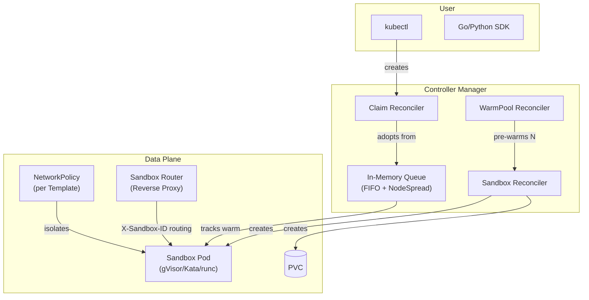
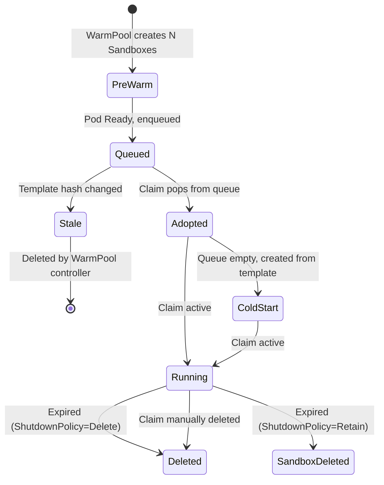
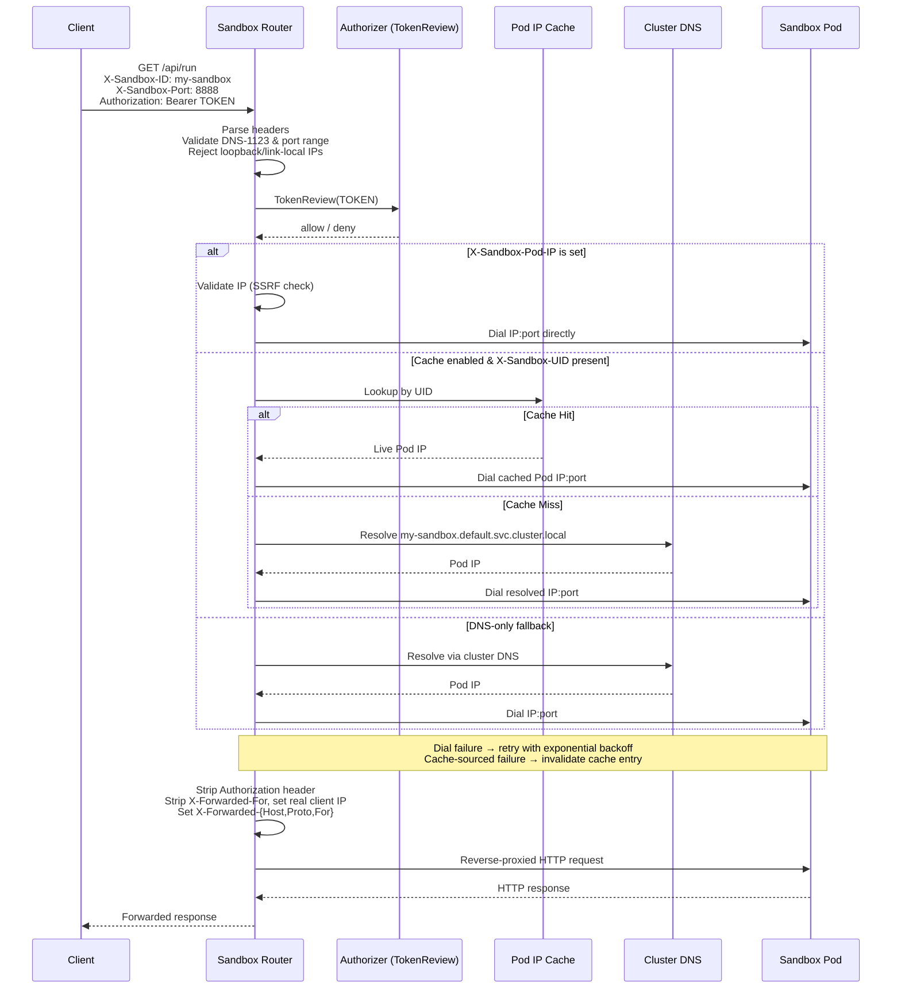

# Agent Sandbox: K8s 原生沙箱执行环境

## What is Agent Sandbox

[Agent Sandbox](https://github.com/kubernetes-sigs/agent-sandbox) 是一个 Kubernetes SIG Apps 子项目，提供了一套 CRD 和 controller 来管理**隔离的、有状态的、单例**工作负载。核心场景是 **AI Agent runtime**：在强隔离环境中执行 LLM 生成的不受信任代码。

两层架构：
- **Core** (`agents.x-k8s.io/v1beta1`)：`Sandbox` CRD —— 声明式定义单 Pod 沙箱，含稳定 hostname、持久存储、pause/resume、定时过期
- **Extensions** (`extensions.agents.x-k8s.io/v1beta1`)：`SandboxTemplate`（可复用蓝图）、`SandboxWarmPool`（预热池）、`SandboxClaim`（用户侧抽象）

配套的 **sandbox-router**（Go 反向代理）通过 `X-Sandbox-*` HTTP header 将客户端请求路由到沙箱 Pod。

- Go 1.26，Apache 2.0

## 架构



## 资源模型

| CRD | 级别 | 功能 |
|---|---|---|
| **SandboxTemplate** | 模板 | 定义 Pod 蓝图（镜像、资源、runtimeClass）+ NetworkPolicy |
| **SandboxWarmPool** | 池（1:N） | 维护 N 个预创建、预调度的 Sandbox，低延迟领取 |
| **Sandbox** | 单例（1:1） | 对应一个 Pod + PVC + Headless Service |
| **SandboxClaim** | 用户请求 | 从 Warm Pool 领取 Sandbox，或冷创建 |

资源关系：

```
SandboxWarmPool (spec.replicas=N)
  ├── Sandbox-A ── Pod-A + PVC-A + SVC-A
  ├── Sandbox-B ── Pod-B + PVC-B + SVC-B
  └── Sandbox-N ── Pod-N + PVC-N + SVC-N

SandboxClaim ──领取──→ Sandbox-A (OwnerRef 改为 Claim, 从 Pool 移除)

Claim 删除 → GC 级联删 Sandbox → Pod/PVC/SVC
```

## SandboxClaim 生命周期



当 Claim 被删除时，controller 不做任何清理——直接 return nil。Kubernetes GC 沿 OwnerRef 链条级联删除：Claim → Sandbox → Pod/PVC/SVC。

**Sandbox Pod 不会回到预热池。** WarmPool controller 独立监测 `current_replicas < spec.replicas`，创建新的 Sandbox 补充。这是单向流动：

```
Pool → (adopt) → Claim → (expire/delete) → GC destroys
  ↑                                              |
  └───── Pool controller creates replacement ────┘
```

### ShutdownPolicy

| 策略 | 行为 |
|---|---|
| `Delete` / `DeleteForeground` | Claim 过期 → 删除 Claim → GC 级联 |
| `Retain`（默认） | Claim 过期 → 仅删除 Sandbox，Claim 保留可供检查 |

## Warm Pool 的工作原理

Warm Pool 是该项目的核心性能优化。它维护一个预创建、预调度的 Sandbox 池子，消除 Pod 调度、镜像拉取、PVC 绑定的延迟。

**Controller 协调流程：**

1. WarmPool controller 监听到 `spec.replicas=N`
2. 创建 N 个 Sandbox（所有权归 Warm Pool）
3. 每个 Sandbox 创建对应的 Pod
4. Pod Ready 后，key 加入内存 FIFO 队列
5. Claim 到达时，从队列中领取（NodeSpread 策略——选择该节点剩余最多的）
6. 池子中移除已领取的 Sandbox，创建新的补充

**领取过程（`adoptSandboxFromCandidates`）：**
- 清空原 OwnerReferences
- 设置 `controllerRef` 指向 Claim
- 移除 Warm Pool 的 label
- 注入 Claim 指定的 env/volume

**Claim 删除时**：
- Controller 返回 nil（不清理）
- K8s GC 按 OwnerRef 级联删除
- Sandbox 不回池子

**两种更新策略**：

| 策略 | 行为 |
|---|---|
| `Recreate` | 删除所有预热 Sandbox，重新创建 |
| `OnReplenish` | 自然消耗后逐步替换为新模板 |

## 安全隔离机制

Agent Sandbox 实现了**纵深防御**，多层防护组合保障安全：

### 1. 运行时隔离

| Runtime | 隔离级别 | 机制 |
|---|---|---|
| **gVisor** | 内核级 | 用户态内核拦截 syscall，每个沙箱独立内核边界 |
| **Kata Containers** | 硬件虚拟化 | 每个 Pod 运行在轻量 VM 内（Firecracker/QEMU/Hyper-V） |
| **runc** | 容器级 | 仅 Linux namespace + cgroup，隔离最弱 |

Pod 级安全上下文：`runAsNonRoot`, `allowPrivilegeEscalation: false`, `capabilities.drop: ["ALL"]`, `seccompProfile: RuntimeDefault`

### 2. ServiceAccount 隔离

默认 `automountServiceAccountToken = false`。即使沙箱被攻破，也无法通过 SA token 访问 K8s API Server，阻止集群级提权。

### 3. 网络隔离（NetworkPolicy）

SandboxTemplate controller 为每个 Template 创建**共享 NetworkPolicy**：

- **Ingress**：仅 sandbox-router 可以连接沙箱
- **Egress（Secure by Default）**：
  - 允许公网（`0.0.0.0/0`）
  - 阻止内网（`10.0.0.0/8`, `172.16.0.0/12`, `192.168.0.0/16`）
  - 阻止 link-local（`169.254.0.0/16`，防止访问云 metadata server）
  - 阻止沙箱之间互访

效果：沙箱只能通过 router 被访问，不能访问集群内部服务、metadata server、或彼此。

### 4. 自动过期

Sandbox 有 TTL。超时后按 ShutdownPolicy 自动回收，防止长期存在的沙箱积累攻击面。

### 5. 资源限制

Template 中可配置 CPU/memory limits，通过 cgroup 强制实施，防止单沙箱消耗过量节点资源。

### 6. 持久存储

每个 Sandbox 绑定独立 PVC。Sandbox 销毁时 PVC 被级联删除，数据不残留。

## Sandbox Router

### 它是什么

Sandbox Router 是一个**独立的 Go 反向代理**（`sandbox-router/` 目录），不运行在 controller manager 中，而是单独部署为一个 Deployment + Service。它的作用是在客户端和沙箱 Pod 之间建立安全的请求路由。

**为什么需要它？** Warm Pool 中的沙箱 Pod 是不可区分的——它们有相同的镜像、相同的配置。用户不能直接知道哪个 Pod 属于他。Router 通过 HTTP header 携带的路由信息，将请求精准代理到正确的 Pod。

### 路由解析优先级

Router 解析目标沙箱时有三级优先级：

1. **`X-Sandbox-Pod-IP`**（显式覆盖）— 客户端直接指定 Pod IP，经过 SSRF 校验后直连。最低延迟，但需要调用方知道 IP。
2. **Pod IP Cache**（`X-Sandbox-UID`）— 通过 UID 查缓存中的 Pod IP。这是 KEP fast path，避免 DNS 查询延迟。
3. **DNS 解析**（fallback）— 构造 DNS 名 `http://<ID>.<NS>.svc.<cluster>:<port>` 通过集群 DNS 解析。最通用但最慢。

### Pod IP Cache（KEP Fast Path）

Router 维护一个本地 Pod IP 缓存，通过 K8s informer 监听 Pod 事件来实时更新：

- **写入**：当 Pod 变为 Ready 且有 Sandbox UID label 时，缓存 Pod IP
- **查找**：`X-Sandbox-UID` → `Pod IP`，O(1) 查询
- **失效**：Pod 被删除或 IP 变化时，从缓存中移除
- **Dial 失败时主动失效**：如果缓存命中的 IP 无法连接，缓存条目被主动清除并回退到 DNS

这使得路由延迟接近 IP 直连，同时保持 DNS 的容错性。

### 请求处理流程



### 认证与授权

Router 的认证通过可插拔的 `Authorizer` 接口实现，启动时选择实现，每个请求调用一次。

**两种实现：**

| 实现 | 行为 | 适用场景 |
|---|---|---|
| **AllowAll** | 所有请求放行（默认） | 开发环境、Router 前置已有 Envoy/Gateway 处理认证 |
| **TokenReviewAuthorizer** | 通过 K8s TokenReview API 验证 Bearer token | 生产环境，K8s 原生认证 |

#### TokenReview 认证流程

```
Client ──BearerToken──→ Router ──SHA-256(token)──→ LRU Cache (30s TTL, 2048 entries)
                              │                         │
                              │ cache miss              │ cache hit
                              ↓                         ↓
                         K8s TokenReview API       return cached decision
                              │
                    ┌─────────┴─────────┐
                    ↓                   ↓
              authenticated       unauthenticated
                    ↓                   ↓
               200 allow            401 deny
```

**缓存安全**：缓存存储 `SHA-256(token)` 哈希而非原始 token——即使内存 dump 泄露缓存也无法获取 session。

**认证步骤**：

1. 从 `Authorization: Bearer TOKEN` 头提取 token
2. SHA-256(token) 作为 LRU 缓存 key
3. Cache hit → 直接返回决策，零 API 调用
4. Cache miss → 调 K8s TokenReview API：
   - `authenticated=false` → `ErrUnauthenticated` (401)
   - API 失败 → 缓存 `1/3 TTL`（最少 1s），防止打爆 apiserver
   - `authenticated=true` → 缓存决策 30s TTL
5. 认证成功 → 请求放行

**身份来源**：

| 来源 | 提取方式 | 优先级 |
|---|---|---|
| **mTLS** 客户端证书 | TLS 握手提取 | SPIFFE URI → DNS SAN → Subject CN |
| **Bearer Token** | `Authorization` header | TokenReview 验证 |

**`RequireToken` 模式**：`false`（默认，无 token 也放行，过渡期） / `true`（无 token → 401）

**当前限制（v1）**：只做**认证**不做**授权**——任何已认证用户可访问任意沙箱。per-sandbox owner identity 授权由后续 KEP 引入。

### 安全头处理

Router 在转发前对关键 header 做安全处理：

| Header | 处理方式 | 原因 |
|---|---|---|
| **Authorization** | 入站消费后**剥离**，不转发 | 防止沙箱获取调用者 K8s token 冒充访问 API Server |
| **X-Forwarded-For** | 入站时剥离，出站时设为实际客户端 IP | 防止客户端伪造 IP |
| **X-Forwarded-Host/Proto** | 基于实际请求设置 | 沙箱可正确判断原始请求的协议和主机 |
| **Origin**（WebSocket） | 剥离 | 防止 CSRF origin 不匹配 |

核心原则：Router 已验证的身份信息**不传递**给沙箱。沙箱只知道"有人请求了它"，不知道"是谁"。

## 参考

- [Agent Sandbox GitHub](https://github.com/kubernetes-sigs/agent-sandbox)
