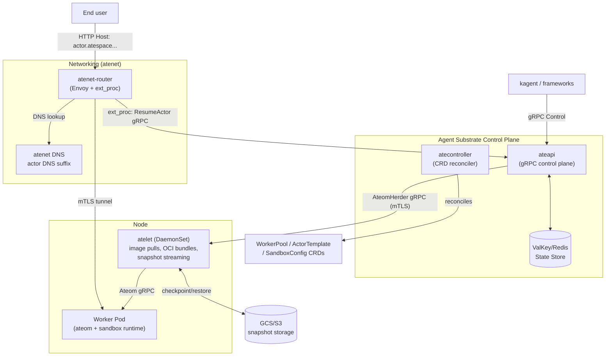
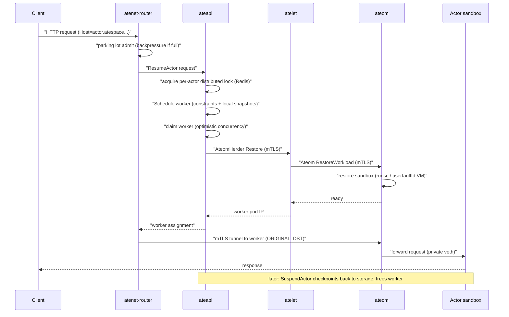

# Agent Substrate: 高密度 Agent 沙箱 Runtime

## What is Agent Substrate

[Agent Substrate](https://github.com/agent-substrate/substrate) 是一个面向大规模 agent 部署的高密度运行时环境，构建于 Kubernetes 之上。核心理念：把大量 **actor**（agent 应用实例）映射到少量预热的 **worker**（K8s Pod），通过**亚秒级的 suspend/resume** 实现空闲 agent 的高密度多路复用。

关键洞察：agent 工作负载大部分时间处于空闲状态。当空闲时 agent 被 suspend（checkpoint 到对象存储快照），worker 释放给其他 actor 使用；当请求到达时 actor 从快照 resume 到任意可用 worker。这解耦了 actor 生命周期和 K8s Pod 生命周期——K8s 管理低频基础设施（worker Pod），专用控制面管理高频低延迟的 actor 调度。

- Go 1.26.3，Apache 2.0，早期开发阶段（v0.0.0）
- Google 背景（非官方产品），425 commits
- 沙箱后端：gVisor (`runsc` checkpoint/restore) + Kata Containers on Cloud Hypervisor microVM

**目标指标**：100ms p95 激活延迟，单集群 10 亿 actor

## 双层状态模型

Agent Substrate 刻意将状态分为两层（协议 etcd 的扩展限制）：

| 层 | 存储 | 内容 | 更新频率 |
|---|---|---|---|
| **系统配置**（CRD） | K8s API Server / etcd | WorkerPool, ActorTemplate, SandboxConfig | 低频（infra 变更） |
| **动态实例状态** | ValKey/Redis | Atespace, Actor, Worker, ActorSnapshot | 高频（数千次/秒） |

## 核心概念

| 概念 | 说明 |
|---|---|
| **Actor** | agent 实例（派生自 ActorTemplate），地址 `(atespace, name)`。在 worker 之间迁移，suspend/resume 是核心操作 |
| **Atespace** | Actor 的隔离边界（类似 K8s namespace，但全局作用域） |
| **Worker** | 一条 WorkerPool Deployment 中的 Pod 记录。同持仅承载一个 actor（ACTIVE/DRAINING） |
| **WorkerPool** | CRD——声明预热计算容量和 worker 规格 |
| **ActorTemplate** | CRD——actor 的不变定义（镜像、资源、沙箱类型），创建时生成 Golden Snapshot |
| **Golden Snapshot** | ActorTemplate 创建时一次性产生的初始 checkpoint。actor 首次 resume 从此恢复 |
| **Last Snapshot** | 每个 actor 最近的快照，suspend 时写入，resume 时用于恢复 |
| **Suspend** | 休眠 actor：checkpoint → snapshot → 上传 GCS/S3 → 释放 worker |
| **Pause** | 短时挂起：快照保留在节点本地，恢复时优先调度回同一节点（数据亲和性） |
| **Resume** | 激活 actor：从快照恢复到任何可用 worker，非冷启动 |

## 架构



## 8 个 Binary

| Binary | 部署方式 | 功能 |
|---|---|---|
| **ateapi** | Deployment (HA) | 控制面——actor 生命周期、调度、快照编排，gRPC API |
| **atelet** | DaemonSet | 节点 supervisor——镜像拉取、OCI bundle 组装、快照流传输 |
| **atecontroller** | Deployment | CRD reconciler（WorkerPool→Deployment、ActorTemplate→golden snapshot） |
| **atenet** | Deployment/DaemonSet | DNS server + Envoy router + `ext_proc`（请求到达时触发 actor resume） |
| **ateom-gvisor** | worker Pod sidecar | gVisor sandbox herder——`runsc` checkpoint/restore |
| **ateom-microvm** | worker Pod sidecar | microVM herder——Kata + Cloud Hypervisor，`userfaultfd` restore |
| **podcertcontroller** | Deployment | Pod 证书签名——短生命周期 mTLS 身份 |
| **kubectl-ate** | 本地 CLI | kubectl 插件——管理 atespace/actor/worker |

## 核心机制

### Actor Suspend/Resume 流程



**分步说明（与时序图对应）：**

**步骤 ① — 请求到达 Router** (`C→R`)：客户端通过 atenet DNS 解析 actor 域名 `(actor).(atespace).actors.resources.substrate.ate.dev`，Router 从 Host header 中提取 `(actor, atespace)` 目标地址。

**步骤 ② — Parking Lot 准入** (`R→R`)：Router 的 `ext_proc` 处理器检查 worker 池是否有空闲容量。如果池子饱和，请求进入有界 parking lot——不直接返回 503，而是等待 worker 释放后重试。同时用 `singleflight.Group` 对并发请求去重（同一 actor 只发起一次 ResumeActor RPC）。默认 5s 重试预算，超时返回 503。

**步骤 ③ — ResumeActor RPC** (`R→A`)：Router 通过 gRPC（mTLS）调用 ateapi 的 `ResumeActor`，传入 `(atespace, actor name)`。

**步骤 ④ — 分布式锁** (`A→A`)：ateapi 在 Redis 中获取 per-actor 的分布式锁，确保同一个 actor 不会被并行在不同 worker 上恢复（防止脑裂）。

**步骤 ⑤ — Worker 调度** (`A→A`)：调度器扫描 worker cache（ateapi 持有的 worker 舰队内存镜像），随机选择一个满足约束的**空闲** worker——约束包括沙箱 class（gVisor/microVM）、worker 的 node selector、以及是否有本地 pause 快照（数据亲和性优先调度回同一节点）。

**步骤 ⑥ — 认领 Worker** (`A→A`)：通过 Redis 乐观并发控制（version check）将 `worker.assignment` 设置为该 actor。如果并发冲突（另一个请求抢先认领了该 worker），重新调度。

**步骤 ⑦ — AteomHerder 下发** (`A→L`)：ateapi 通过 mTLS gRPC 向目标节点上的 atelet（DaemonSet）发送 `Restore`/`Run` 指令。

**步骤 ⑧ — Ateom 恢复** (`L→T`)：atelet 从 GCS/S3 拉取快照（稀疏 zstd 压缩，并行多对象下载），通过 mTLS gRPC 调用 worker Pod 内 ateom sidecar 的 `RestoreWorkload`。

**步骤 ⑨ — 沙箱恢复** (`T→T`)：
- **gVisor**：`runsc restore`（checkpoint/restore 恢复进程树）
- **microVM**：Kata + Cloud Hypervisor，`userfaultfd` 按需分页恢复 VM 内存快照（容器 rootfs 写入通过 `tmpfs` overlay 保持在 guest RAM 中）

**步骤 ⑩⑪ — Worker 就绪** (`T→L→A`)：ateom 报告恢复完成 → atelet 将 worker pod IP 返回 ateapi。

**步骤 ⑫ — 路由目标** (`A→R`)：ateapi 将 `ateomPodIp` 返回给 Router。

**步骤 ⑬ — mTLS 隧道** (`R→T`)：Router 通过 Envoy `ORIGINAL_DST` cluster 建立到 `workerIP:443` 的 mTLS 隧道（atunnel 监听于此）。Envoy 保留原始 Host header，atunnel 根据 actor DNS 名做二次认证。

**步骤 ⑭⑮ — 请求转发** (`T→SB→C`)：atunnel 将请求转发到 actor 容器的 `:80` 端口（私有 veth 接口）。响应沿原路返回。

**Suspend 流程（时序图 Note）**：空闲 actor 超时后触发 suspend——gVisor `runsc checkpoint` → 文件列表上报 atelet → 流式上传 GCS/S3，释放 worker。快照 manifest 固定了创建它的沙箱二进制版本，restore 时不可变，保证跨版本可复现。

### Actor 快照

Suspend 时写入 GCS/S3 的快照包含三部分：

**FULL 作用域**（suspend 默认）：

| 内容 | 说明 |
|---|---|
| **进程内存** | 容器内所有进程的完整内存状态——代码、堆、栈、文件描述符。gVisor 通过 `runsc checkpoint` 捕获 sentry 管理的整个进程树；microVM 通过 Cloud Hypervisor 捕获完整 VM 内存快照 |
| **Rootfs delta** | 容器文件系统自 OCI 镜像启动后的所有写入变更。gVisor 以 overlay delta 保存；microVM 中 rootfs 写入通过 `tmpfs` overlay 保留在 guest RAM 内 |
| **DurableDir 卷** | 用户声明的持久化目录——actor 的应用数据。gVisor 限制 1 个，microVM 支持多个 |

**DATA 作用域**（`onPause`/`onCommit` 触发）：仅保存 DurableDir 卷。恢复时从 OCI 镜像冷启动进程，再挂载数据卷。适用于"只需要保留数据，不关心进程状态"的场景。

**两种快照类型**：

| 类型 | 何时创建 | 说明 |
|---|---|---|
| **Golden Snapshot** | ActorTemplate 创建时 | 从临时启动的 actor 捕获初始状态。所有 actor 首次 resume 共享此快照 |
| **Last Snapshot** | 每次 Suspend | 每个 actor 独立的最新快照，下次 resume 从此恢复 |

快照 manifest 固定创建时的沙箱二进制版本（content-addressed `runsc`/Cloud Hypervisor 路径），确保跨版本 restore 可复现。存储时使用稀疏 zstd 压缩，atelet 并行多对象流式下载。

### 沙箱后端（gVisor / microVM）

Agent Substrate 通过**可插拔沙箱 class** 支持两种 Runtime。ActorTemplate 的 `sandboxClass` 字段决定使用哪种，WorkerPool 在创建 Worker Pod 时注入对应的 ateom sidecar。

**架构分工**：

```
ActorTemplate.sandboxClass ──→ WorkerPool ──→ Worker Pod
                                                    │
SandboxConfig (CRD) ──→ 固定沙箱二进制版本             │
  runsc / kernel + firmware                        │
                                                    ↓
                                              ateom sidecar
                                         (gVisor 或 microVM)
```

- **SandboxConfig**（集群级 CRD）：为一类 Runtime 固定二进制版本（content-addressed）。多个 ActorTemplate 共享同一 SandboxConfig，统一升级沙箱版本
- **atelet**（DaemonSet）：节点 supervisor——按 SandboxConfig 中固定的二进制版本拉取 `runsc` 或 Cloud Hypervisor 二进制，组装 OCI bundle，通过 gRPC 下发给 ateom
- **ateom**（Worker Pod sidecar）：实际驱动沙箱进程——解耦 Pod 生命周期和沙箱进程生命周期

**gVisor（默认）**：

| 项目 | 说明 |
|---|---|
| **实现** | `cmd/ateom-gvisor` 驱动 `runsc` 二进制（运行时 content-addressed 拉取） |
| **Suspend** | `runsc checkpoint` → 捕获 sentry 管理的完整进程树 → 文件列表上报 atelet → 稀疏 zstd 压缩上传 |
| **Resume** | `runsc restore` → 恢复进程树到运行态 |
| **限制** | 仅支持 1 个 DurableDir 卷；需要 `--allow-connected-on-save` 绕过网络恢复 bug |

**microVM（Kata + Cloud Hypervisor）**：

| 项目 | 说明 |
|---|---|
| **实现** | `cmd/ateom-microvm` 在 Kata Containers guest 内运行 Cloud Hypervisor VM |
| **Suspend** | 仅内存快照（无 rootfs delta）——容器 rootfs 写入通过 `tmpfs` overlay 保持在 guest RAM 内 |
| **Resume** | `userfaultfd` 按需分页恢复 VM 内存——不需要一次性加载完整快照 |
| **DurableDir** | host-backed、通过第二块可写 virtio-fs share 挂载，快照中以 tar 传输。支持多个卷 |
| **容器镜像** | 必需 glibc（`debian:stable-slim`），因为 Cloud Hypervisor 二进制需要 glibc + mount/umount |

**对比**：

| | gVisor | microVM |
|---|---|---|
| **隔离级别** | 用户态内核（syscall 拦截） | 硬件虚拟化（VM 边界） |
| **快照内容** | 进程树 + rootfs delta + DurableDir | VM 内存（含 rootfs tmpfs） + DurableDir |
| **恢复方式** | `runsc restore` 一次性恢复 | `userfaultfd` 按需分页 |
| **DurableDir** | 1 个 | 多个 |
| **冷启动恢复** | 恢复进程状态（快） | 可选从 OCI 镜像冷启动 |

#### 如何绕过 K8s 容器运行时

Agent Substrate **不需要**对 Kubernetes 做任何特殊配置——不需要 `RuntimeClass`，不需要安装 gVisor/Kata 的 K8s 集成（如 `containerd-shim-runsc`）。

```
K8s 层:  Worker Pod = 标准 Pod (runc/containerd)
              │
              └── ateom sidecar (普通容器进程)
                      │
Agent Substrate 层:      │  在 Pod 内部 exec 沙箱 Runtime
                      ↓
              runsc / Cloud Hypervisor
                      │
                      ↓
              Actor sandbox (gVisor sentry / microVM guest)
```

Worker Pod 本身是**标准 K8s Pod**——用普通的 `runc` 通过 containerd 启动，不设 `runtimeClassName`。ateom sidecar 也是一个普通容器进程，运行在 Pod 的 cgroup 内。沙箱是 ateom **在 Pod 内部手动 exec** 启动的，完全绕开了 K8s 的容器栈（kubelet → CRI → containerd → runc）。

**SandboxConfig 的角色**：SandboxConfig CRD 通过 content-addressing 固定二进制的精确版本（如 `runsc@sha256:abc123` 或 Cloud Hypervisor 的 kernel + firmware）。atelet 在节点上按需拉取这些二进制到本地缓存，再通过 gRPC 传给 ateom。这意味着沙箱版本的升级与 K8s 节点升级完全解耦——改 SandboxConfig 即可全局生效。

#### Worker Pod 的权限模型

Worker Pod **不是被沙箱保护的对象**——它本身就是沙箱的宿主。ateom sidecar 以 root（UID 0）运行，直接在 Pod 内部 exec 沙箱 Runtime。关键是容器启动时注入的 Linux capabilities 和特权配置。

**gVisor worker**（`runAsUser: 0, privileged: false`）：

先 drop ALL，再加回必需的 13 个 capability：

| Capability | 用途 |
|---|---|
| `SYS_ADMIN` | mount、pivot_root、cgroup delegation（重新挂载 `/sys/fs/cgroup` 为读写） |
| `SYS_PTRACE` | 追踪沙箱应用进程 |
| `SYS_CHROOT` | chroot 到 sandbox rootfs |
| `NET_ADMIN`, `NET_RAW` | 配置 actor 的 veth 和 nftables 规则 |
| `SETUID`, `SETGID`, `SETPCAP`, `SETFCAP` | runsc gofer 的用户命名空间身份映射 |
| `DAC_OVERRIDE`, `FOWNER`, `CHOWN`, `MKNOD` | OCI rootfs 解包和 device node 创建 |

额外配置：
- **AppArmor: Unconfined** — 需要 remount `/sys/fs/cgroup`，默认 profile 会拦截（GKE COS 会强制检查）
- **seccomp: RuntimeDefault** — 不需要禁用 seccomp
- **私有 cgroup namespace** — `/sys/fs/cgroup` 是 Pod 自身的 cgroup scope，ateom 在其中为每个 actor 创建子 cgroup leaf

**microVM worker**（`runAsUser: 0, privileged: true`）：

直接给完整特权模式——Kata + Cloud Hypervisor 需要 `/dev/kvm`（HostPath CharDevice）、vhost 设备、mount 等广泛的宿主机访问。

`/dev/kvm` 通过 HostPath 显式挂载：

```yaml
volumes:
  - name: dev-kvm
    hostPath:
      path: /dev/kvm
      type: CharDevice
containers:
  - volumeMounts:
      - name: dev-kvm
        mountPath: /dev/kvm
```

Node 调度：通过 `nodeSelector: ate.dev/sandboxClass=microvm` 固定到 KVM 节点。

**atelet（DaemonSet）**：`runAsUser: 0, runAsGroup: 0, capabilities: drop ALL`——仅需要 root 做 image pull 和 OCI bundle 组装，不需要额外 capability。沙箱二进制拉取和缓存完全是用户态操作。

**唯一特殊要求**：microVM 的 Worker Pod 镜像需要 glibc（`debian:stable-slim`），因为 Cloud Hypervisor 二进制是动态链接的，依赖 glibc + mount/umount。

### Actor 资源管理

Actor **不设独立的 CPU/memory requests 或 limits**。这与 K8s Pod 模型根本不同：

```
K8s:  Pod requests=100m CPU  → 调度器找到满足条件的节点 → Pod 一直占用
Substrate: Actor 无资源声明    → 调度器找空闲 Worker     → 运行期间占用 Worker
                                → Suspend 后释放 Worker  → 零资源消耗
```

**WorkerPod 是资源边界**：WorkerPool 预创建 N 个固定规格的 Worker Pod（类似 `requests: 2CPU, 4Gi`）。Actor 运行时"借用"所在 worker 的全部资源——如果 worker 有 2CPU，actor 最多用 2CPU。Suspend 后，快照上传，worker 释放，该 worker 可以承载其他 actor。资源利用率通过**时间维度的多路复用**来实现：N 个 actor ↔ M 个 worker（N ≫ M），而非 K8s 的 1 Pod ↔ 确定的资源分配。

cgroup 层面：ateom 为每个 actor 容器在 worker Pod 的 cgroup 树下创建子 cgroup leaf——actor 的 CPU/memory 消耗计入 worker Pod 的 cgroup 统计，从 K8s 视角来看就是 worker Pod 的资源使用。

### 调度器

有独立的调度器（`ateapi/internal/scheduling/`），但**刻意保持简单**——瓶颈不在调度算法，而在 Redis 状态延迟和快照恢复速度。

**调度流程**：

```
ScheduleWorker(actor):
  candidates = []
  for each worker in workerCache:
    if worker.assignment == nil          // 空闲
       and worker.sandboxClass == actor.sandboxClass
       and worker.state == ACTIVE
       and actor.labels match worker.labels
       and (actor无localNode要求 或 worker.node在localNodes内)
    then candidates.append(worker)

  if candidates is empty:
    return ErrNoCapacity  // → Router parking lot 重试
  return candidates[random()]  // 均匀随机
```

**关键组件**：

| 组件 | 功能 |
|---|---|
| **workerCache** | ateapi 内存中的 worker 舰队镜像——K8s Informer 实时同步，O(1) 扫描 |
| **约束匹配** | sandbox class（gVisor/microVM）、worker labels、node selectors、local snapshot 亲和性 |
| **乐观并发认领** | Redis `UpdateWorker( expectedVersion )` → 冲突时重调度 |
| **无抢占/优先级** | 没有 DRF、fair-share、priority。复杂度在 suspend/resume 和路由层 |

**与 K8s Scheduler 对比**：

| | K8s Scheduler | Agent Substrate Scheduler |
|---|---|---|
| **调度对象** | Pod（持久分配） | Actor（临时分配，suspend 后释放） |
| **调度频率** | 低频（Pod 创建/删除） | 高频（每次 actor 激活/休眠） |
| **约束复杂度** | 多插件（亲和性、污点、拓扑、资源拟合） | 简单过滤（class + labels + node） |
| **状态存储** | etcd（异步 watch） | workerCache 内存镜像 + Redis（乐观锁） |
| **目标延迟** | 秒级 | 亚毫秒级（claim worker 仅一次 Redis 调用） |

### Workflow Engine

所有多步 actor 操作都实现为**幂等步骤序列**，由通用 workflow 引擎执行。关键可靠性模式：如果服务器在操作中途崩溃，客户端只需重试相同 RPC，每步的 `IsComplete()` 检查会跳过已完成的工作——"Client-Driven Forward Recovery"。

## 与 kagent、Agent Sandbox 的关系

三个项目形成了 AI 基础设施的技术栈：

```
┌─────────────────────────────────────────────────┐
│ kagent (Agent CRD + Controller + A2A)           │  ← Agent 声明式框架
│ 定义 Agent 的模型、工具、prompt，部署与对话       │
├─────────────────────────────────────────────────┤
│ Agent Sandbox (WarmPool + SandboxClaim + Router) │  ← K8s 原生沙箱执行
│ 预创建沙箱 Pod，Claim 领取，Router 代理请求       │
├─────────────────────────────────────────────────┤
│ Agent Substrate (Actor/Worker + 快照 Suspend)    │  ← 高密度沙箱 Runtime
│ 亚秒级 suspend/resume，actor-worker 多路复用     │
└─────────────────────────────────────────────────┘
```

| | [kagent](./kagent.md) | [Agent Sandbox](./agent-sandbox.md) | Agent Substrate |
|---|---|---|---|
| **层级** | Agent 框架（声明式） | 沙箱执行（K8s 原生） | 沙箱 Runtime（底层） |
| **核心抽象** | Agent, ModelConfig, RemoteMCPServer | Sandbox, WarmPool, Claim | Actor, Worker, ActorTemplate |
| **Pod 模型** | 1 Agent = 1 Deployment | 1 Sandbox = 1 Pod + PVC | N Actors → M Workers（多路复用） |
| **启动延迟** | K8s Deployment 冷启动 | WarmPool 预热（Pool → Claim 领取） | 亚秒级快照 resume（100ms p95 目标） |
| **隔离机制** | MCP 协议、A2A 协议 | gVisor/Kata、NetworkPolicy、SA token 禁用 | gVisor runsc checkpoint/restore、Kata Cloud Hypervisor microVM |
| **路由** | A2A Handler Mux（agent 间通信） | Sandbox Router（X-Sandbox header 代理） | atenet DNS + Envoy ext_proc（Host-based） |
| **状态管理** | K8s CRD + PostgreSQL + pgvector | K8s CRD + 内存 FIFO 队列 | CRD（低频）+ ValKey/Redis（高频） |
| **适用场景** | 多框架 Agent 管理（ADK/LangGraph/CrewAI） | 不受信任代码执行（AI Agent runtime） | 大规模 agent 部署（目标 10 亿 actor） |

三者可以叠加使用：kagent 声明 Agent → SandboxAgent 使用 Agent Substrate 做沙箱执行 → Agent Sandbox 提供 Router 认证与网络隔离。也可以各自独立使用。

## 参考

- [Agent Substrate GitHub](https://github.com/agent-substrate/substrate)
- [Architecture doc](https://github.com/agent-substrate/substrate/blob/main/docs/architecture.md)
