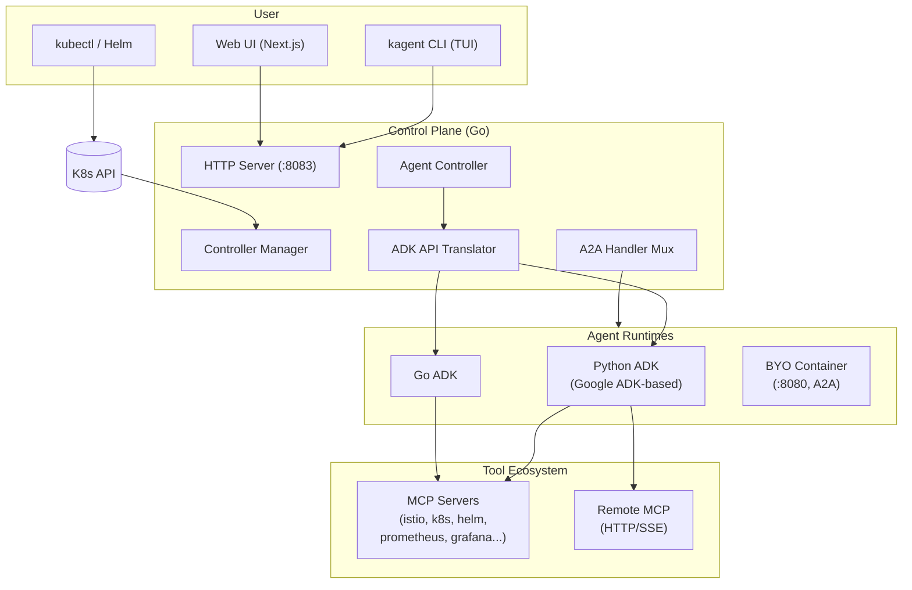

# kagent: K8s 原生 AI Agent 框架

## What is kagent

[kagent](https://github.com/kagent-dev/kagent) 是一个 CNCF 项目，提供了一个 Kubernetes 原生框架用于构建、部署和管理 AI agent。它把 K8s 变成 agentic AI 工作负载的编排层——用声明式 CRD 描述 agent，controller 自动部署 runtime，用户通过 CLI/Web UI/API 与 agent 交互。

- Go（controller/CLI/ADK）、Python（agent runtime）、TypeScript（UI）
- Apache 2.0，最新 v0.10.0-beta6
- CNCF sandbox 阶段

**支持的 LLM Provider**：OpenAI、Anthropic、AWS Bedrock、Gemini、Ollama、Azure OpenAI、SAP AI Core

**支持的 Agent 框架**：Google ADK、LangGraph、CrewAI、OpenAI Agents SDK

## 核心概念

| CRD | 功能 |
|---|---|
| **Agent** | 核心资源——定义一个 AI agent：system prompt、工具集、LLM 模型配置。分**声明式**（CRD 完整描述）和 **BYO**（自带容器镜像，走 A2A 协议）两种 |
| **ModelConfig** | LLM provider + model 配置（provider、model name、API key reference、temperature 等参数） |
| **RemoteMCPServer** | 引用外部 MCP server（HTTP/SSE 协议），让 agent 可以调用外部工具 |
| **SandboxAgent** | 在 Agent Substrate 沙箱 VM 中运行的 agent，隔离执行不受信任代码 |
| **AgentHarness** | 为沙箱 agent 提供可复用的测试/评估框架 |

## 架构



**三层设计**：

| 层 | 组件 | 作用 |
|---|---|---|
| **控制面**（Go）| Controller Manager + HTTP Server + A2A Handler Mux | 监听 CRD 变更、协调资源、提供 API、路由 A2A 请求 |
| **数据层** | PostgreSQL + pgvector + K8s API Server | 持久化 session/任务状态、向量搜索 agent memory |
| **运行时** | Python ADK / Go ADK / BYO 容器 | 执行 agent 逻辑、调用 LLM、访问 MCP 工具 |

## 核心组件

### Agent Controller（最重要）

Agent Controller 是整个系统的核心——它把 Agent CRD 翻译为 K8s 原生资源：

```
Agent CRD ──→ Agent Controller ──→ Deployment + Service + Secret + ConfigMap
                (ADK API Translator)
```

**翻译过程**：
1. 读取 Agent CRD —— 获取 system prompt、工具列表、ModelConfig 引用
2. ADK Translator 构建 manifest（Python/Go 两种 runtime）
3. 注入 ModelConfig 的环境变量和 API key（从 Secret 读取）
4. 为每个 MCP 工具注入地址和认证信息
5. 创建 Deployment（带 readiness probe）+ Service
6. 注册到 A2A Handler Mux，使该 agent 可通过 A2A 协议被其他 agent 发现和调用

### A2A Handler Mux

基于 K8s Informer 的 agent 注册和 A2A 请求路由：

- 通过 Informer 实时监听 Agent CRD 的创建/更新/删除
- 每个 agent 注册时协商协议版本（A2A v0.3.0 / v1.0）
- 收到 A2A 请求时，根据 agent 名称路由到对应的 agent Pod
- 支持 agent-to-agent 通信——一个 agent 可以作为另一个 agent 的"工具"

### ADK API Translator

CRD → 运行时 manifest 的翻译层：

```go
// 简化的翻译流程
func BuildManifest(agent Agent) Manifest {
    m := Manifest{}
    m.Deployment = buildDeployment(agent.Spec.Runtime, agent.Spec.ModelConfig)
    m.ConfigMap = buildConfigMap(agent.Spec.SystemPrompt, agent.Spec.Tools)
    m.Secret = buildSecret(agent.Spec.ModelConfig.APIKeyRef)
    m.Service = buildService(agent.Name, 8080)
    // 为 agent card 生成 A2A 能力声明
    m.AgentCard = buildAgentCard(agent.Spec.Skills, agent.Spec.Tools)
    return m
}
```

### Python ADK Runtime

基于 Google ADK 的 agent 运行环境：
- 接收 controller 生成的 manifest
- 通过 ADK 框架调用 LLM（LiteLLM 作为统一接口）
- 内嵌 MCP client 连接工具服务器
- 通过 A2A executor 暴露 agent-to-agent 接口

### MCP 工具生态

kagent 预置了丰富的 MCP server 用于 K8s 运维场景：

| MCP Server | 功能 |
|---|---|
| **istio-mcp** | Istio 流量管理、故障注入、可观测性配置 |
| **k8s-mcp** | kubectl 操作、资源查询、Pod 管理 |
| **helm-mcp** | Helm chart 安装、升级、回滚 |
| **argo-mcp** | Argo CD/Rollouts 管理 |
| **prometheus-mcp** | PromQL 查询、告警规则管理 |
| **grafana-mcp** | Dashboard 管理、数据源配置 |

## 用户体验

### 声明式创建 Agent

```yaml
apiVersion: kagent.dev/v1alpha2
kind: Agent
metadata:
  name: k8s-troubleshooter
spec:
  modelConfig:
    provider: anthropic
    model: claude-sonnet-4-6
  systemPrompt: |
    You are a Kubernetes troubleshooting expert. You have access to
    kubectl, helm, and prometheus tools to diagnose cluster issues.
  tools:
    - k8s-mcp-server
    - helm-mcp-server
    - prometheus-mcp-server
```

### CLI（TUI 交互式聊天）

```bash
# 列出所有 agent
kagent agent list

# 与 agent 对话（TUI 界面）
kagent agent chat k8s-troubleshooter

# 管理 MCP server
kagent mcp list
kagent mcp install prometheus
```

### Web UI

Next.js 构建的 Web 界面，提供 agent 的创建、管理、对话的可视化操作。

## 与其他项目的关系

| 项目 | 关系 |
|---|---|
| **Agent Sandbox** | kagent 集成 Agent Substrate 为 SandboxAgent，提供沙箱隔离执行 |
| **Google ADK** | Python agent runtime 基于 Google ADK 框架 |
| **A2A Protocol** | Agent 间通信标准，BYO agent 的互操作接口 |
| **MCP Protocol** | Agent 调用外部工具的标准协议 |

## 参考

- [kagent GitHub](https://github.com/kagent-dev/kagent)
- [kagent Documentation](https://kagent.dev)
