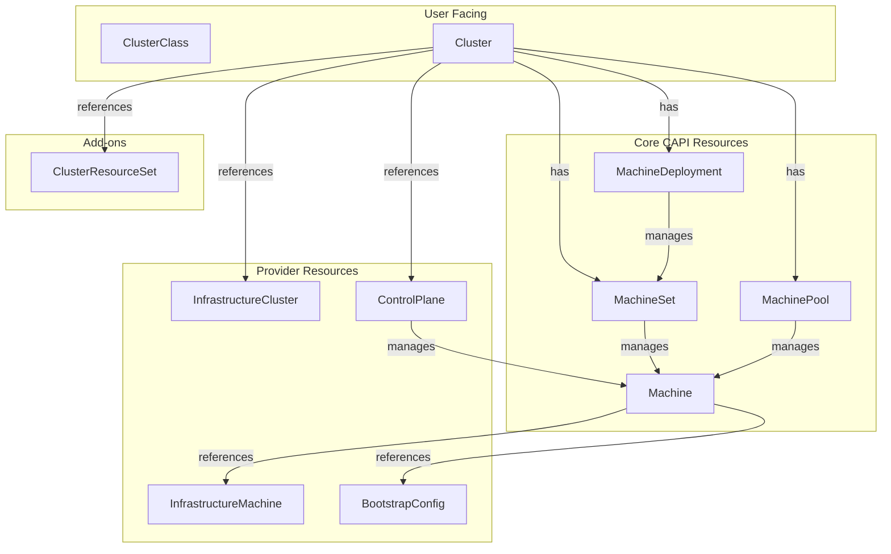
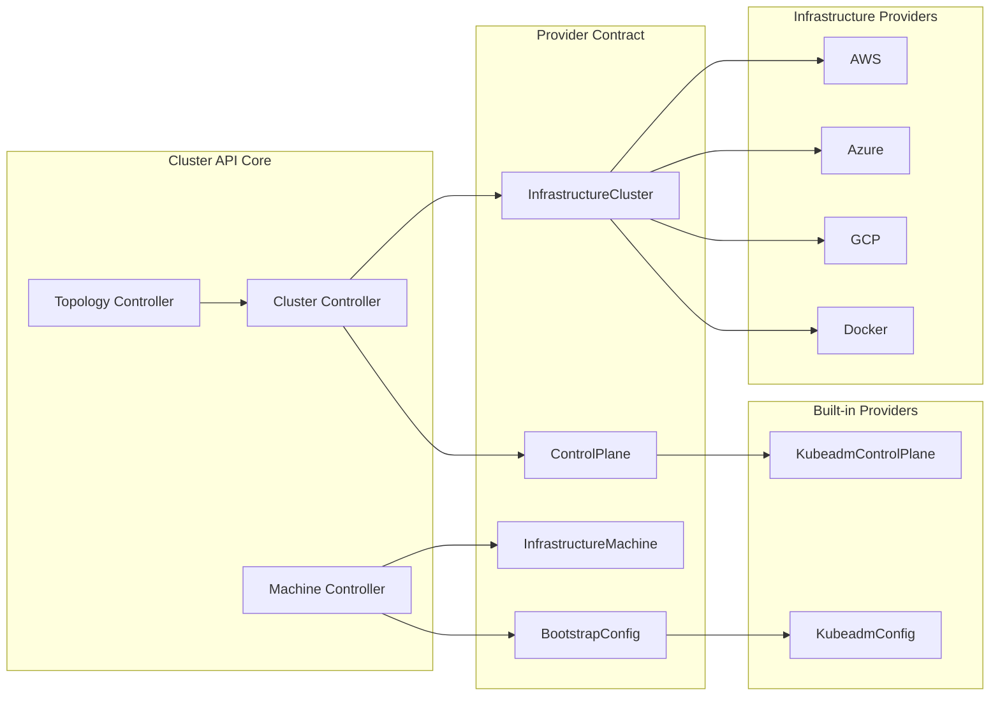
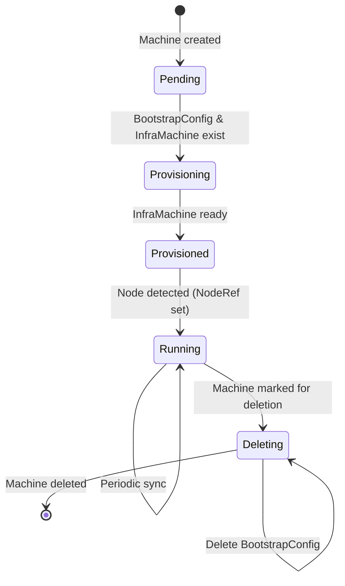
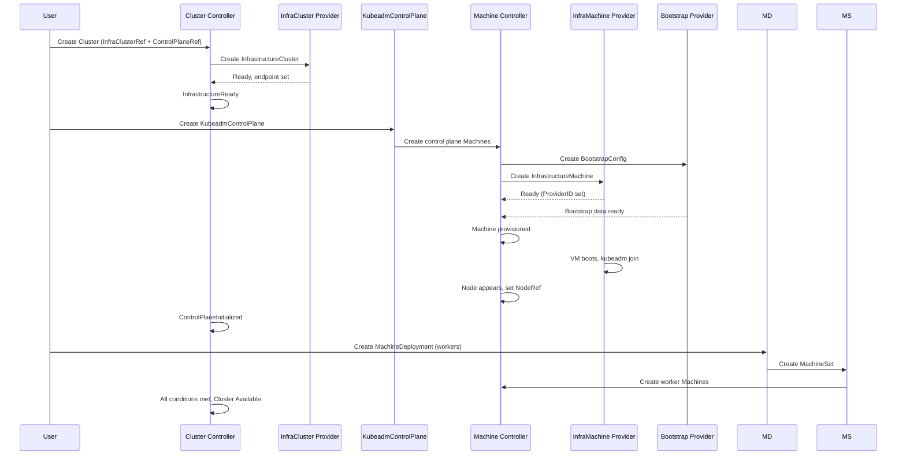

# Cluster API: 声明式集群生命周期管理

## What is Cluster API

[Cluster API (CAPI)](https://cluster-api.sigs.k8s.io) 是一个 Kubernetes SIG 子项目，用声明式 API 管理 Kubernetes 集群的创建、升级和销毁。它把基础设施（VM、网络、LB）和集群配置都定义为 Kubernetes CRD，用同样的 kubectl/controller 模式管理——就像管理普通 workload 一样管理整个集群。

- Go 1.26，Apache 2.0 许可证
- 当前版本 v1.13.2（v1.14.0 预发布）
- API 契约 v1beta2

## 核心概念

### 资源层级



### 核心 CRD

| CRD | 功能 |
|---|---|
| **Cluster** | 顶层——代表一个完整的 Kubernetes 集群 |
| **Machine** | 单个节点——对应一台 VM 或裸金属 |
| **MachineSet** | 一组相同配置的 Machine（类似 ReplicaSet） |
| **MachineDeployment** | MachineSet 的声明式滚动更新（类似 Deployment） |
| **MachinePool** | 带 autoscaling 的 Machine 池 |
| **ClusterClass** | 可复用的集群模板（托管拓扑） |

### Provider 模型

CAPI 本身不管基础设施——它通过 **Provider 契约** 把工作委托给外部 provider：

| Provider 类型 | 职责 | 内置实现 |
|---|---|---|
| **Infrastructure** | 创建 VM、网络、LB | `cluster-api-provider-aws/azure/gcp/vsphere/docker` |
| **Bootstrap** | 生成节点加入集群的配置 | `kubeadm` |
| **Control Plane** | 管理控制平面（HA/扩缩/升级） | `kubeadm` |

### Provider 契约



### Machine 生命周期



## 架构

**Controller Manager** (`main.go`) — 单一二进制，用 controller-runtime 注册所有 reconciler 和 webhook。

**`clusterctl`** — CLI 工具：`init`（初始化管理集群）、`generate cluster`（生成 YAML）、`move`（迁移）、`upgrade`（升级 provider）。

**Provider 契约** — 定义在 `internal/contract/`，通过 unstructured object 来与 provider CRD 交互，无需 Go 类型依赖。

### 集群创建流程



## Customized Provider 最简示例

下面是一个最小化的 Infrastructure Provider，演示如何在 CAPI 框架上创建定制 provider。

### 1. 定义 InfrastructureCluster CRD

```go
// api/v1alpha1/minimalcluster_types.go
package v1alpha1

import (
    metav1 "k8s.io/apimachinery/pkg/apis/meta/v1"
    clusterv1 "sigs.k8s.io/cluster-api/api/v1beta2"
)

// MinimalClusterSpec defines the desired state
type MinimalClusterSpec struct {
    // NodeCount is the number of fake nodes to create
    NodeCount int `json:"nodeCount"`
}

// MinimalClusterStatus defines the observed state
type MinimalClusterStatus struct {
    Ready bool   `json:"ready"`
    VIP   string `json:"vip,omitempty"`
}

// +kubebuilder:object:root=true
// +kubebuilder:subresource:status
type MinimalCluster struct {
    metav1.TypeMeta   `json:",inline"`
    metav1.ObjectMeta `json:"metadata,omitempty"`

    Spec   MinimalClusterSpec   `json:"spec,omitempty"`
    Status MinimalClusterStatus `json:"status,omitempty"`
}
```

### 2. 实现 Reconciler

```go
// internal/controller/minimalcluster_controller.go
package controller

import (
    "context"
    "fmt"

    "sigs.k8s.io/controller-runtime/pkg/controller/controllerutil"
    clusterv1 "sigs.k8s.io/cluster-api/api/v1beta2"
    "sigs.k8s.io/cluster-api/util"
    "sigs.k8s.io/cluster-api/util/conditions"

    infrav1 "mycompany.io/capi-minimal/api/v1alpha1"
)

func (r *MinimalClusterReconciler) Reconcile(ctx context.Context, req ctrl.Request) (ctrl.Result, error) {
    // 1. 获取 InfrastructureCluster 对象
    minimalCluster := &infrav1.MinimalCluster{}
    if err := r.Get(ctx, req.NamespacedName, minimalCluster); err != nil {
        return ctrl.Result{}, client.IgnoreNotFound(err)
    }

    // 2. 找到对应的 CAPI Cluster (ownerRef 指向它)
    cluster, err := util.GetOwnerCluster(ctx, r.Client, minimalCluster.ObjectMeta)
    if err != nil {
        return ctrl.Result{}, err
    }

    // 3. 如果 cluster 正在删除，清理资源
    if !minimalCluster.DeletionTimestamp.IsZero() {
        return r.reconcileDelete(ctx, minimalCluster)
    }

    // 4. 确保 Cluster 的 finalizer
    controllerutil.AddFinalizer(minimalCluster, "minimalcluster.infrastructure.cluster.x-k8s.io")

    // 5. 模拟"创建基础设施"——一个简单的逻辑
    if !minimalCluster.Status.Ready {
        // 在实际 provider 中，这里会调用云平台 API 创建 VM、网络等
        minimalCluster.Status.VIP = fmt.Sprintf("10.0.0.%d", minimalCluster.Spec.NodeCount)
        minimalCluster.Status.Ready = true
    }

    // 6. 将状态写入 CAPI Cluster 的 InfrastructureReady condition
    if minimalCluster.Status.Ready {
        conditions.MarkTrue(cluster, clusterv1.InfrastructureReadyCondition)
    }

    return ctrl.Result{}, r.Status().Update(ctx, minimalCluster)
}

func (r *MinimalClusterReconciler) reconcileDelete(ctx context.Context, c *infrav1.MinimalCluster) (ctrl.Result, error) {
    // 清理"云资源"
    c.Status.Ready = false
    controllerutil.RemoveFinalizer(c, "minimalcluster.infrastructure.cluster.x-k8s.io")
    return ctrl.Result{}, nil
}
```

### 3. 定义 InfrastructureMachine CRD

```go
// api/v1alpha1/minimalmachine_types.go
package v1alpha1

import (
    metav1 "k8s.io/apimachinery/pkg/apis/meta/v1"
)

type MinimalMachineSpec struct {
    InstanceType string `json:"instanceType,omitempty"`
}

type MinimalMachineStatus struct {
    Ready      bool     `json:"ready"`
    Addresses  []string `json:"addresses,omitempty"`
    ProviderID string   `json:"providerID,omitempty"`
}

// +kubebuilder:object:root=true
// +kubebuilder:subresource:status
type MinimalMachine struct {
    metav1.TypeMeta   `json:",inline"`
    metav1.ObjectMeta `json:"metadata,omitempty"`
    Spec   MinimalMachineSpec   `json:"spec,omitempty"`
    Status MinimalMachineStatus `json:"status,omitempty"`
}
```

### 4. 实现 InfrastructureMachine Reconciler

```go
// internal/controller/minimalmachine_controller.go
package controller

import (
    "context"
    "sigs.k8s.io/controller-runtime/pkg/controller/controllerutil"
    clusterv1 "sigs.k8s.io/cluster-api/api/v1beta2"
    "sigs.k8s.io/cluster-api/util"
    infrav1 "mycompany.io/capi-minimal/api/v1alpha1"
)

func (r *MinimalMachineReconciler) Reconcile(ctx context.Context, req ctrl.Request) (ctrl.Result, error) {
    minimalMachine := &infrav1.MinimalMachine{}
    if err := r.Get(ctx, req.NamespacedName, minimalMachine); err != nil {
        return ctrl.Result{}, client.IgnoreNotFound(err)
    }
    machine, err := util.GetOwnerMachine(ctx, r.Client, minimalMachine.ObjectMeta)
    if err != nil {
        return ctrl.Result{}, err
    }
    if !minimalMachine.DeletionTimestamp.IsZero() {
        controllerutil.RemoveFinalizer(minimalMachine, "minimalmachine.infrastructure.cluster.x-k8s.io")
        return ctrl.Result{}, nil
    }
    controllerutil.AddFinalizer(minimalMachine, "minimalmachine.infrastructure.cluster.x-k8s.io")
    if !minimalMachine.Status.Ready {
        minimalMachine.Status.ProviderID = "minimal://" + machine.Name
        minimalMachine.Status.Addresses = []string{"10.0.1." + machine.Name}
        minimalMachine.Status.Ready = true
    }
    if minimalMachine.Status.Ready {
        machine.Spec.ProviderID = &minimalMachine.Status.ProviderID
    }
    return ctrl.Result{}, r.Status().Update(ctx, minimalMachine)
}
```

### 5. 定义 ControlPlane CRD

```go
// api/v1alpha1/minimalcontrolplane_types.go
package v1alpha1

import (
    metav1 "k8s.io/apimachinery/pkg/apis/meta/v1"
)

type MinimalControlPlaneSpec struct {
    Replicas int `json:"replicas"`
}

type MinimalControlPlaneStatus struct {
    Ready              bool   `json:"ready"`
    Replicas           int    `json:"replicas"`
    ReadyReplicas      int    `json:"readyReplicas"`
    Initialized        bool   `json:"initialized"`
    ControlPlaneReady  bool   `json:"controlPlaneReady"`
}

// +kubebuilder:object:root=true
// +kubebuilder:subresource:status
type MinimalControlPlane struct {
    metav1.TypeMeta   `json:",inline"`
    metav1.ObjectMeta `json:"metadata,omitempty"`
    Spec   MinimalControlPlaneSpec   `json:"spec,omitempty"`
    Status MinimalControlPlaneStatus `json:"status,omitempty"`
}
```

### 6. 实现 ControlPlane Reconciler

```go
// internal/controller/minimalcontrolplane_controller.go
package controller

import (
    "context"
    "fmt"

    "sigs.k8s.io/controller-runtime/pkg/controller/controllerutil"
    clusterv1 "sigs.k8s.io/cluster-api/api/v1beta2"
    "sigs.k8s.io/cluster-api/util"
    "sigs.k8s.io/cluster-api/util/conditions"
    infrav1 "mycompany.io/capi-minimal/api/v1alpha1"
    corev1 "k8s.io/api/core/v1"
    metav1 "k8s.io/apimachinery/pkg/apis/meta/v1"
)

func (r *MinimalControlPlaneReconciler) Reconcile(ctx context.Context, req ctrl.Request) (ctrl.Result, error) {
    mcp := &infrav1.MinimalControlPlane{}
    if err := r.Get(ctx, req.NamespacedName, mcp); err != nil {
        return ctrl.Result{}, client.IgnoreNotFound(err)
    }
    cluster, err := util.GetOwnerCluster(ctx, r.Client, mcp.ObjectMeta)
    if err != nil {
        return ctrl.Result{}, err
    }
    if !mcp.DeletionTimestamp.IsZero() {
        // 删除所有 control plane Machine
        controllerutil.RemoveFinalizer(mcp, "minimalcontrolplane.controlplane.cluster.x-k8s.io")
        return ctrl.Result{}, nil
    }
    controllerutil.AddFinalizer(mcp, "minimalcontrolplane.controlplane.cluster.x-k8s.io")

    // 为每个 replica 创建 CAPI Machine 对象
    for i := 0; i < mcp.Spec.Replicas; i++ {
        machine := &clusterv1.Machine{
            ObjectMeta: metav1.ObjectMeta{
                Name:      fmt.Sprintf("%s-%d", mcp.Name, i),
                Namespace: mcp.Namespace,
                OwnerReferences: []metav1.OwnerReference{
                    *metav1.NewControllerRef(mcp, infrav1.GroupVersion.WithKind("MinimalControlPlane")),
                },
            },
            Spec: clusterv1.MachineSpec{
                ClusterName: cluster.Name,
            },
        }
        if err := r.Create(ctx, machine); err != nil {
            return ctrl.Result{}, err
        }
    }

    mcp.Status.ReadyReplicas = mcp.Spec.Replicas
    mcp.Status.Replicas = mcp.Spec.Replicas

    // 标记 Cluster 的 ControlPlaneReady condition
    conditions.MarkTrue(cluster, clusterv1.ControlPlaneReadyCondition)
    mcp.Status.Ready = true
    return ctrl.Result{}, r.Status().Update(ctx, mcp)
}
```

### 7. 与 CAPI 的交互点

Provider 通过以下标准字段与 CAPI 交互：

| 交互 | InfrastructureCluster | InfrastructureMachine | ControlPlane |
|---|---|---|---|
| **就绪标记** | `spec.controlPlaneEndpoint` + `status.ready=true` | `status.ready=true` | `status.ready=true` |
| **地址** | — | `status.addresses` | — |
| **失败** | `status.failureReason` / `failureMessage` | 同上 | 同上 |
| **OwnerRef** | 指向 Cluster | 指向 Machine | 指向 Cluster |
| **副本管理** | — | — | 创建 control plane Machine，管理扩缩/升级 |

### 8. 部署使用

```bash
# 1. 以 Docker provider 为例建管理集群
clusterctl init --infrastructure docker

# 2. 生成 workload cluster YAML
clusterctl generate cluster my-cluster --flavor development \
    --kubernetes-version v1.30.0 \
    --control-plane-machine-count=1 \
    --worker-machine-count=1 > my-cluster.yaml

# 3. 创建集群
kubectl apply -f my-cluster.yaml

# 4. 获取 kubeconfig
clusterctl get kubeconfig my-cluster > my-cluster.kubeconfig
```

### 9. Provider 注册

Provider 通过 `config/` 目录的 manifest 注册自身：

```yaml
# Provider 的 ClusterResourceSet —— 告诉 CAPI 如何找到这个 provider
apiVersion: clusterctl.cluster.x-k8s.io/v1alpha3
kind: InfrastructureProvider
metadata:
  name: minimal
spec:
  version: v0.1.0
  fetchConfig:
    url: https://github.com/mycompany/cluster-api-provider-minimal/releases/v0.1.0/infrastructure-components.yaml
```

## 参考

- [Cluster API 官方文档](https://cluster-api.sigs.k8s.io)
- [Provider 实现列表](https://cluster-api.sigs.k8s.io/reference/providers)
- [CAPI Provider 开发指南](https://cluster-api.sigs.k8s.io/developer/providers/implementers-guide/overview)
