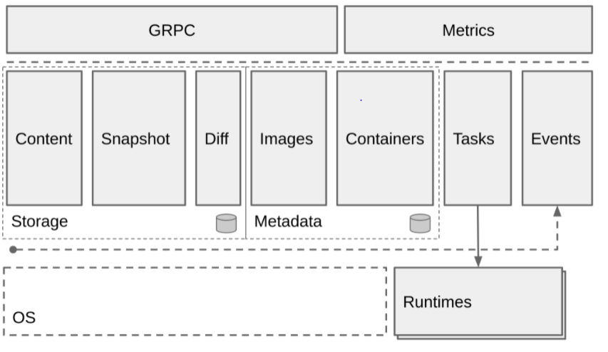

# 一份容器知识备忘录

## Linux Namespace

### Linux Namespace 是什么？

* UTS：隔离不同的机器名、域名
* IPC：隔离 linux 消息队列
* PID：隔离进程可见性（pid）
* Mount：隔离挂载点
* User：隔离用户以及用户组
* Network：隔离网络（网络虚拟化）

基于namespace，docker 就可以达到看起来像是独立于宿主机之外的效果

### 怎么使用 Namespace？

系统调用：

- clone 创建新进程时，根据调用参数来创建该进程的namesapce，并且它的子进程也会包含在 namespace 中
- unshare 将进程移除某个 namespace
- setns 将进程加入某个 namespace

## Linux Cgroup

### Linux Cgroup 是什么？

什么是Cgroup？

* subsystem 是各种控制模块
  * blkio：控制进程对硬盘的访问（例如输入/输出大小限制）
  * cpu：设置进程的cpu调度策略
  * cpuset：控制进程使用的多核cpu（所谓的 绑核）
  * devices：控制进程能够访问的设备
  * freezer：令进程挂起以及恢复
  * memory：控制进程访问内存
  * net_cls：网络包分类，以便 Linux tc (traffic controller ）可以根据分类区分出来自某个 cgroup 的包并做限流或监控
  * net_prio：控制进程的网络流量优先级
  * ns：它的作用是使 cgroup 中的进程在新的 Namespace fork新进 程 （NEWNS ）时，创建出 个新的cgroup ，这个 cgroup 包含新的 Namespace的进程
* cgroup：一个cgroup包含一组进程，通过subsystem与cgroup的关联，将这些进程与subsystem关联
* hierarchy：将一组cgroup组成树状结构，通过这种结构，cgroup 可以继承父节点cgroup的subsystem属性

基于 Cgroup，docker 可以达到控制进程资源的效果。

### 怎么使用 Cgroup？

* Linux中 cgroup 以文件系统的方式暴露给用户，例如`mount -t cgroup cgroup ./cgroup_test/`
* 系统自带的 Cgroup 路径`/sys/fs/cgroup`

## UnionFS

### UnionFS 是什么？

UnionFS是一类文件系统的统称，它可以将多个文件系统，视为同一个文件系统的不同branch，从而实现将不同目录的文件全部挂载到同一个目录上。什么意思？举个例子，有个目录是下面的结构

```
data/
├── mongo
└── mysql
```

我有另外一个目录是这样的结构

```
data/
├── protoc
└── golang
```

通过UnionFS可以将两个文件系统都挂在同一个目录下：

```
data/
├── mongo
├── mysql
├── protoc
└── golang
```

当然以上是一种只读场景，当发生写入时，UnionFS使用了一种CoW的技术（copy-on-write 写时复制）。

> 值得一提的是，系统调用中的 Fork 函数也使用了CoW的思想，fork 出子进程后，子进程的内存物理空间与父进程保持一致，直到子进程开始真正的修改时，才会复制对应的内存页

当我们对一个文件进行写入时，我们并没有更改原来的文件，而是新增了一个 branch，在这个新的branch中，UnionFS会把原来的文件copy过来，并新增需要写入的内容。

通过这种方式，可以同时使用只读和可读写的文件系统，并且可以保持一定的低开销。两种常见的UnionFS的实现是**AUFS**和**OverlayFS**

基于UnionFS，Docker 可以实现镜像分层（layer）以及镜像文件的重复利用

### 怎么使用 UnionFS ？

使用系统调用 mount，以aufs为例：

```bash
mount -t aufs -o dirs=/read-write-layer:/read-only-layer-1:/read-only-layer-2 none /mnt-dir
```

如何设置读写权限？左边第一个目录是 read-write 权限，其他的都是 read-only的

## 解析 docker 的各种操作

### 解析 docker run 发生了什么？

如何产生子进程

* fork 进程，同时创建新的 namespace，并开始 wait 子进程
* fork 出的进程会调用自身（也就是 /proc/self/exe，这个路径会短链到当前的可执行文件），并在arg参中数增加 init 命令
* init 命令会 exec 一个新的进程（注意exec 与fork 不同，exec 产生的子进程会完全替换当前的进程，包括数据、堆栈、PID等信息）
* exec 产生的进程会执行 `mount proc`，并执行用户指定的 command 命令

继续丰富上面过程中的细节，对子进程进行资源限制：

* 执行 docker run，fork 子进程
* 根据用户参数，创建 Cgroup
  * cpu：写入cpu.shares文件
  * cpuset：写入cpuset.cpus
  * memory：写入memory.limit_in_bytes
* 将子进程 pid 加入到创建 cgroup 中
* wait 子进程

继续丰富上面过程中的细节，通过管道向子进程传递参数：

* 执行 docker run，fork 子进程
* 创建一个 pipe
* 将pipe的读取段，作为一个fd添加到子进程中
* 父进程在pipe写入端，写入数据
* 子进程读取 3号 fd
* 父进程 wait 子进程

### docker 镜像是什么？怎么使用？

#### 镜像文件里有什么？

- manifest.json： 关于这个镜像包的一些配置，比如说镜像有哪几个 layer

- - Config 文件：关于镜像本身的一些配置，比说 ENV，Entrypoint， Cmd

- layer：layer 一般是一个tar包，几个 layer 共同叠加之后组成一个 root 文件系统

以 busybox 为例：

它的 manifest.json:

```json
[
  {
    "Config": "d23834f29b3875b6759be00a48013ba523c6a89fcbaeaa63607512118a9c4c19.json",
    "RepoTags": [
      "busybox:latest"
    ],
    "Layers": [
      "2a7f8eb07ab44ffd8e11d364e8b7ad18f69df5f29e2e2eb13695e6b01fbb4f77/layer.tar"
    ]
  }
]
```


把它的layer解压之后得到目录:

```
total 48
drwxr-xr-x 2 lubingtan lubingtan 12288 Nov 30 02:55 bin
drwxr-xr-x 4 lubingtan lubingtan  4096 Dec  5 12:47 dev
drwxr-xr-x 3 lubingtan lubingtan  4096 Dec  5 12:47 etc
drwxr-xr-x 2 lubingtan lubingtan  4096 Nov 30 02:55 home
drwxr-xr-x 2 lubingtan lubingtan  4096 Dec  5 12:47 proc
drwx------ 2 lubingtan lubingtan  4096 Nov 30 02:55 root
drwxr-xr-x 2 lubingtan lubingtan  4096 Dec  5 12:47 sys
drwxrwxr-x 2 lubingtan lubingtan  4096 Nov 30 02:55 tmp
drwxr-xr-x 3 lubingtan lubingtan  4096 Nov 30 02:55 usr
drwxr-xr-x 4 lubingtan lubingtan  4096 Nov 30 02:55 var
```


#### 怎么使用镜像？

使用镜像时怎么把读写 layer 分开？

- 会新建一个 read-write 的 layer 以及一个 read-only 的 layer
  - 这里 read-only 的 layer是用来存储启动容器时传入的系统信息
- 把所有镜像的 layer 以及刚刚的两个 layer mount 到一个目录下，把这个目录作为容器的 root 目录

容器启动时怎么使用新的 root 文件系统？

- 系统调用 pivot_root 可以改变整个系统的 root 文件系统，从而移除对老 root 的依赖。
- 系统调用 chroot 是针对某个进程，其他进程还是老的 root
- docker 会使用 pivot_root ，umouont 掉原来的 root

这样就可以在容器内看到镜像的文件系统了。

整个流程：

1. 创建只读层
2. 创建容器读写层 
3. 创建挂载点
4. 将挂载点作为容器的root

容器退出的时

1. 卸载挂载点
2. 删除挂载点
3. 删除除读写层

### 解析 docker stop、logs、delete

Stop：

- 查找主进程 PID
- 发送 SIGTERM 信号 （kill -15）
- 等待进程结束，如果一直不结束，发送 SIGKILL （kill -9）
- 修改容器信息，写入存储容器信息的文件

Delete：

- 根据容器名查找容器信息。
- 判断容器是否处于停止状态。
- 查找容器存储信息的地址。
- 移除记录容器信息的文件。

Logs：

- 把stdout、stderr重定向到一个日志文件
- 找到容器对应的文件，输出。

### 解析 docker commit

- 容器的进程会被 pause
- 重新打包当前的 root 文件系统

### 解析 docker exec

- 使用了一个系统调用 `setns`能够进入目标进程的 namespace

## Linux 网络虚拟化

Linux 网络虚拟化以及独赢的容器网络是有很多种形式的，在书中只介绍了 veth + bridge 这中容器网络方案。

### Veth是什么？

* veth 可以理解为虚拟网卡，它是成对出现的，即一个发送端、一个接收端，它可以用来连接不同 network namespace
* 如何操作：

```bash
# 创建 network namespace
ip netns add ns1
ip netns add ns2
# 创建一对 veth
ip link add veth0 type veth peer name veth1
# 把两个 veth 添加到两个 namespace 中
ip link set veth0 netns ns1
ip link set veth1 netns ns2
# 查看 ns1 的网络设备
ip netns exec ns1 ip link
# 配置 veth 的ip, 以及 namespace 的路由
ip netns exec ns1 ifconfig veth0 172.17.0.2/24 up
ip netns exec ns1 route add default dev veth0
ip netns exec ns2 ifconfig veth1 172.17.0.3/24 up
ip netns exec ns2 route add default dev veth1
# 对 veth 设备进行 ping
ip netns exec ns1 ping -c 1 172.18.0.3
```


### bridge 是什么？

* bridge 相当于一个虚拟的交换机，可以连接不同的网络设备。通过 bridge 可以连接 namespace 中的网络设备和宿主机上的网络。

```bash
# 创建 namespace 以及 veth
ip netns add ns1
ip link add veth0 type veth peer name veth1
# 将其中一个移到 ns1
ip link set veth1 setns ns1
# 创建网桥
brctl addbr br0
# 挂载网络设备
brctl addif br0 eth0
brctl addif br0 veth0
```

### 路由表是什么？

* 路由表是内核中的一个模块，通过定义路由表来决定在某个 namespace 中包的流向

```bash
# 启动虚拟网络设备, 并设置 veth 在 ns 中的IP
ip link set veth0 up
ip link set br0 up
ip netns exec ns1 ifconfig veth1 172.18.0.2/24
# 设置 ns1 网络空间的路由和宿主机上的路由
# default 代表 0.0.0.0/0, 即在 net namespace 中所有的流量都经过 veth1
ip netns exec ns1 route add default dev veth1
# 在宿主机上, 将流向 172.18.0.2/24 网段的请求, 全部路由到 br0 上ss
route add -net 172.18.0.2/24 dev br0
# 从 ns 访问宿主机
ip netns exec ns1 ping -c 10.0.2.15
# 宿主机访问 ns
ping -c 172.18.0.2
```

### Iptables 是什么？

iptables 是对内核中的 netfilter 模块进行操作的工具，可以用来管理流量包的流动和传送，通过不同的策略对包进行加工、传送或丢弃。例如：

* MASQUERADE 策略：将请求包的源地址换成一个网络设备的地址。这个用到的场景是，ns 中的请求包到达宿主机外部后，不知道如何访问这个请求包的源地址。如果使用这个策略将源地址替换，就可以找到宿主机了。
* DNAT 策略：可以将 ns 内部的端口映射到宿主机端口，这样外部请求到达时，就可以访问ns中的网络了。

## Docker 的容器网络

### golang 中如何实现

* net 库
* netlink 库
* netns 库

### Docker 对于容器网络的抽象

* 网络：是容器的集合，在这个网络上的容器可以通过这个网络互相通信，就像挂载到同一个 Linux Bridge 设备上的网络设备一样。网络中会包括这个网络相关的配置，比如网络的容器地址段、网络操作所调用的网络驱动等信息。
* 网络端点：连接容器与网络，凹征容器内部与网络的通信。例如Veth设备，一端挂在容器内部，一端挂在 Bridge 上，就能保证容器和网络的通信。网络端点中包括连接到网络的一些信息，比如地址、Veth 设备、端口映射、连接的容器和网络等信息。
* 网络驱动：网络功能中的组件，不同驱动代表者对网络创建、连接、销毁的不同策略。创建网络时指定不同的网络驱动来定义如何做网络的配置。
* IPAM：也是网络功能中的组件，用于网络 IP 地址的分配和释放，包括容器的 IP 地址和网络网关的 IP 地址。它的功能时从指定的 subnet 网段中分配 IP 地址，以及释放 IP 地址。

### 如何分配IP？

- 基于 bitmap 算法：把一段 ip 是否已经分配的状态，保存在一段二进制数字中（已分配为 1，未分配为 0）
- 分配 ip 时把 ip 地址的信息记录到文件中

### 如何创建网络？

创建网络：

- 输入网络的网段、网关以及网络的名字
- 创建 bridge 设备
- 设置 bridge 设备的地址和路由
- 启动 bridge 设备
- 设置 iptabels 的 SNAT 规则

删除网络：

- 删除 bridge 设备

### 如何把容器连上网络？

- 创建 veth
- 挂载一端到 bridge 上
- 挂载另一端到 network ns 中
- 设置另一端的 ip
- 设置 network ns 中的路由
- 设置端口映射

### 如何容器之间跨主机通信？

* 通过一致性 kv-store 分配 ip
* 通过封包或者路由实现跨主机通信
  * 封包：将请求包封装成宿主机直接的通信包，在宿主机解包后再发送到对应的容器
    * vxlan
    * gre
  * 路由：让宿主机网络知道容器的地址要怎么路由，需要网络设备的支持
    * 路由器路由表
    * Vlan
    * VPC路由表
    * macvlan：**一块物理网卡虚拟成多块虚拟网卡**

## 业界主流技术栈

### runC

runc 的目标是，构造到处都可以运行的标准容器

* 由docker 的子项目 libcontainer 发展而来，托管于OCI（open container Initiative，2015年成立的组织）
* 完全支持 Linux Namespace
* 支持所有 Linux 所有原生安全特性（Selinux、prvot_root、capability等等）
* 支持容器热迁移（CRIU项目）
* 正式的容器标准以及实现
* OCI 标准
  * rootfs 一个文件夹， 代表容器的 root 文件系统
  * config.json 包括容纳容器的配置数据

#### 容器配置里有什么？

- mounts：挂载点，源设备名或者文件名，目标挂载路径，等等
- process：比如工作目录，环境变量，启动命令，资源使用量等等。
- user：容器内的用户信息
- platform：容器运行的系统信息
- hook 钩子
  - prestart：在容器启动之后、用户进程启动之前执行，可以配置一些容器初始化环境。
    - 典型的例如，nvidia container runtime，它在 runc 之上包了一层，把一个 prestart hook 传递给runc，这个 prestart hook 其实是一个叫做 nvidia-container-toolkit 的 cli 程序，这个cli 调用了 libnvidia-contaiener 来做一些初始化环境的工作。
  - poststart：在用户进程启动之后执行，例如提醒用户容器已经起来了。
  - poststop：在容器进行停止后执行，可以用来做一些清理工作。

#### runc 是怎么创建容器的？

1. 读取配置文件
2. 设置 rootfs
3. 使用factory 创建容器（不同系统不同的实现）
4. 创建初始化进程
5. 设置容器的输出管道
6. 启动 container.Start 启动物理的容器
7. 回调 init 方法重新初始化容器进程
8. runC 父进程等待子进程，结束后退出

#### OCI 标准还有什么东西？

[image-spec](https://github.com/opencontainers/image-spec)：定义了镜像保存的格式

[distribution-spec](https://github.com/opencontainers/distribution-spec)：定义了镜像仓库的接口

### Docker containerd

* 作为 daemon 程序（守护进程）运行在 Linux 上，管理机器上所有容器的生命周期
* 从 docker 项目中独立出来的，向更上层的平台暴露 gRPC API，例如 Swram、Kubernetes、Mesos等等
* containerd 负责一台机器的 镜像操作（pull / push）、容器操作（start / stop）、网络以及存储，不过对于容器具体的运行是由 runC 负责
  * 支持 OCI 运行时
  * 支持镜像 pull / push
  * 容器运行时生命周期管理
  * 网络操作原语
  * 存储


Containerd 的架构：




#### containerd 和 docker 之间的关系？

* docker 包含 containerd，除了containerd 的 功能之外，docker 还可以完成镜像构建的功能，以及 docker client 提供的 cli 工具

#### containerd和 OCI、runc 之间的关系？

OCI 个标准化的容器规范，包括运行时规范和镜像规范 rune 是基于此规范的参考实现， Docker 贡献了 runc 主要代码。

从技术枝上看 containerd 比 runc 的层次更高， containerd 可以使用 runc 启动容器，还可以下载镜像，管理网络。

### CRI 以及 shim 层

CRI 是 k8s（容器编排）这个项目定义的一组接口，可以让 kubelet 通过 CRI 接口进行容器操作。

#### CRI 的接口定义有哪些？

CRI 的核心概念：PodSandbox 和 Container：

- pod 由一组 Container 构成，这些容器贡献相同的环境与资源，这个共同的环境被称为 PodSandbox
- 不同的实现可以由不同的 PodSandbox，比如 docker 可以实现成一个 namespace，Hypervisor 可以实现成一个虚拟机。

定义：[cri-api/api.proto at master · kubernetes/cri-api](https://github.com/kubernetes/cri-api/blob/master/pkg/apis/runtime/v1/api.proto)

- RuntimeService：Pod 、容器以及日志的操作
- ImageService：镜像的操作（不包括 build）

#### 使用 CRI 有什么好处？

- 解耦了 Pod 的实现与接口，开发 shim 时不需要了解 kubelet
- 有利于 kubelet 的扩展


CRI 的目的在于：

- 提升 Kubernetes 可扩展性，让更多的容器运行时更容易集成到 Kubernetes 中。
- 提升 Pod Feature 的更新迭代效率。
- 构建易于维护的代码体系。

CRI 不会做以下5件事。

- 建议如何与新的容器运行时集成，例如决定 Container Shim 应该在哪里实现。
- 提供新接口的版本管理。
- 提供 Windows container 支持。本接口不会在 Windows container 支持方面花费太多，但会尽量做到更加易于扩展来让 Windows container 特性更容易被添加进来。
- 重新定义 Kubelet 的内部运行时相关接口。尽管会增加 Kubelet 可维护性，但这不是 CRI 的工作。

- 提升 Kubelet 效率和性能。
