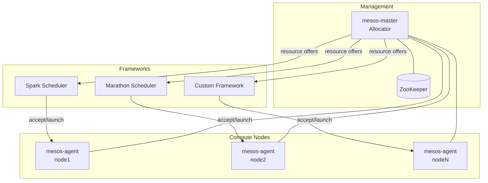
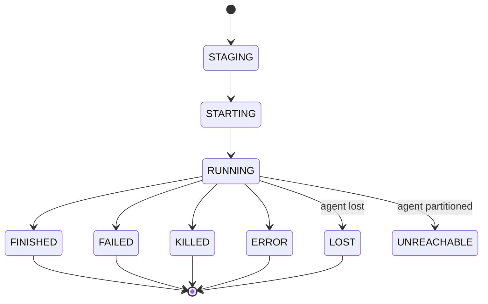

# Apache Mesos: 分布式系统内核

## What is Mesos

[Apache Mesos](https://mesos.apache.org) 是一个分布式系统内核——将多台机器的 CPU、内存、存储等资源抽象为统一资源池的集群管理器。它提供资源隔离和共享能力，允许多种分布式应用框架（Spark、Hadoop、Jenkins 等）在同一集群上动态共享资源。

核心创新是**两级调度**模型：

- **Master** 用可插拔分配策略决定给每个框架分配多少资源
- **框架调度器** 决定接受哪些资源、在哪些节点上运行哪些任务
- 这种薄接口让 Mesos 能扩展到数千节点，同时框架独立演化

Mesos 不是一个调度器——它是资源管理器，把调度决策委托给各应用框架。这区别于 Slurm（HPC 专用）和 Kubernetes（容器编排+内置调度）。

- 当前版本: 1.12.0，Apache 2.0 许可证，C++ 为主
- 起源于 UC Berkeley（2011 NSDI 论文），现由 Apache 软件基金会维护

## 架构



### 核心 Daemon

| Binary | 功能 |
|---|---|
| **mesos-master** | 中央控制器——管理 agent、框架注册、资源分配。默认端口 5050 |
| **mesos-agent** | 节点 daemon——运行在每个节点上，启动和监控 executor/task。默认端口 5051 |
| **mesos-local** | 单机 Mesos 集群（master+agent 合一），用于开发测试 |

### 插件/模块系统

通过动态库（`.so`）在运行时加载，约 12 种可插拔接口：

| 模块类型 | 功能 |
|---|---|
| **Allocator** | 资源分配策略（默认：层级 DRF） |
| **Isolator** | 容器资源隔离（cgroups、Docker、disk/volume） |
| **Containerizer** | 容器运行时（Mesos、Docker、composing） |
| **Authenticator / Authorizer** | 认证（SASL、JWT）和 ACL 授权 |
| **Hook** | Master/agent 生命周期钩子 |
| **QoS Controller** | Oversubscription 的服务质量管控 |
| **Resource Estimator** | 预估可用资源用于 oversubscription |

## 核心概念

### 数据模型（Protobuf）

| 消息 | 功能 |
|---|---|
| **FrameworkInfo** | 框架描述：用户、名称、角色、能力、failover 超时 |
| **Resource** | 资源：name、type（SCALAR/RANGES/SET）、value、role reservation |
| **Offer** | 资源提供：某 agent 上可分配给框架的一组资源 |
| **InverseOffer** | 反向提供：请求回收框架的资源（维护/降级） |
| **TaskInfo / TaskStatus** | 任务描述和状态更新 |
| **ExecutorInfo** | Executor 描述：类型（DEFAULT/CUSTOM）、命令、资源、容器 |

**Task 生命周期：**



### 调度器 API（v1 HTTP）

**Events（master → scheduler）：** SUBSCRIBED、OFFERS、INVERSE_OFFERS、RESCIND、UPDATE、FAILURE、ERROR、HEARTBEAT

**Calls（scheduler → master）：** SUBSCRIBE、ACCEPT、DECLINE、REVIVE、KILL、ACKNOWLEDGE、RECONCILE、SUPPRESS

### 10 种 Offer 操作

| 操作 | 功能 |
|---|---|
| LAUNCH / LAUNCH_GROUP | 启动单个/一组共享 executor 的任务 |
| RESERVE / UNRESERVE | 动态角色预留/释放 |
| CREATE / DESTROY | 创建/销毁持久化卷 |
| GROW_VOLUME / SHRINK_VOLUME | 卷扩容/缩容 |
| CREATE_DISK / DESTROY_DISK | CSI 磁盘供应/取消 |

## 核心算法：层级 DRF 分配器

默认分配器 `HierarchicalDRFAllocatorProcess` 实现**主导资源公平性（DRF）** + 层级角色 + 配额支持。

**DRF 原理：**
- 每个框架/角色有一个**主导份额** = `max(cpu_share, mem_share, disk_share)`
- 排序器按主导份额升序排列（"最穷"的优先获得资源）
- 分配后该框架的主导份额上升，排名下降
- 保证多资源维度的 max-min 公平性

**两阶段分配：**

```
Algorithm: __generateOffers()

Stage 1 — 配额感知分配:
  for each agent (随机顺序):
    for each role in DRF顺序:
      for each framework in DRF顺序:
        分配预留资源 + 满足配额保证的无预留资源
        更新配额跟踪 + headroom 跟踪

Stage 2 — 尽最大努力分配:
  for each agent (重新随机):
    for each role in DRF顺序:
      for each framework in DRF顺序:
        分配剩余资源（受配额限制 + headroom 约束）
```

### 资源预留模型

| 类型 | 方式 |
|---|---|
| **静态预留** | agent `--resources` 配置，不可变 |
| **动态预留** | `RESERVE` 操作或 `/reserve` HTTP 端点 |
| **精炼预留** | 动态预留的进一步特化（如 `eng` → `eng/front_end`）|

## 与 Kueue、Slurm 对比

| | Mesos | [Slurm](../Machine_Learning/High_Performance_Computing/slurm.md) | [Kueue](../Cloud_Native/Kubernetes/kueue.md) |
|---|---|---|---|
| **调度模型** | 两级（Master→框架） | 单体（slurmctld） | 两级（K8s→Kueue） |
| **运行环境** | 裸金属/云 VM | HPC 集群 | Kubernetes |
| **资源模型** | Offer 供应模式 | 节点分配 | ResourceFlavor |
| **多租户** | 角色+动态预留 | Account+QOS | ClusterQueue+Cohort |
| **适用场景** | 混部多框架 | HPC/超算 | K8s 批处理作业 |

## 参考

- [Apache Mesos 官网](https://mesos.apache.org)
- [Mesos: A Platform for Fine-Grained Resource Sharing (NSDI 2011)](https://people.eecs.berkeley.edu/~alig/papers/mesos.pdf)
