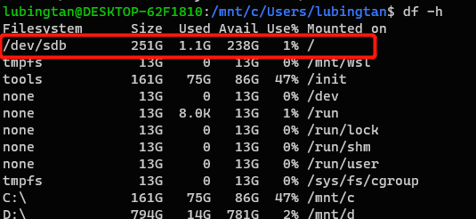
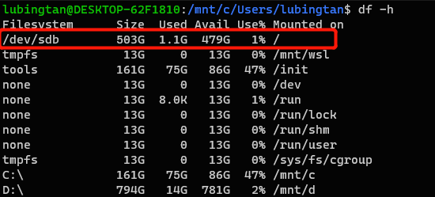

## WSL

### 切换wsl版本

管理员运行：

`wsl --set-version Ubuntu 2`


### WSL 无法访问windonws host 上的服务

#### networkMode=NAT

原因是 Windows 防火墙阻止了访问, 查看这个[issue](https://github.com/microsoft/WSL/issues/4585)

```sh 
New-NetFirewallRule -DisplayName "WSL" -Direction Inbound  -InterfaceAlias "vEthernet (WSL)"  -Action Allow
```

#### networkMode=mirrored

另一种方法： https://zhuanlan.zhihu.com/p/15762609815
把 network 模式设置为 mirrored 

同时最好打开 hostAddressLoopback，能够允许使用 IP 访问（否则只能用localhost或者127.0.0.1）

最终的`.wslconfig`:

```toml
[wsl2]
networkingMode=Mirrored
[experimental]
hostAddressLoopback=true
```


### 使用VPN代理时的问题

> [!NOTE]
>
> 这里的vpn并不是平常用的 http/https/socks5 proxy，指的是一般公司里使用的、用来访问 private network 的代理
>
> 如果需要在wsl中访问 host 上的proxy， 参考[这里](#wsl-无法访问windonws-host-上的服务)

#### WLS2 启动不了

参考这个issue https://github.com/microsoft/WSL/issues/4177#issuecomment-508826708

下载NoLsp： https://www.proxifier.com/tmp/Test20200228/NoLsp.exe

然后**管理员权限**启动PowerShell，然后执行：

`.\NoLsp.exe c:\windows\system32\wsl.exe`

#### WSL 内无法访问网络

使用这个东西: [wsl-vpnkit](https://github.com/sakai135/wsl-vpnkit)


### 自定义wsl安装位置

参考：https://zhuanlan.zhihu.com/p/263089007：

手动下载ubuntu：https://docs.microsoft.com/zh-cn/windows/wsl/install-manual

把appx的后缀改为.zip，然后解压到想要安装WSL的目录下，我们可以得到一些文件

双击红框框出的那个ubuntu.exe（其他发行版的话也有类似的程序）,等待一段时间就成功安装到当前目录啦~

需要注意的是安装目录的磁盘不能开**压缩内容以便节省磁盘空间**选项，否则会报错`0xc03a001a`

可以右键`文件夹-->属性-->常规-->高级`找到并关闭这个选项

### wsl扩展硬盘大小

参考：https://www.jianshu.com/p/2348dc7e9aef

#### windows侧操作

首先关闭wsl（ `wsl --shutdown `）

管理员打开powershell切到wsl的安装位置（自定义安装位置参考自定义wsl安装位置）

找到wsl文件系统路径，应该是ext4.vhdx这个文件


然后执行 diskpart 命令，之后会进入一个命令行操作界面，一次执行以下命令

```powershell
Select vdisk file="<pathToVHD>"
expand vdisk maximum="<sizeInMegaBytes>"
```

其中 是vhdx文件路径，是更改后的大小，单位为MB（例如希望大小改为512G, 就是524288）

#### wsl内操作

重新打开wsl（打开的时候需要等待一段时间，猜测可能是在重新load文件系统）

然后执行以下命令

```bash
sudo mount -t devtmpfs none /dev
# 获取文件系统的设备名， 这里获得的是/dev/sdb
mount | grep ext4 
# resize2fs 是个命令工具，如果不存在则需要安装(apt-get install resize2fs)
sudo resize2fs /dev/sdb
```





成功！

### WLS2 Ubuntu安装systemd

https://zhuanlan.zhihu.com/p/180195635

安装

`sudo apt install -y fontconfig daemonize` 

编辑/etc/profile，添加

```bash
SYSTEMD_PID=$(ps -ef | grep '/lib/systemd/systemd --system-unit=basic.target$' | grep -v unshare | awk '{print $2}')

if [ -z "$SYSTEMD_PID" ]; then
   sudo /usr/bin/daemonize /usr/bin/unshare --fork --pid --mount-proc /lib/systemd/systemd --system-unit=basic.target
   SYSTEMD_PID=$(ps -ef | grep '/lib/systemd/systemd --system-unit=basic.target$' | grep -v unshare | awk '{print $2}')
fi

if [ -n "$SYSTEMD_PID" ] && [ "$SYSTEMD_PID" != "1" ]; then
    exec sudo /usr/bin/nsenter -t $SYSTEMD_PID -a su - $LOGNAME
fi
```

编辑/etc/sudoers，添加

```bash
%sudo ALL=(ALL) NOPASSWD: /usr/sbin/daemonize /usr/bin/unshare --fork --pid --mount-proc /lib/systemd/systemd --system-unit=basic.target
%sudo ALL=(ALL) NOPASSWD: /usr/bin/nsenter -t [0-9]* -a su - [a-zA-Z0-9]*
```

然后重启，最好检查

```bash
source /etc/profile
systemctl -version
```

## windows terminal

### windows terminal设置

```json
// This file was initially generated by Windows Terminal 1.3.2651.0
// It should still be usable in newer versions, but newer versions might have additional
// settings, help text, or changes that you will not see unless you clear this file
// and let us generate a new one for you.

// To view the default settings, hold "alt" while clicking on the "Settings" button.
// For documentation on these settings, see: https://aka.ms/terminal-documentation
{
    "$schema": "https://aka.ms/terminal-profiles-schema",

    "defaultProfile": "{61c54bbd-c2c6-5271-96e7-009a87ff44bf}",

    // You can add more global application settings here.
    // To learn more about global settings, visit https://aka.ms/terminal-global-settings

    // If enabled, selections are automatically copied to your clipboard.
    "copyOnSelect": false,

    // If enabled, formatted data is also copied to your clipboard
    "copyFormatting": false,

    // A profile specifies a command to execute paired with information about how it should look and feel.
    // Each one of them will appear in the 'New Tab' dropdown,
    //   and can be invoked from the commandline with `wt.exe -p xxx`
    // To learn more about profiles, visit https://aka.ms/terminal-profile-settings
    "profiles":
    {
        "defaults":
        {
            // Put settings here that you want to apply to all profiles.
        },
        "list":
        [
             
            {
                "guid": "{07b52e3e-de2c-5db4-bd2d-ba144ed6c273}",
                "hidden": false,
                "name": "Ubuntu-20.04",
                "source": "Windows.Terminal.Wsl"
            },
            {
                // Make changes here to the powershell.exe profile.
                "guid": "{61c54bbd-c2c6-5271-96e7-009a87ff44bf}",
                "name": "Windows PowerShell",
                "commandline": "powershell.exe",
                "hidden": false
            },
            {
                // Make changes here to the cmd.exe profile.
                "guid": "{0caa0dad-35be-5f56-a8ff-afceeeaa6101}",
                "name": "命令提示符",
                "commandline": "cmd.exe",
                "hidden": false
            },
            {
                "guid": "{b453ae62-4e3d-5e58-b989-0a998ec441b8}",
                "hidden": false,
                "name": "Azure Cloud Shell",
                "source": "Windows.Terminal.Azure"
            },
            {
                "guid": "{c6eaf9f4-32a7-5fdc-b5cf-066e8a4b1e40}",
                "hidden": false,
                "name": "Ubuntu-18.04",
                "source": "Windows.Terminal.Wsl"
            }
        ]
    },

    // Add custom color schemes to this array.
    // To learn more about color schemes, visit https://aka.ms/terminal-color-schemes
    "schemes": [],

    // Add custom actions and keybindings to this array.
    // To unbind a key combination from your defaults.json, set the command to "unbound".
    // To learn more about actions and keybindings, visit https://aka.ms/terminal-keybindings
    "actions":
    [
        // Copy and paste are bound to Ctrl+Shift+C and Ctrl+Shift+V in your defaults.json.
        // These two lines additionally bind them to Ctrl+C and Ctrl+V.
        // To learn more about selection, visit https://aka.ms/terminal-selection
        { "command": {"action": "copy", "singleLine": false }, "keys": "ctrl+shift+c" },
        { "command": "paste", "keys": "ctrl+shift+v" },

        // Press Ctrl+Shift+F to open the search box
        { "command": "find", "keys": "ctrl+shift+f" },

        // Press Alt+Shift+D to open a new pane.
        // - "split": "auto" makes this pane open in the direction that provides the most surface area.
        // - "splitMode": "duplicate" makes the new pane use the focused pane's profile.
        // To learn more about panes, visit https://aka.ms/terminal-panes
        { "command": { "action": "splitPane", "split": "auto", "splitMode": "duplicate" }, "keys": "alt+shift+plus" },
        { "command": { "action": "switchToTab", "index": 0 }, "keys": "alt+1" },
        { "command": { "action": "switchToTab", "index": 1 }, "keys": "alt+2" },
        { "command": { "action": "switchToTab", "index": 2 }, "keys": "alt+3" },
        { "command": { "action": "switchToTab", "index": 3 }, "keys": "alt+4" },
        { "command": { "action": "switchToTab", "index": 4 }, "keys": "alt+5" },
        { "command": { "action": "switchToTab", "index": 5 }, "keys": "alt+6" },
        { "command": { "action": "switchToTab", "index": 6 }, "keys": "alt+7" },
        { "command": { "action": "switchToTab", "index": 7 }, "keys": "alt+8" },
        { "command": { "action": "switchToTab", "index": 8 }, "keys": "alt+9" }
    ]
}
```


## Useful tools
### Alfred 平替
[Wox](https://github.com/Wox-launcher/Wox): A cross-platform launcher that simply works

基本可以满足需求:

- 搜索应用/文件
- 剪切板历史以及搜索
- 自定义快捷命令

### 自定义快捷键

[PowerToys](https://github.com/microsoft/PowerToys): Microsoft PowerToys is a collection of utilities that help you customize Windows and streamline everyday tasks

可以满足：

- 搜索应用/文件
- 自定义任何快捷键（可以指定只在某个应用中启用）